STA380 Excercises
================
Katie Grant, Hannah Li, Trisha Paul, Puja Subramaniam

# Green Buildings

``` r
library(mosaic)
library(dplyr)
library(ggplot2)
setwd("/Users/pujas/OneDrive/Documents")
green =  read.csv("greenbuildings.csv")
summary(green)
```

*Clean Data:*

A dataset containing information on 7,894 rental properties across the
U.S. was used to determine if building a “green” building would be
economically advantageous for an Austin real estate developer. The data
was cleaned to remove all buildings with leasing rates under 10% and
those that were under a year old because these buildings may not have
established sound business practices yet.

``` r
#get data with leasing rates > 10% and age >0
data = green[green$leasing_rate > 10 & green$age > 0,]
#creating dummy variables
data$LEED <- as.factor(data$LEED)
data$Energystar <- as.factor(data$Energystar)
data$amenities <- as.factor(data$amenities)
data$green_rating = as.factor(data$green_rating)
data$class_a = as.factor(data$class_a)
data$class_b = as.factor(data$class_b)
data$net = as.factor(data$net)
data$cluster = as.factor(data$cluster)

#get green buildings and non-green buildings data
green_buildings = data[data$green_rating == 1,]
non_green_buildings = data[data$green_rating == 0,]
```

*Compare Rent Prices*

``` r
hist(green_buildings$Rent, 25)
```

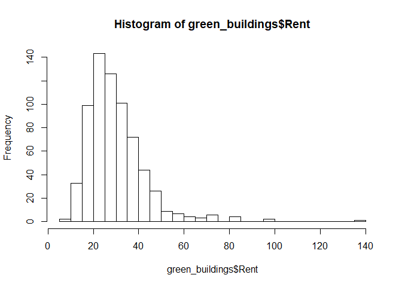<!-- -->

``` r
hist(non_green_buildings$Rent, 25)
```

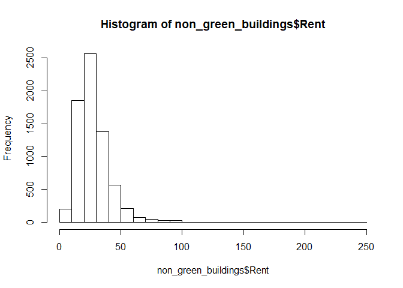<!-- -->

``` r
mean(green_buildings$Rent)
```

    ## [1] 30.03023

``` r
mean(non_green_buildings$Rent)
```

    ## [1] 28.42239

``` r
median(green_buildings$Rent)
```

    ## [1] 27.6

``` r
median(non_green_buildings$Rent)
```

    ## [1] 25

*Bootstrap the median*

``` r
#green
boot_g = do(2500)*{
    median(resample(green_buildings)$Rent)
}
head(boot_g)
```

    ##   result
    ## 1 27.930
    ## 2 27.615
    ## 3 27.500
    ## 4 28.400
    ## 5 28.285
    ## 6 27.600

``` r
qplot(boot_g$result, geom="histogram")+labs(x = "Rent per square foot", y = 'Frequency')+ggtitle("Median Rent for Green Buildings")
```

    ## `stat_bin()` using `bins = 30`. Pick better value with `binwidth`.

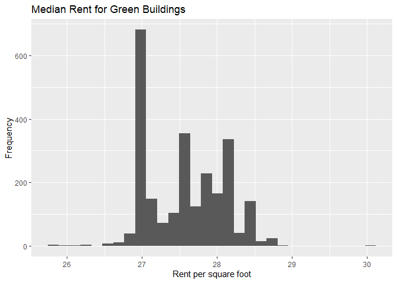<!-- -->

``` r
confint(boot_g)
```

    ##     name lower upper level     method estimate
    ## 1 result 26.89  28.5  0.95 percentile     27.6

``` r
#non-green
boot_ng = do(2500)*{
    median(resample(non_green_buildings)$Rent)
}
head(boot_ng)
```

    ##   result
    ## 1  25.34
    ## 2  25.44
    ## 3  25.00
    ## 4  25.00
    ## 5  25.00
    ## 6  25.00

``` r
qplot(boot_ng$result, geom="histogram")+labs(x = "Rent per square foot", y = 'Frequency')+ggtitle("Median Rent for Non-Green Buildings")
```

    ## `stat_bin()` using `bins = 30`. Pick better value with `binwidth`.

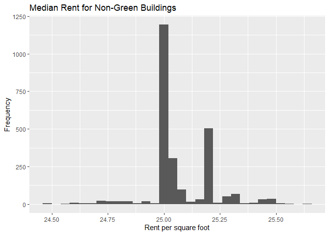<!-- -->

``` r
confint(boot_ng)
```

    ##     name    lower upper level     method estimate
    ## 1 result 24.77475 25.44  0.95 percentile       25

We first decided to compare rent rates to see how long it would take to
recuperate the loss from the 5% premium. The analyst took a single
median value to determine how long it would take to gain back that loss,
however this is not the most accurate way to measure rent rates. In
order to get a more accurate measure of median for rent, we bootstrapped
the median 2500 times and obtained a confidence interval of what the
rent price range was for green buildings. We then repeated the same
process for non-green buildings. In doing this, we noticed that
non-green building rent is around $24.74-$25.45 with 95% confidence and
green-building rent is around $26.89-$28.50 with 95% confidence; so
roughly a $2-$3 upcharge for tenants of green-buildings. This leads us
to believe that the owner will be able to regain their loss from the
premium cost in $5,000,000/$750,000 = 6.6 years at the earliest.

### Confounding Variables

There are several variables that may confound the relationship between
rent and green status. For example, a higher percentage of green
buildings have amenities than non-green buildings. Additionally,
green-buildings tend to be newer than non-green buildings and a higher
percentage have been renovated which may indicate that green buildings
have higher quality interiors. All of these factors may contribute to
green buildings having higher rents.

*Percent of buildings with amenities*

``` r
x1=data %>%
  group_by(green_rating) %>%
  summarize(amen_pct=sum(amenities==1)/n())
ggplot(data = x1) + 
   geom_bar(mapping = aes(x=green_rating, y=amen_pct), stat='identity',fill='#0c5712') + labs(x='Green Rating',y='% of Buildings with Amenities',title='Comparison of Amenities in Green and Non-Green Buildings') + theme(plot.title = element_text(hjust = 0.5))
```

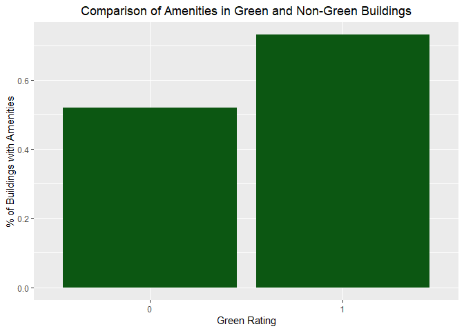<!-- -->

*Comparing age of green buildings to non-green
buildings*

``` r
ggplot(data, aes(age, fill = green_rating)) + geom_density(alpha = 0.2) + scale_fill_manual(values=c("blue", "green"))
```

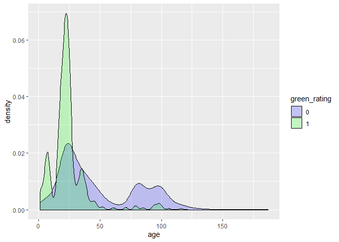<!-- -->

### Green-rating vs. leasing rate

Another potential advantage of building a green building is that it may
attract more tenants. While the average leasing rate is higher for green
rated buildings, the standard deviation shows that it is not
significantly different from the leasing rate of non-green buildings.

``` r
# Bar chart of green rating and leasing rate with standard error bars
greenleasing_summ = data %>%
  group_by(green_rating)  %>%  # group the data points by green rating
  summarize(leasing.mean = mean(leasing_rate), leasing.sd=sd(leasing_rate))  # calculate mean leasing rate
# Create plot
ggplot(greenleasing_summ, aes(x=green_rating, y=leasing.mean)) + 
  geom_bar(stat='identity',fill='#0c5712') + geom_errorbar(aes(ymin=leasing.mean-leasing.sd,ymax=leasing.mean+leasing.sd),size=1.5) + labs(title='Leasing Rate vs. Green Rating',y='Leasing Rate',x='Green Rating') + theme(plot.title = element_text(hjust = 0.5))
```

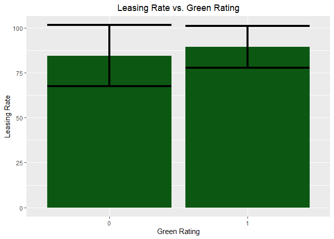<!-- -->

### Conclusion

Ultimately, we do not agree with the analysis of the stats guru. In his
analysis, he failed to consider the confidence intervals associated with
the median rent for green and non-green buildings. After considering
these intervals, it is possible that the extra revenue generated by
green buildings is less than estimated. Additionally, he fails to
consider other variables that might contribute to high rents such as
amenities, and the age of the building. As a result of this, we
recommend that the real estate developer does not build a green
building. While it may be the socially responsible option, it will not
prove to be financially beneficial for the developer due to the
$5,000,000 premium for green certification. The owner will likely have
to add amenities and perform renovations to their property in order to
compete with the other green buildings, which will result in additional
costs .

# Flights at ABIA

``` r
library(mosaic)
library(tidyverse)
library(ggplot2)
library(knitr)
library(chron)
setwd("/Users/pujas/OneDrive/Documents")
abia = read.csv("ABIA.csv", header = T, stringsAsFactors = FALSE)
attach(abia)
#head(abia)
#names(abia)

#cleaning data by converting the integers to times.
DepTime <- substr(as.POSIXct(sprintf("%04.0f", DepTime), format='%H%M'), 12, 16)
CRSDepTime <- substr(as.POSIXct(sprintf("%04.0f", CRSDepTime), format='%H%M'), 12, 16)
ArrTime <- substr(as.POSIXct(sprintf("%04.0f", ArrTime), format='%H%M'), 12, 16)
CRSArrTime <- substr(as.POSIXct(sprintf("%04.0f", CRSArrTime), format='%H%M'), 12, 16)

# cleaning data by converting integers to actual days
DayOfWeek[DayOfWeek == 1] <- 'Monday'
DayOfWeek[DayOfWeek == 2] <- 'Tuesday'
DayOfWeek[DayOfWeek == 3] <- 'Wednesday'
DayOfWeek[DayOfWeek == 4] <- 'Thursday'
DayOfWeek[DayOfWeek == 5] <- 'Friday'
DayOfWeek[DayOfWeek == 6] <- 'Saturday'
DayOfWeek[DayOfWeek == 7] <- 'Sunday'

# cleaning data by converting integers to actual months.
Month[Month == 1] <- 'January'
Month[Month == 2] <- 'February'
Month[Month == 3] <- 'March'
Month[Month == 4] <- 'April'
Month[Month == 5] <- 'May'
Month[Month == 6] <- 'June'
Month[Month == 7] <- 'July'
Month[Month == 8] <- 'August'
Month[Month == 9] <- 'September'
Month[Month == 10] <- 'October'
Month[Month == 11] <- 'November'
Month[Month == 12] <- 'December'
```

Our goal was to see if we could ultimately recommend the best day and
carrier for individuals. First, we looked big picture to understand the
frequency of the flights coming in and out of Austin by month. It turns
out that there are more flights to/from Austin from May through July, as
many people go on vacation during summer months. March had a lot as
well, probably due to Spring Break and SXSW.

``` r
# plot for frequency of flights by month
ggplot(data=abia, aes(x=Month, fill=Month)) +
geom_bar(fill = "#AE3116") +
geom_text(stat='count', aes(label=..count..), vjust=-1) + 
scale_x_continuous(breaks = seq(1, 12, by = 1)) + ggtitle('Frequency of Flights by Month') + 
    labs(y="Number of Flights", x = "Month")
```

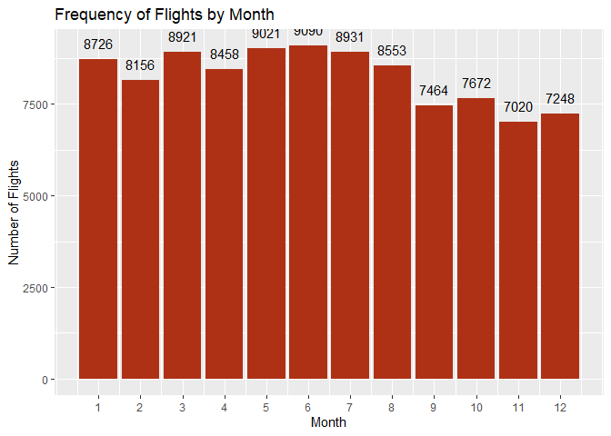<!-- -->

Next, we zoomed in a little to see which days of the week had the most
flights, and the counts were pretty consistent Monday through Friday,
but Saturday and Sunday had significantly fewer flights. This means that
most people try to take full advantage of their weekend in a different
destination. This decrease during the weekend was something we wanted to
look into further.

``` r
# plot for frequency of flights by day
ggplot(data=abia, aes(x=DayOfWeek)) +
geom_bar(fill = "#AE3116", width = 0.7, ) +
geom_text(stat='count', aes(label=..count..), vjust=-1) + 
scale_x_continuous(breaks = seq(1, 12, by = 1)) + ggtitle('Frequency of Flights by Day') + 
    labs(y="Number of Flights", x = "Day of the Week")
```

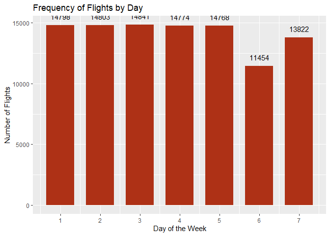<!-- --> Before
zooming into Saturday alone, we wanted to see how delays varied by day.
Arrival delays were interesting to see. Wednesday and Saturday had the
shortest arrival delays. Saturday stood out with the lowest arrival
delay of an average of 4 minutes. In general these averages are low
because for most of the year, planes arrived earlier than scheduled
arrival. This is likely because ABIA is a smaller airport, and is able
to get flights in and out according to schedule.

``` r
# plot for average arrival delay by day

abia1 <- subset(abia, abia$Origin == 'AUS')

library(dplyr)
summarise_at(group_by(abia1,DayOfWeek),vars(ArrDelay),funs(mean(.,na.rm=TRUE)))
```

    ## # A tibble: 7 x 2
    ##   DayOfWeek ArrDelay
    ##       <int>    <dbl>
    ## 1         1     6.66
    ## 2         2     6.01
    ## 3         3     4.27
    ## 4         4     6.95
    ## 5         5     8.09
    ## 6         6     4.00
    ## 7         7     5.80

``` r
v <- c("Mon","Tue","Wed","Thu","Fri","Sat","Sun")
t <- c(6.66,6.01,4.27,6.95,8.09,4.00, 5.80)

# Plot the line graph
plot(t, type = "o",col = "red", ylim=c(0,10), xlab = "Day", ylab = "Arrival Delay (in minutes)",
  main = "Average Plane Arrival Delay by Day")
```

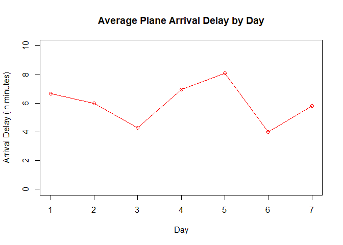<!-- --> Next, we
look at the average airtime by day, and notice again that Saturday
stands out. Flights out of AUS on Saturday have the longest flights, but
not by much: only an average of 5 minutes more than the other days.
However, even those few extra minutes could have significant costs
attached to them for both the airlines and airport.

``` r
#plot for average flight times by day
summarise_at(group_by(abia1,DayOfWeek),vars(AirTime),funs(mean(.,na.rm=TRUE)))
```

    ## # A tibble: 7 x 2
    ##   DayOfWeek AirTime
    ##       <int>   <dbl>
    ## 1         1    101.
    ## 2         2    101.
    ## 3         3    101.
    ## 4         4    101.
    ## 5         5    100.
    ## 6         6    105.
    ## 7         7    101.

``` r
v <- c("Mon","Tue","Wed","Thu","Fri","Sat","Sun")
t <- c(99.11365 ,99.41158   ,99.14433   ,99.55306   ,99.28342   ,103.75217, 99.27976)

# Plot the line grah
plot(t, type = "o",col = "red", ylim=c(90,105), xlab = "Day", ylab = "Airtime (in minutes)",
  main = "Average Airtime by Day")
```

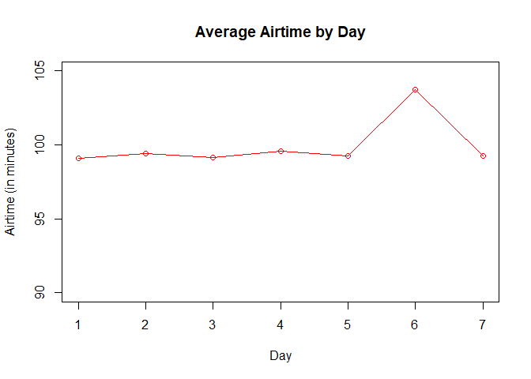<!-- --> Even
though Saturday had the longest flights, it still had one of the lowest
arrival delay with an average of 7.47 minutes. This means that most
likely, delays that occur on other days aren’t due to issues in the air,
but moreso on the ground when departing/landing. Saturday appears to
have, on average, the fewest delays, which is good for a passenger to
know, even though there are fewer flights on Saturday.

``` r
abia2 <- subset(abia, abia$Dest == 'AUS')

library(dplyr)
summarise_at(group_by(abia2,DayOfWeek),vars(DepDelay),funs(mean(.,na.rm=TRUE)))
```

    ## # A tibble: 7 x 2
    ##   DayOfWeek DepDelay
    ##       <int>    <dbl>
    ## 1         1    11.3 
    ## 2         2    10.1 
    ## 3         3     8.97
    ## 4         4    10.9 
    ## 5         5    13.2 
    ## 6         6     8.97
    ## 7         7    12.7

``` r
v <- c("Mon","Tue","Wed","Thu","Fri","Sat","Sun")
t <- c(11.3 ,10.1   ,8.97,10.9,13.2,8.97,12.7)

# Plot the bar chart.
plot(t, type = "o",col = "red", ylim=c(7,14), xlab = "Day", ylab = "Arrival Delay (in minutes)",
  main = "Average Plane Arrival Delay by Day")
```

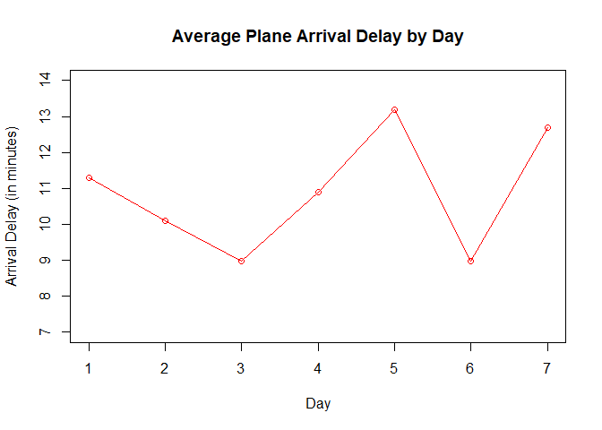<!-- --> Now that
Saturday has stood out on multiple occassions, it is time to dive deeper
into Saturday flights. We first looked at the frequency of flights by
the hour on Saturdays. 7AM and 11AM seem to be the most popular times at
the airport for departures. Knowing when the influx of people are during
various points in the day could help passengers know when to expect long
lines at security and at various businesses in the airport. It also
helps the Austin airport know when to have extra staff at the airport,
given that they know when to expect rush periods.

``` r
# plot for frequency of departures on Saturdays by hour
L = abia1$DayOfWeek == 6
df <-abia1[L,]
df$Hour = as.numeric(substr(df$DepTime, 1, nchar(df$DepTime)-2))
ggplot(data=df, aes(x=Hour)) +
geom_bar(fill = "#AE3116", width = 0.7) +
geom_text(stat='count', aes(label=..count..), vjust=-1) + 
scale_x_continuous(breaks = seq(1, 24, by = 1)) + ggtitle('Frequency of Saturday Departures by Hour') + 
    labs(y="Number of Flights", x = "Hour of the Day")
```

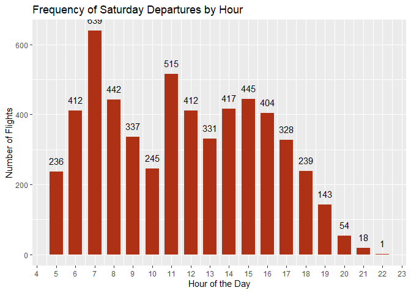<!-- --> Now we
looked at arrivals by the hour at AUS on Saturdays. Most arrivals occur
at 11AM, 1PM, and 4PM. There was an interesting pattern of arrivals
between 11AM to 3PM as can be seen with the spike/dip pattern between
those hours. This makes sense since 11AM, 1PM, and 4PM are on average
more popular times of arrival, the airport has a limit of how many
planes can arrive at one time, and there are slight delays or early
arrivals/departures for most flights. So strategically scheduling less
arrivals following the peak hours helps control this inevitable
congestion. Again, this timing information could be valuable to the
airport for the same reasons mentioned above: staffing and airport
businesses.

``` r
# plot for frequency of arrivals by the hour
L = abia2$DayOfWeek == 6
df2 <-abia2[L,]
df2$Hour = as.numeric(substr(df2$ArrTime, 1, nchar(df2$ArrTime)-2))
ggplot(data=df2, aes(x=Hour)) +
geom_bar(fill = "#AE3116", width = 0.7) +
geom_text(stat='count', aes(label=..count..), vjust=-1) + 
scale_x_continuous(breaks = seq(1, 24, by = 1)) + ggtitle('Frequency of Saturday Arrivals by Hour') + 
    labs(y="Number of Flights", x = "Hour of the Day")
```

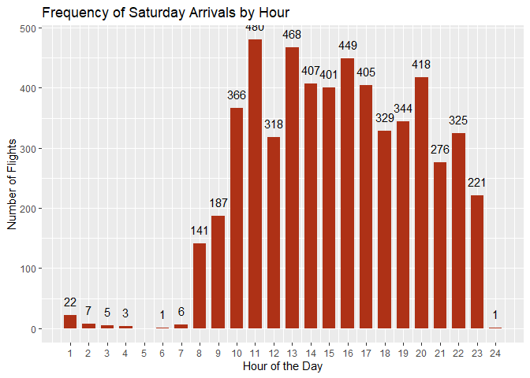<!-- --> Lastly,
we looked at departure and arrival delays by the carriers on Saturdays.
We decided to look at this to see which carriers passengers should avoid
based on these delays. It is frustrating for passengers to have to wait
and be late to their destination. Also these delays can impact the
airport as well, since arriving or leaving too late can have a chain
reaction and negatively impact the other flights for the day. So
finally, we see that on Saturdays, MQ and US don’t have arrival or
delays (on average), while OH has, on average, the longest arrival and
departure delays; customers should be weary of this carrier before they
book a flight with this carrier.

``` r
# plot for arrivals and departures by carriers on Saturdays
L = abia$DayOfWeek == 6
df3 <-abia[L,]
summarise_at(group_by(df3,UniqueCarrier),vars(DepDelay),funs(mean(.,na.rm=TRUE)))
```

    ## # A tibble: 16 x 2
    ##    UniqueCarrier DepDelay
    ##    <chr>            <dbl>
    ##  1 9E              6.02  
    ##  2 AA              5.70  
    ##  3 B6             10.9   
    ##  4 CO              5.71  
    ##  5 DL             10.7   
    ##  6 EV              9.05  
    ##  7 F9              1.15  
    ##  8 MQ             -1.23  
    ##  9 NW             -0.875 
    ## 10 OH             13.3   
    ## 11 OO              9.06  
    ## 12 UA             13.9   
    ## 13 US             -0.0581
    ## 14 WN              7.87  
    ## 15 XE              8.18  
    ## 16 YV              9.87

``` r
summarise_at(group_by(df3,UniqueCarrier),vars(ArrDelay),funs(mean(.,na.rm=TRUE)))
```

    ## # A tibble: 16 x 2
    ##    UniqueCarrier ArrDelay
    ##    <chr>            <dbl>
    ##  1 9E               3.37 
    ##  2 AA               4.93 
    ##  3 B6               7.68 
    ##  4 CO               6.81 
    ##  5 DL              12.0  
    ##  6 EV               2.01 
    ##  7 F9              -0.920
    ##  8 MQ              -3.16 
    ##  9 NW               3    
    ## 10 OH              16.6  
    ## 11 OO               6.40 
    ## 12 UA              12.8  
    ## 13 US              -4.53 
    ## 14 WN               1.92 
    ## 15 XE               6.60 
    ## 16 YV               8.55

``` r
d <- data.frame(column1=rep(c("9E","AA","B6", "CO","DL","EV","F9","MQ","NW","OH","OO","UA","US","WN","XE","YV"), each=2), 
                column2=rep(c("DepDelay", "ArrDelay"), 2), 
                column3=c(6.02194357, 3.3710692, 5.69703215, 4.9265070, 10.91718750 , 7.6755486, 5.70562293, 6.8066298  , 10.69841270, 12.0079681, 9.04901961   , 2.0098039, 1.14878893 , -0.9204152, -1.22560976, -3.1585366, -0.87500000, 3.0000000, 13.28176796  ,16.5888889, 9.06288032, 6.3963415, 13.87553648, 12.7931034, -0.05813953,-4.5290698,7.87417568,1.9197466,8.18257261,6.6008316,9.87347561,8.5460123))
require(lattice)

barchart(column3 ~ column1, groups=column2, d, auto.key = list(columns = 2), main='Delay Times on Saturdays for Various Carriers', xlab='Carriers',ylab='Delays (in minutes)', ylim = c(0 , 20))
```

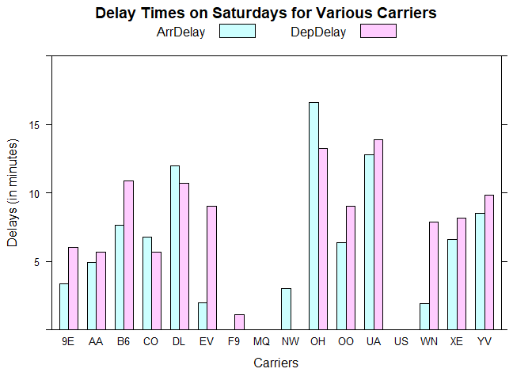<!-- --> In
conclusion, Saturday flights incited some interesting findings at ABIA.
The lowest number of flights and longest lenght flights were on
Saturdays. It also had the shortest delays for both arrivals and
departures compared to the rest of the week, which is good to note for
customers who are looking for the best days to fly. And finally, based
on this data, OH carrier should be avoided since it notably has the
longest delays.

# Portfolio Modeling

``` r
library(mosaic)
library(quantmod)
library(foreach)
```

### PORTFOLIO \#1: Aggressive

``` r
rm(list=ls())
set.seed(512)
mystocks1 = c("VTI", "QQQ", "IVV", "SHYG", "HYG")
myprices = getSymbols(mystocks1, from = "2014-01-01")

# creating new object with adjusted values for each ticker
for(ticker in mystocks1) {
    expr = paste0(ticker, "a = adjustOHLC(", ticker, ")")
    eval(parse(text=expr))
}

all_returns = cbind(ClCl(VTIa),
                                ClCl(QQQa),
                                ClCl(IVVa),
                                ClCl(SHYGa),
                                ClCl(HYGa))
all_returns = as.matrix(na.omit(all_returns))

#looping over four trading weeks
total_wealth = 100000
weights = c(0.25, 0.25, 0.25, 0.125, 0.125)
holdings = weights * total_wealth
n_days = 20
wealthtracker = rep(0, n_days) 
for(today in 1:n_days) {
    return.today = resample(all_returns, 1, orig.ids=FALSE)
    holdings = holdings + holdings*return.today
    total_wealth = sum(holdings)
    wealthtracker[today] = total_wealth
}
total_wealth
```

    ## [1] 98259.41

``` r
plot(wealthtracker, type='l')
```

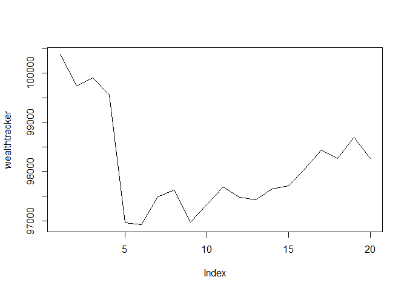<!-- -->

``` r
# creating histogram to get VaR
initial_wealth = 100000
sim1 = foreach(i=1:5000, .combine='rbind') %do% {
    total_wealth = initial_wealth
    weights = c(0.25, 0.25, 0.25, 0.125, 0.125)
    holdings = weights * total_wealth
    n_days = 20
    wealthtracker = rep(0, n_days)
    for(today in 1:n_days) {
        return.today = resample(all_returns, 1, orig.ids=FALSE)
        holdings = holdings + holdings*return.today
        total_wealth = sum(holdings)
        wealthtracker[today] = total_wealth
    }
    wealthtracker
}

# Profit/loss
mean(sim1[,n_days])
```

    ## [1] 100905.3

``` r
hist(sim1[,n_days]- initial_wealth, breaks=30, main="Profit/Loss for Portfolio #1" )
```

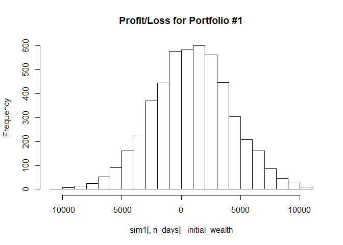<!-- -->

``` r
h = (sim1[,n_days] - initial_wealth)
quantile(h, 0.05)
```

    ##       5% 
    ## -4452.19

For the first portfolio, we decided to make it a high growth portfolio
by picking three large capital growth equities ETFs to make up 75% of
the portfolio, and two high yield bonds ETFs to comprise the other 25%
of the portfolio. We structured it this way instead of having 100% of
the high growth stocks because the bonds act as a buffer since there is
lower risk with bonds. So we wanted to be aggressive, but not too
aggressive. We selected Vanguard Total Stock Market ETF (VTI), iShares
Core S\&P 500 ETF (IVV), Invesco QQQ (QQQ), ISHARES TR/0-5 YR HIGH YIELD
CORP B (SHYG), and iShares iBoxx $ High Yid Corp Bond (HYG). We decided
to pick these five ETFs based on the total assets each had, and the best
daily change rate. The value at risk at the 5% level is a loss of
$4520.20. This means that if there is no trading over the period, there
is a 5% chance that this portfolio will fall in value by over $4520.
This high amount is expected since this is a high growth portfolio;
since there is more of a return on this portfolio, there is also a
higher risk.

### PORTFOLIO \#2: Conservative

``` r
rm(list=ls())
set.seed(512)
mystocks2 = c("SHV", "SHY", "VGSH", "BOND", "VTI", "VXUS")
myprices = getSymbols(mystocks2, from = "2014-01-14")
```

    ## pausing 1 second between requests for more than 5 symbols
    ## pausing 1 second between requests for more than 5 symbols

``` r
for(ticker in mystocks2) {
  expr = paste0(ticker, "a = adjustOHLC(", ticker, ")")
  eval(parse(text=expr))
}
all_returns = cbind(ClCl(SHVa),
                    ClCl(SHYa),
                    ClCl(VGSHa),
                    ClCl(BONDa),
                    ClCl(VTIa),
                    ClCl(VXUSa))
head(all_returns)
```

    ##                ClCl.SHVa     ClCl.SHYa    ClCl.VGSHa    ClCl.BONDa
    ## 2014-01-14            NA            NA            NA            NA
    ## 2014-01-15  0.000000e+00 -0.0003553542 -0.0011501807 -0.0023687701
    ## 2014-01-16 -9.072109e-05  0.0002370542  0.0006580194  0.0037990407
    ## 2014-01-17  9.072932e-05  0.0000000000 -0.0001644254  0.0028384520
    ## 2014-01-21 -9.072109e-05 -0.0001184931  0.0008220816 -0.0009434758
    ## 2014-01-22  0.000000e+00 -0.0004739455 -0.0003285855 -0.0027387006
    ##                ClCl.VTIa    ClCl.VXUSa
    ## 2014-01-14            NA            NA
    ## 2014-01-15  0.0050172887  0.0021193833
    ## 2014-01-16 -0.0007280291  0.0001923092
    ## 2014-01-17 -0.0038509887 -0.0036524029
    ## 2014-01-21  0.0033434333  0.0036657919
    ## 2014-01-22  0.0018744143  0.0030757401

``` r
all_returns = as.matrix(na.omit(all_returns))
return.today = resample(all_returns, 1, orig.ids=FALSE)
total_wealth = 100000
weights = c(0.2, 0.2, 0.2, 0.2, 0.15, 0.05)
holdings = weights * total_wealth
n_days = 20
wealthtracker = rep(0, n_days) # Set up a placeholder to track total wealth
for(today in 1:n_days) {
  return.today = resample(all_returns, 1, orig.ids=FALSE)
  holdings = holdings + holdings*return.today
  total_wealth = sum(holdings)
  wealthtracker[today] = total_wealth
}
total_wealth
```

    ## [1] 100787.7

``` r
plot(wealthtracker, type='l')
```

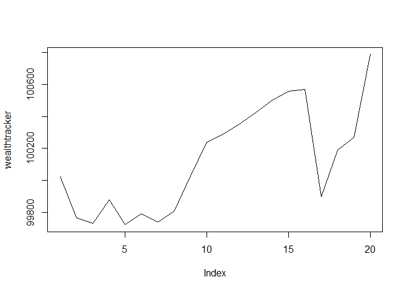<!-- -->

``` r
# Now simulate many different possible scenarios  
initial_wealth = 100000
sim1 = foreach(i=1:5000, .combine='rbind') %do% {
  total_wealth = initial_wealth
  weights = c(0.2, 0.2, 0.2, 0.2, 0.15, 0.05)
  holdings = weights * total_wealth
  n_days = 20
  wealthtracker = rep(0, n_days)
  for(today in 1:n_days) {
    return.today = resample(all_returns, 1, orig.ids=FALSE)
    holdings = holdings + holdings*return.today
    total_wealth = sum(holdings)
    wealthtracker[today] = total_wealth
  }
  wealthtracker
}

# Profit/loss
mean(sim1[,n_days])
```

    ## [1] 100251.3

``` r
hist(sim1[,n_days]- initial_wealth, breaks=30, main="Profit/Loss for Portfolio #2")
```

<!-- -->

``` r
h = (sim1[,n_days] - initial_wealth)
quantile(h, 0.05)
```

    ##        5% 
    ## -933.2883

For the second portfolio, we took a more conservative approach, with 80%
made up of government bond ETFs and 20% made up of stock ETFs. These
ETF’s include the iShares Short Treasury Bond ETF (SHV), iShares 1-3
Year Treasury Bond ETF (SHY), Vanguard Short-Term Treasury ETF (VGSH),
PIMCO Active Bond Exchange-Traded Fund (BOND), Vanguard Total Stock
Market ETF (VTI), and Vanguard Total International Stock ETF (VXUS). We
picked government bonds because they are known to be low-risk
investments since the issuing government backs them. We paired it with
two large growth ETFs to slightly increase its risk. As a result, the
value at risk at the 5% level is a loss of -$935.28. This is
considerably lower than the previous example because this is a
conservative, low risk portfolio, so it is understandable that the risk
of loss would be lower.

### PORTFOLIO \#3: Diversified

``` r
rm(list=ls())
set.seed(512)
mystocks3 = c("AOR", "FXE", "LQD", "VHT", "USO", "IYW", "DBC", "VFH", "INDA", "VNQ")
myprices = getSymbols(mystocks3, from = "2014-01-14")
```

    ## pausing 1 second between requests for more than 5 symbols
    ## pausing 1 second between requests for more than 5 symbols
    ## pausing 1 second between requests for more than 5 symbols
    ## pausing 1 second between requests for more than 5 symbols
    ## pausing 1 second between requests for more than 5 symbols
    ## pausing 1 second between requests for more than 5 symbols

``` r
for(ticker in mystocks3) {
  expr = paste0(ticker, "a = adjustOHLC(", ticker, ")")
  eval(parse(text=expr))
}

all_returns = cbind(ClCl(AORa),
                    ClCl(FXEa),
                    ClCl(LQDa),
                    ClCl(VHTa),
                    ClCl(USOa),
                    ClCl(IYWa),
                    ClCl(DBCa),
                    ClCl(VFHa),
                    ClCl(INDAa),
                    ClCl(VNQa))
head(all_returns)
```

    ##                ClCl.AORa     ClCl.FXEa     ClCl.LQDa     ClCl.VHTa
    ## 2014-01-14            NA            NA            NA            NA
    ## 2014-01-15  0.0025980253 -0.0058418548  0.0002608382  9.552096e-05
    ## 2014-01-16 -0.0007773776  0.0013388351  0.0023469836  2.960256e-03
    ## 2014-01-17 -0.0010373703 -0.0070568789  0.0011274304 -3.808531e-04
    ## 2014-01-21  0.0018172378  0.0024687814 -0.0013860273  6.191075e-03
    ## 2014-01-22  0.0005182949 -0.0007463134 -0.0024288602  3.786539e-04
    ##               ClCl.USOa     ClCl.IYWa    ClCl.DBCa    ClCl.VFHa
    ## 2014-01-14           NA            NA           NA           NA
    ## 2014-01-15  0.022094400  0.0126425449  0.002816901  0.010105570
    ## 2014-01-16 -0.003553391 -0.0004458923 -0.001605177 -0.004891107
    ## 2014-01-17  0.001188618 -0.0076948256  0.001205828 -0.002680943
    ## 2014-01-21  0.008904809  0.0048325577  0.002408631  0.002688150
    ## 2014-01-22  0.016769608 -0.0002237445  0.004805807  0.002010724
    ##              ClCl.INDAa    ClCl.VNQa
    ## 2014-01-14           NA           NA
    ## 2014-01-15  0.006865913  0.007557436
    ## 2014-01-16 -0.003610108  0.001800105
    ## 2014-01-17 -0.013687601 -0.005840072
    ## 2014-01-21 -0.001224531  0.009037491
    ## 2014-01-22  0.012259951  0.004329019

``` r
all_returns = as.matrix(na.omit(all_returns))


# simulating a random day
return.today = resample(all_returns, 1, orig.ids=FALSE)

# Now loop over four trading weeks
total_wealth = 100000
weights = c(0.1,0.1,0.1,0.1,0.1,0.1,0.1,0.1,0.1,0.1)
holdings = weights * total_wealth
n_days = 20
wealthtracker = rep(0, n_days) # Set up a placeholder to track total wealth
for(today in 1:n_days) {
  return.today = resample(all_returns, 1, orig.ids=FALSE)
  holdings = holdings + holdings*return.today
  total_wealth = sum(holdings)
  wealthtracker[today] = total_wealth
}
total_wealth
```

    ## [1] 102065.4

``` r
plot(wealthtracker, type='l')
```

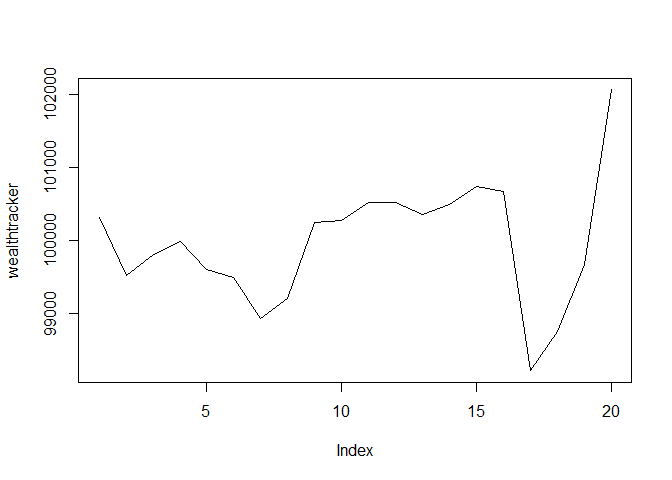<!-- -->

``` r
# Now simulate many different possible scenarios  
initial_wealth = 100000
sim1 = foreach(i=1:5000, .combine='rbind') %do% {
  total_wealth = initial_wealth
  weights = c(0.1, 0.1, 0.1, 0.1, 0.1, 0.1, 0.1,0.1,0.1,0.1)
  holdings = weights * total_wealth
  n_days = 20
  wealthtracker = rep(0, n_days)
  for(today in 1:n_days) {
    return.today = resample(all_returns, 1, orig.ids=FALSE)
    holdings = holdings + holdings*return.today
    total_wealth = sum(holdings)
    wealthtracker[today] = total_wealth
  }
  wealthtracker
}

# Profit/loss
mean(sim1[,n_days])
```

    ## [1] 100345.4

``` r
hist(sim1[,n_days]- initial_wealth, breaks=30, main="Profit/Loss for Portfolio #3")
```

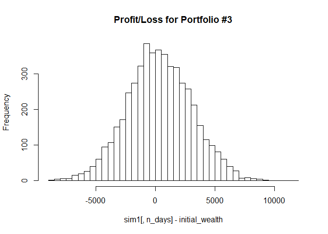<!-- -->

``` r
h = (sim1[,n_days] - initial_wealth)
quantile(h, 0.05)
```

    ##       5% 
    ## -4101.95

The last portfolio was comprised of ten ETF’s that were all very
different to have a diversified portfolio since research has shown that
those are more likely to have a higher return. The ETF’s range from oil
& gas to health/biotech to international equity ETF’s. Each of them were
given a 10% weight in the portfolio. The value at risk at the 5% level
is a potential loss of $4101.95. This high amount is expected because
each ETF within the portfolio carries various amounts of risk, so when
they are put together into one, it is a risky profile overall. But the
outlook four week outlook looked better for this portfolio than the
previous two as the investment is predicted to increase over time.

# Market Segmentation

``` r
rm(list=ls())
library(flexclust)
library(ggplot2)
setwd("/Users/pujas/OneDrive/Documents")
social = read.csv("social_marketing.csv", header = TRUE, stringsAsFactors = FALSE, row.names = 1)

library(ggcorrplot)
cormat <- round(cor(social), 2)
ggcorrplot(cormat, hc.order = TRUE)
```

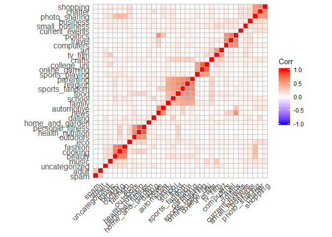<!-- --> Hard to
read the correlation plot, but we see that there’s definitely some
correlation present between words

### PRE-PROCESSING

*Data cleaning:* We started by eliminating tags that Twitter already
tries to weed out. This includes spam, chatter, inappropriate adult
content. We also removed uncategorized information, given that it would
be hard to place its importance. All of this information potentially may
have been generated by bots, so we want to ensure that the marketing
team does not focus on irrelevant features.

``` r
# Remove chatter, uncategorized, spam, and adult
social = social[,c(-1,-5,-35,-36)]

# First normalize phrase counts to phrase frequencies.
Z = social/rowSums(social)
#gives us frequencies of the data used versus the actual counts

#standardize Z
Z_std = scale(Z, center=TRUE, scale=FALSE)
plot(Z_std)
```

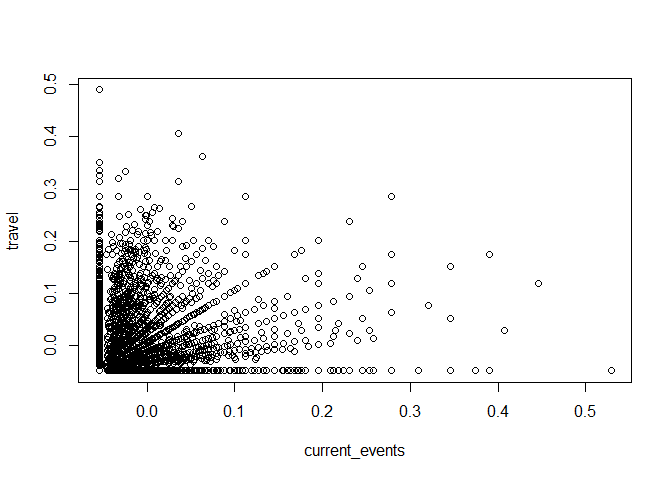<!-- -->

### ANALYSIS

``` r
# PCA
pc = prcomp(Z, scale=TRUE)
#PC1 accounts for ~8% of the variation in the model, PC2 for ~7%, etc.

pr_var <-  pc$sdev ^ 2
pve <- pr_var / sum(pr_var)
plot(pve, xlab = "Principal Component", ylab = "Proportion of Variance Explained", ylim = c(0,1), type = 'b')
```

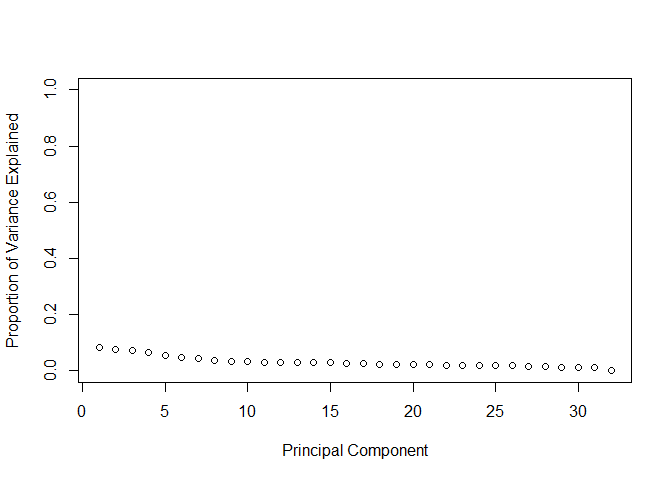<!-- -->

``` r
#x axis shows # of principal components, y axis shows proportion of variance 
loadings = pc$rotation
```

Loadings describe the weight given to each raw variable in calculating
the new PC

Positive values contribute positively to the component. Negative values
mean negative relationship. Larger numbers mean stronger relationship

``` r
scores = pc$x
plot(pc, main='Variance by PC')
```

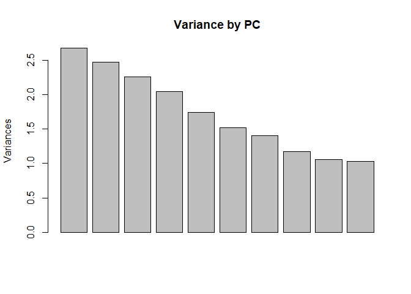<!-- -->

Looking at the plot, we see that the ‘knee’ of the graph happens at
around 7, so we will look at 7 PC components

``` r
pc7 = prcomp(Z, scale=TRUE, rank=7) #stops after 7 prinicipal components
loadings = pc7$rotation
#PC1: 
#highest: sports_fandom, food, family, health_nutrition, cooking, religion, parenting, personal fitness
scores = pc7$x

barplot(pc7$rotation[,1], las=3)
```

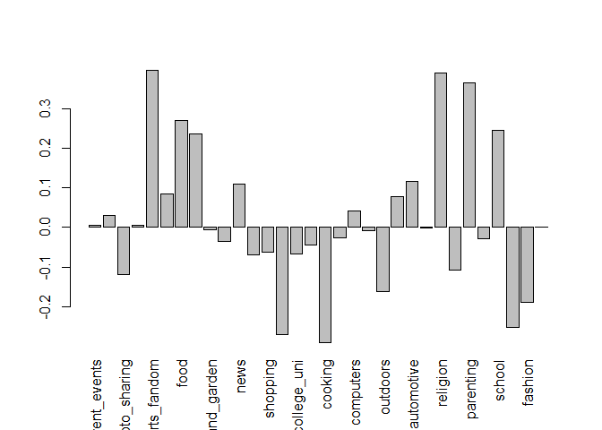<!-- -->

Next , we want to see how the individual PCs are loaded on the original
variables

``` r
# The top words associated with each component
o1 = order(loadings[,1], decreasing=TRUE)
o2 = order(loadings[,2], decreasing=TRUE)
o3 = order(loadings[,3], decreasing=TRUE)
o4 = order(loadings[,4], decreasing=TRUE)
o5 = order(loadings[,5], decreasing=TRUE)
o6 = order(loadings[,6], decreasing=TRUE)
o7 = order(loadings[,7], decreasing=TRUE)
```

We then break down Twitter users into general groups, based on the
tweets they posted.

``` r
# Return the top 5 variables with the highest loadings for each PC
colnames(Z)[tail(o1,4)]
```

    ## [1] "fashion"          "personal_fitness" "health_nutrition"
    ## [4] "cooking"

This group of individuals are likely very health conscious. They eat
clean, like to look up recipes for meal prep Sunday, and are committed
to working out daily. Thus, the best way for NutrientH20 to reach them
is by playing up the ‘health’ aspect of the brand - talk about its
health benefits, how it can be used in the kitchen, how the electrolytes
in the product help improve workouts, etc.

``` r
colnames(Z)[tail(o2,4)]
```

    ## [1] "tv_film"     "college_uni" "travel"      "politics"

This group most likely comprises of college students who are actively
engaged with their community. When they’re not studying, they’re likely
Netflix bingers. They also follow politics, given that they are now of
voting age. They also are likely to be travelling during their breaks,
whether for fun or to see family. The best way for Nutrient H20 to reach
this market is by perhaps creating a student discount, advertising how
the product is a great product for taking to class, to have while
chilling on the couch, or while travelling.

``` r
colnames(Z)[tail(o3,4)]
```

    ## [1] "personal_fitness" "health_nutrition" "news"            
    ## [4] "politics"

This group probably includes young professionals - no longer broke
college students, they’re spending more time focusing on their health
and fitness. They’re also very interested in current events, and follow
the news so that they know what their coworkers are talking about. The
best way to reach this market is to advertise on online news platforms,
like the New York Times, since these are the types of sites this group
probably frequenting the most to get information about everything they
need.

``` r
colnames(Z)[tail(o4,4)]
```

    ## [1] "politics" "cooking"  "beauty"   "fashion"

This group of individuals also actively follows beauty and fashion
blogs, and love to try new recipes from their cookbooks, but they’re
equally active in politics as well. A great way to reach out to them is
by also engaging with them through various blogs, both political and
personal.

``` r
colnames(Z)[tail(o5,4)]
```

    ## [1] "news"    "beauty"  "cooking" "fashion"

These are the fashion bloggers and Instagram influencers (or wanna be
influencers). They’re likely to follow all the fashion trends, know what
vegetable is now ‘in’, and all of the makeup tips. Given that they’re on
social media often, mainly to focus on these hashtags, the best way for
NutrientH20 to reach them is advertising on Instagram, Facebook,
Snapchat, and Twitter.

``` r
colnames(Z)[tail(o6,4)]
```

    ## [1] "crafts"  "travel"  "art"     "tv_film"

This is the DIYer - the people who love to try making their friends
handmade gifts, pick up quaint gifts when they travel, and love watching
TV channels like HGTV. They live at the craft store, and therefore
NutrientH20 could think about ways to advertise how their packaging
could be reused for various craft projects (perhaps the bottle could
become a
    terrarium).

``` r
colnames(Z)[tail(o7,4)]
```

    ## [1] "sports_playing" "dating"         "travel"         "computers"

This group is similar to the young professional, but probably includes
more of the male clientele. They probably work in tech, might be
travelling regularly for work, follow the NFL/NBA, and amidst all this,
are trying to date. NutrientH20 can focus on this group by also focusing
on various online platforms, including tech, sports, and dating blogs.

## Summary

Based on the results of our Principal Component Analysis, there are a
variety of ways that NutrientH20 can better reach their target market.
We could see early on that there were correlations between what their
social media followers were talking about - people after all, have
similar interests\! We were able to create 7 different groups based on
Tweet topics that we want NutrientH20 to target to best reach their
customers.

We do see some overlap between groups, which is expected - people have
similar interests after all. Of course, this helps us in our marketing
plan, because we can assume that certain marketing strategies will
perform better, as there are more individuals who will view them.

# Author Attribution

``` r
library(tm) 
library(magrittr)
library(slam)
library(proxy)
library(tidyverse)
library(glmnet)
```

*Read all files in the training set*

``` r
# Read plain text docs in English
readerPlain = function(fname){
  readPlain(elem=list(content=readLines(fname)), 
            id=fname, language='en') }
# Load files from all 50 authors
setwd("/Users/pujas/OneDrive/Documents")
files_train = Sys.glob('ReutersC50/C50train/*/*.txt')
class_labels = c(rep('aaron', 50), rep('alan', 50), rep('alexander', 50), 
                 rep('benjamin', 50), rep('bernard', 50), rep('brad', 50), 
                 rep('darren', 50), rep('david', 50), rep('edna', 50), 
                 rep('eric', 50), rep('fumiko', 50), rep('graham', 50), 
                 rep('heather', 50), rep('jane', 50), rep('jan', 50), 
                 rep('jim', 50), rep('joe', 50), rep('john', 50), 
                 rep('jonathan', 50), rep('jo', 50), rep('karl', 50), 
                 rep('keith', 50), rep('kevind', 50), rep('kevinm', 50), 
                 rep('kirstin', 50), rep('kourosh', 50), rep('lydia', 50), 
                 rep('lynne', 50), rep('lynnley', 50), rep('marcel', 50), 
                 rep('mark', 50),rep('martin', 50), rep('matthew', 50), 
                 rep('michael', 50), rep('mure', 50), rep('nick', 50), 
                 rep('patricia', 50), rep('peter', 50), rep('pierre', 50), 
                 rep('robin', 50), rep('roger', 50), rep('samuel', 50), 
                 rep('sarah', 50), rep('scott', 50), rep('simon', 50), 
                 rep('tan', 50), rep('therese', 50), rep('tim', 50), 
                 rep('todd', 50), rep('william', 50))
docs_train = lapply(files_train, readerPlain)
```

*Tokenization/ Pre-processing*

``` r
corpus_train = Corpus(VectorSource(docs_train))
corpus_train = tm_map(corpus_train, content_transformer(tolower))
corpus_train = tm_map(corpus_train, content_transformer(removeNumbers))
corpus_train = tm_map(corpus_train, content_transformer(removePunctuation))
corpus_train = tm_map(corpus_train, content_transformer(stripWhitespace))
corpus_train = tm_map(corpus_train, content_transformer(removeWords), stopwords("en"))
```

Pre-processing was carried out on the text in the articles so the words
could be processed by a computer. All of the letters were changed to
lowercase, and numbers, punctuation, extra white spaces, and stop words
were removed.

*Create Document Term Matrix*

``` r
DTM_train = DocumentTermMatrix(corpus_train)
DTM_train = removeSparseTerms(DTM_train, 0.92)
DTM_asmatrix = as.matrix(DTM_train)
```

A document-term matrix was created to count the frequency of a word in
each document. Sparse terms were removed from the dataset because they
may introduce noise. Terms were considered sparse if they appeared in
less than 92% of the documents. Several values between 90 and 100% were
tested to determine what percentage should be used as the threshold for
sparse terms. 92% was found to be the value that lead to the highest
test accuracy without a great reduction in the number of terms.

*Create test corpus, tokenization, preprocessing*

``` r
setwd("/Users/pujas/OneDrive/Documents")
files_test = Sys.glob('ReutersC50/C50test/*/*.txt')
docs_test = lapply(files_test, readerPlain)

corpus_test = Corpus(VectorSource(docs_test))
corpus_test = tm_map(corpus_test, content_transformer(tolower))
corpus_test = tm_map(corpus_test, content_transformer(removeNumbers))
corpus_test = tm_map(corpus_test, content_transformer(removePunctuation))
corpus_test = tm_map(corpus_test, content_transformer(stripWhitespace))
corpus_test = tm_map(corpus_test, content_transformer(removeWords), stopwords("en"))

DTM_test = DocumentTermMatrix(corpus_test)

#Terms(DTM_train)
#Terms(DTM_test)
#summary(Terms(DTM_test) %in% Terms(DTM_train))

#DTM_test2 = DocumentTermMatrix(corpus_test,
#                               control = list(dictionary=Terms(DTM_train)))
DTM_test2 = removeSparseTerms(DTM_test, 0.92)
DTM_testasmatrix = as.matrix(DTM_test2)
#summary(Terms(DTM_test2) %in% Terms(DTM_train))
```

The test data was pre-processed using the same steps used on the
training data.

### Random forest

``` r
library(randomForest)
```

    ## Warning: package 'randomForest' was built under R version 3.6.1

``` r
colnames(DTM_asmatrix) = make.names(colnames(DTM_asmatrix))
df <- data.frame(Author = class_labels, DTM_asmatrix)

colnames(DTM_testasmatrix) = make.names(colnames(DTM_testasmatrix))
df_test <- data.frame(Author = class_labels, DTM_testasmatrix)

rf = randomForest(Author~.,data=df)
CM = table(predict(rf), df_test$Author)
accuracy = (sum(diag(CM)))/sum(CM)
```

Random forest was run on the training articles and used to predict the
author of the test articles. The document-term matrix was converted to a
data frame and a column was added providing the author of that article.
Random forest had an accuracy of 76.16%.

# Association Rule Mining

``` r
library(tidyverse)
library(tidyr)
library(arules)
library(arulesViz)
library(dplyr)
# Load data as transactions
setwd("/Users/pujas/OneDrive/Documents")
groceries = read.transactions('groceries.txt',sep=',',header=FALSE)
str(groceries)
```

    ## Formal class 'transactions' [package "arules"] with 3 slots
    ##   ..@ data       :Formal class 'ngCMatrix' [package "Matrix"] with 5 slots
    ##   .. .. ..@ i       : int [1:43367] 29 88 118 132 33 157 167 166 38 91 ...
    ##   .. .. ..@ p       : int [1:9836] 0 4 7 8 12 16 21 22 27 28 ...
    ##   .. .. ..@ Dim     : int [1:2] 169 9835
    ##   .. .. ..@ Dimnames:List of 2
    ##   .. .. .. ..$ : NULL
    ##   .. .. .. ..$ : NULL
    ##   .. .. ..@ factors : list()
    ##   ..@ itemInfo   :'data.frame':  169 obs. of  1 variable:
    ##   .. ..$ labels: chr [1:169] "abrasive cleaner" "artif. sweetener" "baby cosmetics" "baby food" ...
    ##   ..@ itemsetInfo:'data.frame':  0 obs. of  0 variables

``` r
summary(groceries)
```

    ## transactions as itemMatrix in sparse format with
    ##  9835 rows (elements/itemsets/transactions) and
    ##  169 columns (items) and a density of 0.02609146 
    ## 
    ## most frequent items:
    ##       whole milk other vegetables       rolls/buns             soda 
    ##             2513             1903             1809             1715 
    ##           yogurt          (Other) 
    ##             1372            34055 
    ## 
    ## element (itemset/transaction) length distribution:
    ## sizes
    ##    1    2    3    4    5    6    7    8    9   10   11   12   13   14   15 
    ## 2159 1643 1299 1005  855  645  545  438  350  246  182  117   78   77   55 
    ##   16   17   18   19   20   21   22   23   24   26   27   28   29   32 
    ##   46   29   14   14    9   11    4    6    1    1    1    1    3    1 
    ## 
    ##    Min. 1st Qu.  Median    Mean 3rd Qu.    Max. 
    ##   1.000   2.000   3.000   4.409   6.000  32.000 
    ## 
    ## includes extended item information - examples:
    ##             labels
    ## 1 abrasive cleaner
    ## 2 artif. sweetener
    ## 3   baby cosmetics

*Get association
rules*

``` r
groceryrules = apriori(groceries, parameter=list(support=.005, confidence=.1, maxlen=4,minlen=2))
```

    ## Apriori
    ## 
    ## Parameter specification:
    ##  confidence minval smax arem  aval originalSupport maxtime support minlen
    ##         0.1    0.1    1 none FALSE            TRUE       5   0.005      2
    ##  maxlen target   ext
    ##       4  rules FALSE
    ## 
    ## Algorithmic control:
    ##  filter tree heap memopt load sort verbose
    ##     0.1 TRUE TRUE  FALSE TRUE    2    TRUE
    ## 
    ## Absolute minimum support count: 49 
    ## 
    ## set item appearances ...[0 item(s)] done [0.00s].
    ## set transactions ...[169 item(s), 9835 transaction(s)] done [0.01s].
    ## sorting and recoding items ... [120 item(s)] done [0.00s].
    ## creating transaction tree ... done [0.01s].
    ## checking subsets of size 1 2 3 4

    ## Warning in apriori(groceries, parameter = list(support = 0.005, confidence
    ## = 0.1, : Mining stopped (maxlen reached). Only patterns up to a length of 4
    ## returned!

    ##  done [0.01s].
    ## writing ... [1574 rule(s)] done [0.00s].
    ## creating S4 object  ... done [0.00s].

``` r
arules::inspect(groceryrules)
```

    ##        lhs                           rhs                            support confidence      lift count
    ## [1]    {cake bar}                 => {whole milk}               0.005592272  0.4230769 1.6557746    55
    ## [2]    {dishes}                   => {other vegetables}         0.005998983  0.3410405 1.7625502    59
    ## [3]    {dishes}                   => {whole milk}               0.005287239  0.3005780 1.1763569    52
    ## [4]    {mustard}                  => {whole milk}               0.005185562  0.4322034 1.6914924    51
    ## [5]    {pot plants}               => {whole milk}               0.006914082  0.4000000 1.5654596    68
    ## [6]    {chewing gum}              => {soda}                     0.005388917  0.2560386 1.4683033    53
    ## [7]    {chewing gum}              => {whole milk}               0.005083884  0.2415459 0.9453259    50
    ## [8]    {canned fish}              => {other vegetables}         0.005083884  0.3378378 1.7459985    50
    ## [9]    {pasta}                    => {whole milk}               0.006100661  0.4054054 1.5866145    60
    ## [10]   {herbs}                    => {root vegetables}          0.007015760  0.4312500 3.9564774    69
    ## [11]   {herbs}                    => {other vegetables}         0.007727504  0.4750000 2.4548739    76
    ## [12]   {herbs}                    => {whole milk}               0.007727504  0.4750000 1.8589833    76
    ## [13]   {processed cheese}         => {soda}                     0.005287239  0.3190184 1.8294729    52
    ## [14]   {processed cheese}         => {other vegetables}         0.005490595  0.3312883 1.7121497    54
    ## [15]   {processed cheese}         => {whole milk}               0.007015760  0.4233129 1.6566981    69
    ## [16]   {semi-finished bread}      => {other vegetables}         0.005185562  0.2931034 1.5148042    51
    ## [17]   {semi-finished bread}      => {whole milk}               0.007117438  0.4022989 1.5744565    70
    ## [18]   {beverages}                => {yogurt}                   0.005490595  0.2109375 1.5120775    54
    ## [19]   {beverages}                => {rolls/buns}               0.005388917  0.2070312 1.1255679    53
    ## [20]   {beverages}                => {other vegetables}         0.005185562  0.1992188 1.0295935    51
    ## [21]   {beverages}                => {whole milk}               0.006812405  0.2617188 1.0242753    67
    ## [22]   {ice cream}                => {soda}                     0.006100661  0.2439024 1.3987058    60
    ## [23]   {ice cream}                => {other vegetables}         0.005083884  0.2032520 1.0504381    50
    ## [24]   {ice cream}                => {whole milk}               0.005897306  0.2357724 0.9227303    58
    ## [25]   {detergent}                => {other vegetables}         0.006405694  0.3333333 1.7227185    63
    ## [26]   {detergent}                => {whole milk}               0.008947636  0.4656085 1.8222281    88
    ## [27]   {pickled vegetables}       => {other vegetables}         0.006405694  0.3579545 1.8499648    63
    ## [28]   {pickled vegetables}       => {whole milk}               0.007117438  0.3977273 1.5565650    70
    ## [29]   {baking powder}            => {other vegetables}         0.007320793  0.4137931 2.1385471    72
    ## [30]   {baking powder}            => {whole milk}               0.009252669  0.5229885 2.0467935    91
    ## [31]   {flour}                    => {other vegetables}         0.006304016  0.3625731 1.8738342    62
    ## [32]   {flour}                    => {whole milk}               0.008439248  0.4853801 1.8996074    83
    ## [33]   {soft cheese}              => {yogurt}                   0.005998983  0.3511905 2.5174623    59
    ## [34]   {soft cheese}              => {rolls/buns}               0.005388917  0.3154762 1.7151511    53
    ## [35]   {soft cheese}              => {other vegetables}         0.007117438  0.4166667 2.1533981    70
    ## [36]   {soft cheese}              => {whole milk}               0.007524148  0.4404762 1.7238692    74
    ## [37]   {specialty bar}            => {soda}                     0.007219115  0.2639405 1.5136181    71
    ## [38]   {specialty bar}            => {rolls/buns}               0.005592272  0.2044610 1.1115940    55
    ## [39]   {specialty bar}            => {other vegetables}         0.005592272  0.2044610 1.0566861    55
    ## [40]   {specialty bar}            => {whole milk}               0.006507372  0.2379182 0.9311284    64
    ## [41]   {misc. beverages}          => {bottled water}            0.005287239  0.1863799 1.6863354    52
    ## [42]   {misc. beverages}          => {soda}                     0.007320793  0.2580645 1.4799210    72
    ## [43]   {misc. beverages}          => {other vegetables}         0.005592272  0.1971326 1.0188120    55
    ## [44]   {misc. beverages}          => {whole milk}               0.007015760  0.2473118 0.9678917    69
    ## [45]   {grapes}                   => {tropical fruit}           0.006100661  0.2727273 2.5991015    60
    ## [46]   {grapes}                   => {other vegetables}         0.009049314  0.4045455 2.0907538    89
    ## [47]   {grapes}                   => {whole milk}               0.007320793  0.3272727 1.2808306    72
    ## [48]   {cat food}                 => {yogurt}                   0.006202339  0.2663755 1.9094778    61
    ## [49]   {cat food}                 => {other vegetables}         0.006507372  0.2794760 1.4443753    64
    ## [50]   {cat food}                 => {whole milk}               0.008845958  0.3799127 1.4868448    87
    ## [51]   {specialty chocolate}      => {soda}                     0.006304016  0.2073579 1.1891338    62
    ## [52]   {specialty chocolate}      => {rolls/buns}               0.005592272  0.1839465 1.0000629    55
    ## [53]   {specialty chocolate}      => {other vegetables}         0.006100661  0.2006689 1.0370881    60
    ## [54]   {specialty chocolate}      => {whole milk}               0.008032537  0.2642140 1.0340410    79
    ## [55]   {meat}                     => {sausage}                  0.005287239  0.2047244 2.1790742    52
    ## [56]   {meat}                     => {root vegetables}          0.005083884  0.1968504 1.8059922    50
    ## [57]   {meat}                     => {soda}                     0.005490595  0.2125984 1.2191869    54
    ## [58]   {meat}                     => {yogurt}                   0.005287239  0.2047244 1.4675398    52
    ## [59]   {meat}                     => {rolls/buns}               0.006914082  0.2677165 1.4554959    68
    ## [60]   {meat}                     => {other vegetables}         0.009964413  0.3858268 1.9940128    98
    ## [61]   {meat}                     => {whole milk}               0.009964413  0.3858268 1.5099906    98
    ## [62]   {frozen meals}             => {tropical fruit}           0.005490595  0.1935484 1.8445236    54
    ## [63]   {frozen meals}             => {soda}                     0.006202339  0.2186380 1.2538220    61
    ## [64]   {frozen meals}             => {yogurt}                   0.006202339  0.2186380 1.5672774    61
    ## [65]   {frozen meals}             => {other vegetables}         0.007524148  0.2652330 1.3707653    74
    ## [66]   {frozen meals}             => {whole milk}               0.009862735  0.3476703 1.3606593    97
    ## [67]   {hard cheese}              => {sausage}                  0.005185562  0.2116183 2.2524519    51
    ## [68]   {hard cheese}              => {root vegetables}          0.005592272  0.2282158 2.0937519    55
    ## [69]   {hard cheese}              => {yogurt}                   0.006405694  0.2614108 1.8738886    63
    ## [70]   {hard cheese}              => {rolls/buns}               0.005897306  0.2406639 1.3084187    58
    ## [71]   {hard cheese}              => {other vegetables}         0.009456024  0.3858921 1.9943505    93
    ## [72]   {hard cheese}              => {whole milk}               0.010066090  0.4107884 1.6076815    99
    ## [73]   {butter milk}              => {pip fruit}                0.005083884  0.1818182 2.4034702    50
    ## [74]   {butter milk}              => {tropical fruit}           0.005490595  0.1963636 1.8713531    54
    ## [75]   {butter milk}              => {root vegetables}          0.005083884  0.1818182 1.6680801    50
    ## [76]   {butter milk}              => {yogurt}                   0.008540925  0.3054545 2.1896104    84
    ## [77]   {butter milk}              => {rolls/buns}               0.007625826  0.2727273 1.4827378    75
    ## [78]   {butter milk}              => {other vegetables}         0.010371124  0.3709091 1.9169159   102
    ## [79]   {butter milk}              => {whole milk}               0.011591256  0.4145455 1.6223854   114
    ## [80]   {candy}                    => {tropical fruit}           0.005388917  0.1802721 1.7180002    53
    ## [81]   {candy}                    => {soda}                     0.008642603  0.2891156 1.6579897    85
    ## [82]   {candy}                    => {yogurt}                   0.005490595  0.1836735 1.3166389    54
    ## [83]   {candy}                    => {rolls/buns}               0.007117438  0.2380952 1.2944537    70
    ## [84]   {candy}                    => {other vegetables}         0.006914082  0.2312925 1.1953557    68
    ## [85]   {candy}                    => {whole milk}               0.008235892  0.2755102 1.0782502    81
    ## [86]   {ham}                      => {white bread}              0.005083884  0.1953125 4.6398513    50
    ## [87]   {white bread}              => {ham}                      0.005083884  0.1207729 4.6398513    50
    ## [88]   {ham}                      => {tropical fruit}           0.005388917  0.2070312 1.9730158    53
    ## [89]   {ham}                      => {yogurt}                   0.006710727  0.2578125 1.8480947    66
    ## [90]   {ham}                      => {rolls/buns}               0.006914082  0.2656250 1.4441249    68
    ## [91]   {ham}                      => {other vegetables}         0.009150991  0.3515625 1.8169297    90
    ## [92]   {ham}                      => {whole milk}               0.011489578  0.4414062 1.7275091   113
    ## [93]   {sliced cheese}            => {sausage}                  0.007015760  0.2863071 3.0474349    69
    ## [94]   {sliced cheese}            => {tropical fruit}           0.005287239  0.2157676 2.0562739    52
    ## [95]   {sliced cheese}            => {root vegetables}          0.005592272  0.2282158 2.0937519    55
    ## [96]   {sliced cheese}            => {soda}                     0.005083884  0.2074689 1.1897705    50
    ## [97]   {sliced cheese}            => {yogurt}                   0.008032537  0.3278008 2.3497968    79
    ## [98]   {sliced cheese}            => {rolls/buns}               0.007625826  0.3112033 1.6919208    75
    ## [99]   {sliced cheese}            => {other vegetables}         0.009049314  0.3692946 1.9085720    89
    ## [100]  {sliced cheese}            => {whole milk}               0.010777834  0.4398340 1.7213560   106
    ## [101]  {UHT-milk}                 => {bottled water}            0.007320793  0.2188450 1.9800740    72
    ## [102]  {UHT-milk}                 => {soda}                     0.007625826  0.2279635 1.3073010    75
    ## [103]  {UHT-milk}                 => {yogurt}                   0.007422471  0.2218845 1.5905496    73
    ## [104]  {UHT-milk}                 => {rolls/buns}               0.006405694  0.1914894 1.0410712    63
    ## [105]  {UHT-milk}                 => {other vegetables}         0.008134215  0.2431611 1.2566944    80
    ## [106]  {oil}                      => {root vegetables}          0.007015760  0.2500000 2.2936101    69
    ## [107]  {oil}                      => {yogurt}                   0.005287239  0.1884058 1.3505620    52
    ## [108]  {oil}                      => {rolls/buns}               0.005083884  0.1811594 0.9849104    50
    ## [109]  {oil}                      => {other vegetables}         0.009964413  0.3550725 1.8350697    98
    ## [110]  {oil}                      => {whole milk}               0.011286223  0.4021739 1.5739675   111
    ## [111]  {onions}                   => {whipped/sour cream}       0.005083884  0.1639344 2.2869434    50
    ## [112]  {onions}                   => {citrus fruit}             0.005592272  0.1803279 2.1787771    55
    ## [113]  {onions}                   => {bottled water}            0.005897306  0.1901639 1.7205725    58
    ## [114]  {onions}                   => {tropical fruit}           0.005693950  0.1836066 1.7497776    56
    ## [115]  {onions}                   => {root vegetables}          0.009456024  0.3049180 2.7974523    93
    ## [116]  {onions}                   => {soda}                     0.005287239  0.1704918 0.9777183    52
    ## [117]  {onions}                   => {yogurt}                   0.007219115  0.2327869 1.6687019    71
    ## [118]  {onions}                   => {rolls/buns}               0.006812405  0.2196721 1.1942927    67
    ## [119]  {onions}                   => {other vegetables}         0.014234875  0.4590164 2.3722681   140
    ## [120]  {onions}                   => {whole milk}               0.012099644  0.3901639 1.5269647   119
    ## [121]  {berries}                  => {whipped/sour cream}       0.009049314  0.2721713 3.7968855    89
    ## [122]  {whipped/sour cream}       => {berries}                  0.009049314  0.1262411 3.7968855    89
    ## [123]  {berries}                  => {citrus fruit}             0.005388917  0.1620795 1.9582948    53
    ## [124]  {berries}                  => {tropical fruit}           0.006710727  0.2018349 1.9234941    66
    ## [125]  {berries}                  => {root vegetables}          0.006609049  0.1987768 1.8236655    65
    ## [126]  {berries}                  => {soda}                     0.007320793  0.2201835 1.2626849    72
    ## [127]  {berries}                  => {yogurt}                   0.010574479  0.3180428 2.2798477   104
    ## [128]  {berries}                  => {rolls/buns}               0.006609049  0.1987768 1.0806907    65
    ## [129]  {berries}                  => {other vegetables}         0.010269446  0.3088685 1.5962805   101
    ## [130]  {berries}                  => {whole milk}               0.011794611  0.3547401 1.3883281   116
    ## [131]  {hamburger meat}           => {sausage}                  0.005185562  0.1559633 1.6600639    51
    ## [132]  {hamburger meat}           => {root vegetables}          0.006202339  0.1865443 1.7114399    61
    ## [133]  {hamburger meat}           => {soda}                     0.005795628  0.1743119 0.9996255    57
    ## [134]  {hamburger meat}           => {yogurt}                   0.006507372  0.1957187 1.4029832    64
    ## [135]  {hamburger meat}           => {rolls/buns}               0.008642603  0.2599388 1.4132109    85
    ## [136]  {hamburger meat}           => {other vegetables}         0.013828165  0.4159021 2.1494470   136
    ## [137]  {hamburger meat}           => {whole milk}               0.014743264  0.4434251 1.7354101   145
    ## [138]  {hygiene articles}         => {napkins}                  0.006100661  0.1851852 3.5364977    60
    ## [139]  {napkins}                  => {hygiene articles}         0.006100661  0.1165049 3.5364977    60
    ## [140]  {hygiene articles}         => {citrus fruit}             0.005287239  0.1604938 1.9391361    52
    ## [141]  {hygiene articles}         => {shopping bags}            0.005185562  0.1574074 1.5976283    51
    ## [142]  {hygiene articles}         => {bottled water}            0.005693950  0.1728395 1.5638239    56
    ## [143]  {hygiene articles}         => {tropical fruit}           0.006710727  0.2037037 1.9413042    66
    ## [144]  {hygiene articles}         => {root vegetables}          0.005388917  0.1635802 1.5007572    53
    ## [145]  {hygiene articles}         => {soda}                     0.007015760  0.2129630 1.2212774    69
    ## [146]  {hygiene articles}         => {yogurt}                   0.007320793  0.2222222 1.5929705    72
    ## [147]  {hygiene articles}         => {rolls/buns}               0.005897306  0.1790123 0.9732374    58
    ## [148]  {hygiene articles}         => {other vegetables}         0.009557702  0.2901235 1.4994032    94
    ## [149]  {hygiene articles}         => {whole milk}               0.012811388  0.3888889 1.5219746   126
    ## [150]  {salty snack}              => {fruit/vegetable juice}    0.005998983  0.1586022 2.1938849    59
    ## [151]  {salty snack}              => {whipped/sour cream}       0.005185562  0.1370968 1.9125486    51
    ## [152]  {salty snack}              => {pastry}                   0.005185562  0.1370968 1.5409677    51
    ## [153]  {salty snack}              => {shopping bags}            0.005998983  0.1586022 1.6097545    59
    ## [154]  {salty snack}              => {sausage}                  0.005287239  0.1397849 1.4878625    52
    ## [155]  {salty snack}              => {tropical fruit}           0.005592272  0.1478495 1.4090111    55
    ## [156]  {salty snack}              => {soda}                     0.009354347  0.2473118 1.4182576    92
    ## [157]  {salty snack}              => {yogurt}                   0.006202339  0.1639785 1.1754581    61
    ## [158]  {salty snack}              => {other vegetables}         0.010777834  0.2849462 1.4726465   106
    ## [159]  {salty snack}              => {whole milk}               0.011184545  0.2956989 1.1572618   110
    ## [160]  {sugar}                    => {margarine}                0.005490595  0.1621622 2.7688626    54
    ## [161]  {sugar}                    => {pastry}                   0.005185562  0.1531532 1.7214414    51
    ## [162]  {sugar}                    => {root vegetables}          0.006405694  0.1891892 1.7357049    63
    ## [163]  {sugar}                    => {soda}                     0.007320793  0.2162162 1.2399338    72
    ## [164]  {sugar}                    => {yogurt}                   0.006914082  0.2042042 1.4638107    68
    ## [165]  {sugar}                    => {rolls/buns}               0.007015760  0.2072072 1.1265245    69
    ## [166]  {sugar}                    => {other vegetables}         0.010777834  0.3183183 1.6451186   106
    ## [167]  {sugar}                    => {whole milk}               0.015048297  0.4444444 1.7393996   148
    ## [168]  {waffles}                  => {chocolate}                0.005795628  0.1507937 3.0390483    57
    ## [169]  {chocolate}                => {waffles}                  0.005795628  0.1168033 3.0390483    57
    ## [170]  {waffles}                  => {whipped/sour cream}       0.005083884  0.1322751 1.8452850    50
    ## [171]  {waffles}                  => {pastry}                   0.007015760  0.1825397 2.0517460    69
    ## [172]  {waffles}                  => {shopping bags}            0.005490595  0.1428571 1.4499484    54
    ## [173]  {waffles}                  => {tropical fruit}           0.006100661  0.1587302 1.5127046    60
    ## [174]  {waffles}                  => {root vegetables}          0.006609049  0.1719577 1.5776154    65
    ## [175]  {waffles}                  => {soda}                     0.009557702  0.2486772 1.4260879    94
    ## [176]  {waffles}                  => {yogurt}                   0.007524148  0.1957672 1.4033312    74
    ## [177]  {waffles}                  => {rolls/buns}               0.009150991  0.2380952 1.2944537    90
    ## [178]  {waffles}                  => {other vegetables}         0.010066090  0.2619048 1.3535645    99
    ## [179]  {waffles}                  => {whole milk}               0.012709710  0.3306878 1.2941961   125
    ## [180]  {long life bakery product} => {chocolate}                0.005287239  0.1413043 2.8478038    52
    ## [181]  {chocolate}                => {long life bakery product} 0.005287239  0.1065574 2.8478038    52
    ## [182]  {long life bakery product} => {fruit/vegetable juice}    0.006202339  0.1657609 2.2929088    61
    ## [183]  {long life bakery product} => {whipped/sour cream}       0.005795628  0.1548913 2.1607886    57
    ## [184]  {long life bakery product} => {pastry}                   0.005897306  0.1576087 1.7715217    58
    ## [185]  {long life bakery product} => {shopping bags}            0.005388917  0.1440217 1.4617686    53
    ## [186]  {long life bakery product} => {sausage}                  0.005388917  0.1440217 1.5329587    53
    ## [187]  {long life bakery product} => {tropical fruit}           0.006304016  0.1684783 1.6056044    62
    ## [188]  {long life bakery product} => {root vegetables}          0.005287239  0.1413043 1.2963883    52
    ## [189]  {long life bakery product} => {soda}                     0.007625826  0.2038043 1.1687555    75
    ## [190]  {long life bakery product} => {yogurt}                   0.008744281  0.2336957 1.6752163    86
    ## [191]  {long life bakery product} => {rolls/buns}               0.007930859  0.2119565 1.1523452    78
    ## [192]  {long life bakery product} => {other vegetables}         0.010676157  0.2853261 1.4746096   105
    ## [193]  {long life bakery product} => {whole milk}               0.013523132  0.3614130 1.4144438   133
    ## [194]  {dessert}                  => {curd}                     0.005185562  0.1397260 2.6225295    51
    ## [195]  {dessert}                  => {fruit/vegetable juice}    0.005998983  0.1616438 2.2359594    59
    ## [196]  {dessert}                  => {pastry}                   0.005388917  0.1452055 1.6321096    53
    ## [197]  {dessert}                  => {shopping bags}            0.006202339  0.1671233 1.6962410    61
    ## [198]  {dessert}                  => {sausage}                  0.005897306  0.1589041 1.6913657    58
    ## [199]  {dessert}                  => {bottled water}            0.005185562  0.1397260 1.2642185    51
    ## [200]  {dessert}                  => {tropical fruit}           0.006304016  0.1698630 1.6188011    62
    ## [201]  {dessert}                  => {root vegetables}          0.005795628  0.1561644 1.4327208    57
    ## [202]  {dessert}                  => {soda}                     0.009862735  0.2657534 1.5240145    97
    ## [203]  {dessert}                  => {yogurt}                   0.009862735  0.2657534 1.9050182    97
    ## [204]  {dessert}                  => {rolls/buns}               0.006812405  0.1835616 0.9979706    67
    ## [205]  {dessert}                  => {other vegetables}         0.011591256  0.3123288 1.6141636   114
    ## [206]  {dessert}                  => {whole milk}               0.013726487  0.3698630 1.4475140   135
    ## [207]  {canned beer}              => {shopping bags}            0.011387900  0.1465969 1.4879052   112
    ## [208]  {shopping bags}            => {canned beer}              0.011387900  0.1155831 1.4879052   112
    ## [209]  {canned beer}              => {bottled water}            0.008032537  0.1034031 0.9355749    79
    ## [210]  {canned beer}              => {soda}                     0.013828165  0.1780105 1.0208356   136
    ## [211]  {canned beer}              => {rolls/buns}               0.011286223  0.1452880 0.7898878   111
    ## [212]  {canned beer}              => {other vegetables}         0.009049314  0.1164921 0.6020495    89
    ## [213]  {canned beer}              => {whole milk}               0.008845958  0.1138743 0.4456642    87
    ## [214]  {cream cheese}             => {curd}                     0.005083884  0.1282051 2.4062928    50
    ## [215]  {cream cheese}             => {domestic eggs}            0.005083884  0.1282051 2.0206690    50
    ## [216]  {cream cheese}             => {fruit/vegetable juice}    0.005693950  0.1435897 1.9862238    56
    ## [217]  {cream cheese}             => {whipped/sour cream}       0.006405694  0.1615385 2.2535188    63
    ## [218]  {cream cheese}             => {pip fruit}                0.006100661  0.1538462 2.0337055    60
    ## [219]  {cream cheese}             => {citrus fruit}             0.005693950  0.1435897 1.7348957    56
    ## [220]  {cream cheese}             => {shopping bags}            0.005592272  0.1410256 1.4313593    55
    ## [221]  {cream cheese}             => {sausage}                  0.005592272  0.1410256 1.5010684    55
    ## [222]  {cream cheese}             => {bottled water}            0.005897306  0.1487179 1.3455759    58
    ## [223]  {cream cheese}             => {tropical fruit}           0.007219115  0.1820513 1.7349558    71
    ## [224]  {cream cheese}             => {root vegetables}          0.007524148  0.1897436 1.7407912    74
    ## [225]  {cream cheese}             => {soda}                     0.006812405  0.1717949 0.9851910    67
    ## [226]  {cream cheese}             => {yogurt}                   0.012404677  0.3128205 2.2424123   122
    ## [227]  {cream cheese}             => {rolls/buns}               0.009964413  0.2512821 1.3661465    98
    ## [228]  {cream cheese}             => {other vegetables}         0.013726487  0.3461538 1.7889769   135
    ## [229]  {cream cheese}             => {whole milk}               0.016471784  0.4153846 1.6256696   162
    ## [230]  {chicken}                  => {frozen vegetables}        0.006710727  0.1563981 3.2519564    66
    ## [231]  {frozen vegetables}        => {chicken}                  0.006710727  0.1395349 3.2519564    66
    ## [232]  {chicken}                  => {pork}                     0.005795628  0.1350711 2.3428998    57
    ## [233]  {pork}                     => {chicken}                  0.005795628  0.1005291 2.3428998    57
    ## [234]  {chicken}                  => {butter}                   0.005795628  0.1350711 2.4374755    57
    ## [235]  {butter}                   => {chicken}                  0.005795628  0.1045872 2.4374755    57
    ## [236]  {chicken}                  => {newspapers}               0.005185562  0.1208531 1.5141274    51
    ## [237]  {chicken}                  => {domestic eggs}            0.006202339  0.1445498 2.2782803    61
    ## [238]  {chicken}                  => {whipped/sour cream}       0.007219115  0.1682464 2.3470976    71
    ## [239]  {whipped/sour cream}       => {chicken}                  0.007219115  0.1007092 2.3470976    71
    ## [240]  {chicken}                  => {citrus fruit}             0.006914082  0.1611374 1.9469124    68
    ## [241]  {chicken}                  => {sausage}                  0.005287239  0.1232227 1.3115755    52
    ## [242]  {chicken}                  => {bottled water}            0.005287239  0.1232227 1.1148995    52
    ## [243]  {chicken}                  => {tropical fruit}           0.006405694  0.1492891 1.4227309    63
    ## [244]  {chicken}                  => {root vegetables}          0.010879512  0.2535545 2.3262206   107
    ## [245]  {chicken}                  => {soda}                     0.008337570  0.1943128 1.1143244    82
    ## [246]  {chicken}                  => {yogurt}                   0.008337570  0.1943128 1.3929055    82
    ## [247]  {chicken}                  => {rolls/buns}               0.009659380  0.2251185 1.2239029    95
    ## [248]  {chicken}                  => {other vegetables}         0.017895272  0.4170616 2.1554393   176
    ## [249]  {chicken}                  => {whole milk}               0.017590239  0.4099526 1.6044106   173
    ## [250]  {white bread}              => {frankfurter}              0.005185562  0.1231884 2.0888931    51
    ## [251]  {white bread}              => {domestic eggs}            0.005795628  0.1376812 2.1700228    57
    ## [252]  {white bread}              => {fruit/vegetable juice}    0.007422471  0.1763285 2.4390869    73
    ## [253]  {fruit/vegetable juice}    => {white bread}              0.007422471  0.1026723 2.4390869    73
    ## [254]  {white bread}              => {whipped/sour cream}       0.005490595  0.1304348 1.8196115    54
    ## [255]  {white bread}              => {pip fruit}                0.006609049  0.1570048 2.0754604    65
    ## [256]  {white bread}              => {pastry}                   0.005592272  0.1328502 1.4932367    55
    ## [257]  {white bread}              => {shopping bags}            0.007422471  0.1763285 1.7896706    73
    ## [258]  {white bread}              => {sausage}                  0.007219115  0.1714976 1.8254099    71
    ## [259]  {white bread}              => {tropical fruit}           0.008744281  0.2077295 1.9796699    86
    ## [260]  {white bread}              => {root vegetables}          0.007930859  0.1884058 1.7285177    78
    ## [261]  {white bread}              => {soda}                     0.010269446  0.2439614 1.3990437   101
    ## [262]  {white bread}              => {yogurt}                   0.009049314  0.2149758 1.5410258    89
    ## [263]  {white bread}              => {rolls/buns}               0.006507372  0.1545894 0.8404569    64
    ## [264]  {white bread}              => {other vegetables}         0.013726487  0.3260870 1.6852681   135
    ## [265]  {white bread}              => {whole milk}               0.017081851  0.4057971 1.5881474   168
    ## [266]  {chocolate}                => {butter}                   0.006202339  0.1250000 2.2557339    61
    ## [267]  {butter}                   => {chocolate}                0.006202339  0.1119266 2.2557339    61
    ## [268]  {chocolate}                => {newspapers}               0.005490595  0.1106557 1.3863684    54
    ## [269]  {chocolate}                => {fruit/vegetable juice}    0.006812405  0.1372951 1.8991521    67
    ## [270]  {chocolate}                => {pip fruit}                0.006100661  0.1229508 1.6252975    60
    ## [271]  {chocolate}                => {pastry}                   0.008032537  0.1618852 1.8195902    79
    ## [272]  {chocolate}                => {citrus fruit}             0.006405694  0.1290984 1.5598064    63
    ## [273]  {chocolate}                => {shopping bags}            0.008134215  0.1639344 1.6638752    80
    ## [274]  {chocolate}                => {sausage}                  0.006609049  0.1331967 1.4177378    65
    ## [275]  {chocolate}                => {bottled water}            0.005795628  0.1168033 1.0568172    57
    ## [276]  {chocolate}                => {tropical fruit}           0.008134215  0.1639344 1.5623014    80
    ## [277]  {chocolate}                => {root vegetables}          0.006405694  0.1290984 1.1844052    63
    ## [278]  {chocolate}                => {soda}                     0.013523132  0.2725410 1.5629391   133
    ## [279]  {chocolate}                => {yogurt}                   0.009252669  0.1864754 1.3367242    91
    ## [280]  {chocolate}                => {rolls/buns}               0.011794611  0.2377049 1.2923316   116
    ## [281]  {chocolate}                => {other vegetables}         0.012709710  0.2561475 1.3238103   125
    ## [282]  {chocolate}                => {whole milk}               0.016675140  0.3360656 1.3152427   164
    ## [283]  {coffee}                   => {fruit/vegetable juice}    0.005998983  0.1033275 1.4292910    59
    ## [284]  {coffee}                   => {whipped/sour cream}       0.006100661  0.1050788 1.4658866    60
    ## [285]  {coffee}                   => {pip fruit}                0.006914082  0.1190893 1.5742519    68
    ## [286]  {coffee}                   => {pastry}                   0.006914082  0.1190893 1.3385639    68
    ## [287]  {coffee}                   => {citrus fruit}             0.006405694  0.1103327 1.3330744    63
    ## [288]  {coffee}                   => {shopping bags}            0.009354347  0.1611208 1.6353183    92
    ## [289]  {coffee}                   => {sausage}                  0.006914082  0.1190893 1.2675795    68
    ## [290]  {coffee}                   => {bottled water}            0.007320793  0.1260946 1.1408833    72
    ## [291]  {coffee}                   => {tropical fruit}           0.007117438  0.1225919 1.1683060    70
    ## [292]  {coffee}                   => {root vegetables}          0.007320793  0.1260946 1.1568471    72
    ## [293]  {coffee}                   => {soda}                     0.009964413  0.1716287 0.9842382    98
    ## [294]  {coffee}                   => {yogurt}                   0.009761057  0.1681261 1.2051896    96
    ## [295]  {coffee}                   => {rolls/buns}               0.010981190  0.1891419 1.0283085   108
    ## [296]  {coffee}                   => {other vegetables}         0.013421454  0.2311734 1.1947400   132
    ## [297]  {coffee}                   => {whole milk}               0.018708693  0.3222417 1.2611408   184
    ## [298]  {frozen vegetables}        => {pork}                     0.006405694  0.1331924 2.3103124    63
    ## [299]  {pork}                     => {frozen vegetables}        0.006405694  0.1111111 2.3103124    63
    ## [300]  {frozen vegetables}        => {frankfurter}              0.005083884  0.1057082 1.7924838    50
    ## [301]  {frozen vegetables}        => {margarine}                0.005083884  0.1057082 1.8049316    50
    ## [302]  {frozen vegetables}        => {butter}                   0.005795628  0.1205074 2.1746611    57
    ## [303]  {butter}                   => {frozen vegetables}        0.005795628  0.1045872 2.1746611    57
    ## [304]  {frozen vegetables}        => {domestic eggs}            0.005185562  0.1078224 1.6994125    51
    ## [305]  {frozen vegetables}        => {fruit/vegetable juice}    0.007829181  0.1627907 2.2518235    77
    ## [306]  {fruit/vegetable juice}    => {frozen vegetables}        0.007829181  0.1082982 2.2518235    77
    ## [307]  {frozen vegetables}        => {whipped/sour cream}       0.007930859  0.1649049 2.3004813    78
    ## [308]  {whipped/sour cream}       => {frozen vegetables}        0.007930859  0.1106383 2.3004813    78
    ## [309]  {frozen vegetables}        => {pip fruit}                0.007320793  0.1522199 2.0122076    72
    ## [310]  {frozen vegetables}        => {citrus fruit}             0.006609049  0.1374207 1.6603597    65
    ## [311]  {frozen vegetables}        => {sausage}                  0.005998983  0.1247357 1.3276795    59
    ## [312]  {frozen vegetables}        => {bottled water}            0.006202339  0.1289641 1.1668459    61
    ## [313]  {frozen vegetables}        => {tropical fruit}           0.008744281  0.1818182 1.7327343    86
    ## [314]  {frozen vegetables}        => {root vegetables}          0.011591256  0.2410148 2.2111759   114
    ## [315]  {root vegetables}          => {frozen vegetables}        0.011591256  0.1063433 2.2111759   114
    ## [316]  {frozen vegetables}        => {soda}                     0.008642603  0.1797040 1.0305475    85
    ## [317]  {frozen vegetables}        => {yogurt}                   0.012404677  0.2579281 1.8489235   122
    ## [318]  {frozen vegetables}        => {rolls/buns}               0.010167768  0.2114165 1.1494092   100
    ## [319]  {frozen vegetables}        => {other vegetables}         0.017793594  0.3699789 1.9121083   175
    ## [320]  {frozen vegetables}        => {whole milk}               0.020437214  0.4249471 1.6630940   201
    ## [321]  {beef}                     => {pork}                     0.007625826  0.1453488 2.5211743    75
    ## [322]  {pork}                     => {beef}                     0.007625826  0.1322751 2.5211743    75
    ## [323]  {beef}                     => {margarine}                0.006202339  0.1182171 2.0185152    61
    ## [324]  {margarine}                => {beef}                     0.006202339  0.1059028 2.0185152    61
    ## [325]  {beef}                     => {butter}                   0.005795628  0.1104651 1.9934393    57
    ## [326]  {butter}                   => {beef}                     0.005795628  0.1045872 1.9934393    57
    ## [327]  {beef}                     => {newspapers}               0.006405694  0.1220930 1.5296623    63
    ## [328]  {beef}                     => {domestic eggs}            0.005998983  0.1143411 1.8021548    59
    ## [329]  {beef}                     => {whipped/sour cream}       0.006710727  0.1279070 1.7843477    66
    ## [330]  {beef}                     => {pastry}                   0.006304016  0.1201550 1.3505426    62
    ## [331]  {beef}                     => {citrus fruit}             0.008439248  0.1608527 1.9434723    83
    ## [332]  {citrus fruit}             => {beef}                     0.008439248  0.1019656 1.9434723    83
    ## [333]  {beef}                     => {sausage}                  0.005592272  0.1065891 1.1345284    55
    ## [334]  {beef}                     => {bottled water}            0.006202339  0.1182171 1.0696088    61
    ## [335]  {beef}                     => {tropical fruit}           0.007625826  0.1453488 1.3851801    75
    ## [336]  {beef}                     => {root vegetables}          0.017386884  0.3313953 3.0403668   171
    ## [337]  {root vegetables}          => {beef}                     0.017386884  0.1595149 3.0403668   171
    ## [338]  {beef}                     => {soda}                     0.008134215  0.1550388 0.8890998    80
    ## [339]  {beef}                     => {yogurt}                   0.011692933  0.2228682 1.5976012   115
    ## [340]  {beef}                     => {rolls/buns}               0.013624809  0.2596899 1.4118576   134
    ## [341]  {beef}                     => {other vegetables}         0.019725470  0.3759690 1.9430662   194
    ## [342]  {other vegetables}         => {beef}                     0.019725470  0.1019443 1.9430662   194
    ## [343]  {beef}                     => {whole milk}               0.021250635  0.4050388 1.5851795   209
    ## [344]  {curd}                     => {margarine}                0.006304016  0.1183206 2.0202833    62
    ## [345]  {margarine}                => {curd}                     0.006304016  0.1076389 2.0202833    62
    ## [346]  {curd}                     => {butter}                   0.006812405  0.1278626 2.3073920    67
    ## [347]  {butter}                   => {curd}                     0.006812405  0.1229358 2.3073920    67
    ## [348]  {curd}                     => {newspapers}               0.005693950  0.1068702 1.3389410    56
    ## [349]  {curd}                     => {domestic eggs}            0.006507372  0.1221374 1.9250343    64
    ## [350]  {domestic eggs}            => {curd}                     0.006507372  0.1025641 1.9250343    64
    ## [351]  {curd}                     => {whipped/sour cream}       0.010472801  0.1965649 2.7421499   103
    ## [352]  {whipped/sour cream}       => {curd}                     0.010472801  0.1460993 2.7421499   103
    ## [353]  {curd}                     => {pip fruit}                0.007829181  0.1469466 1.9424993    77
    ## [354]  {pip fruit}                => {curd}                     0.007829181  0.1034946 1.9424993    77
    ## [355]  {curd}                     => {pastry}                   0.007524148  0.1412214 1.5873282    74
    ## [356]  {curd}                     => {citrus fruit}             0.007117438  0.1335878 1.6140490    70
    ## [357]  {curd}                     => {shopping bags}            0.005388917  0.1011450 1.0265856    53
    ## [358]  {curd}                     => {sausage}                  0.007625826  0.1431298 1.5234646    75
    ## [359]  {curd}                     => {bottled water}            0.006100661  0.1145038 1.0360120    60
    ## [360]  {curd}                     => {tropical fruit}           0.010269446  0.1927481 1.8368968   101
    ## [361]  {curd}                     => {root vegetables}          0.010879512  0.2041985 1.8734067   107
    ## [362]  {curd}                     => {soda}                     0.008134215  0.1526718 0.8755258    80
    ## [363]  {curd}                     => {yogurt}                   0.017285206  0.3244275 2.3256154   170
    ## [364]  {yogurt}                   => {curd}                     0.017285206  0.1239067 2.3256154   170
    ## [365]  {curd}                     => {rolls/buns}               0.010066090  0.1889313 1.0271638    99
    ## [366]  {curd}                     => {other vegetables}         0.017183528  0.3225191 1.6668288   169
    ## [367]  {curd}                     => {whole milk}               0.026131164  0.4904580 1.9194805   257
    ## [368]  {whole milk}               => {curd}                     0.026131164  0.1022682 1.9194805   257
    ## [369]  {napkins}                  => {newspapers}               0.006202339  0.1184466 1.4839775    61
    ## [370]  {napkins}                  => {domestic eggs}            0.005998983  0.1145631 1.8056541    59
    ## [371]  {napkins}                  => {fruit/vegetable juice}    0.006914082  0.1320388 1.8264444    68
    ## [372]  {napkins}                  => {whipped/sour cream}       0.007219115  0.1378641 1.9232528    71
    ## [373]  {whipped/sour cream}       => {napkins}                  0.007219115  0.1007092 1.9232528    71
    ## [374]  {napkins}                  => {pip fruit}                0.006710727  0.1281553 1.6940965    66
    ## [375]  {napkins}                  => {pastry}                   0.007015760  0.1339806 1.5059417    69
    ## [376]  {napkins}                  => {citrus fruit}             0.007625826  0.1456311 1.7595596    75
    ## [377]  {napkins}                  => {shopping bags}            0.007219115  0.1378641 1.3992706    71
    ## [378]  {napkins}                  => {sausage}                  0.006710727  0.1281553 1.3640777    66
    ## [379]  {napkins}                  => {bottled water}            0.008642603  0.1650485 1.4933325    85
    ## [380]  {napkins}                  => {tropical fruit}           0.010066090  0.1922330 1.8319880    99
    ## [381]  {napkins}                  => {root vegetables}          0.009964413  0.1902913 1.7458158    98
    ## [382]  {napkins}                  => {soda}                     0.011997966  0.2291262 1.3139687   118
    ## [383]  {napkins}                  => {yogurt}                   0.012302999  0.2349515 1.6842183   121
    ## [384]  {napkins}                  => {rolls/buns}               0.011692933  0.2233010 1.2140216   115
    ## [385]  {napkins}                  => {other vegetables}         0.014438231  0.2757282 1.4250060   142
    ## [386]  {napkins}                  => {whole milk}               0.019725470  0.3766990 1.4742678   194
    ## [387]  {pork}                     => {frankfurter}              0.005897306  0.1022928 1.7345679    58
    ## [388]  {frankfurter}              => {pork}                     0.005897306  0.1000000 1.7345679    58
    ## [389]  {pork}                     => {margarine}                0.006405694  0.1111111 1.8971836    63
    ## [390]  {margarine}                => {pork}                     0.006405694  0.1093750 1.8971836    63
    ## [391]  {pork}                     => {newspapers}               0.006609049  0.1146384 1.4362664    65
    ## [392]  {pork}                     => {whipped/sour cream}       0.008235892  0.1428571 1.9929078    81
    ## [393]  {whipped/sour cream}       => {pork}                     0.008235892  0.1148936 1.9929078    81
    ## [394]  {pork}                     => {pip fruit}                0.006100661  0.1058201 1.3988451    60
    ## [395]  {pork}                     => {pastry}                   0.006304016  0.1093474 1.2290653    62
    ## [396]  {pork}                     => {citrus fruit}             0.006507372  0.1128748 1.3637880    64
    ## [397]  {pork}                     => {shopping bags}            0.006405694  0.1111111 1.1277376    63
    ## [398]  {pork}                     => {sausage}                  0.006507372  0.1128748 1.2014323    64
    ## [399]  {pork}                     => {bottled water}            0.007422471  0.1287478 1.1648892    73
    ## [400]  {pork}                     => {tropical fruit}           0.008540925  0.1481481 1.4118576    84
    ## [401]  {pork}                     => {root vegetables}          0.013624809  0.2363316 2.1682099   134
    ## [402]  {root vegetables}          => {pork}                     0.013624809  0.1250000 2.1682099   134
    ## [403]  {pork}                     => {soda}                     0.011896289  0.2063492 1.1833495   117
    ## [404]  {pork}                     => {yogurt}                   0.009557702  0.1657848 1.1884066    94
    ## [405]  {pork}                     => {rolls/buns}               0.011286223  0.1957672 1.0643286   111
    ## [406]  {pork}                     => {other vegetables}         0.021657346  0.3756614 1.9414764   213
    ## [407]  {other vegetables}         => {pork}                     0.021657346  0.1119285 1.9414764   213
    ## [408]  {pork}                     => {whole milk}               0.022165735  0.3844797 1.5047187   218
    ## [409]  {frankfurter}              => {brown bread}              0.007117438  0.1206897 1.8604745    70
    ## [410]  {brown bread}              => {frankfurter}              0.007117438  0.1097179 1.8604745    70
    ## [411]  {frankfurter}              => {margarine}                0.006405694  0.1086207 1.8546606    63
    ## [412]  {margarine}                => {frankfurter}              0.006405694  0.1093750 1.8546606    63
    ## [413]  {frankfurter}              => {domestic eggs}            0.007015760  0.1189655 1.8750414    69
    ## [414]  {domestic eggs}            => {frankfurter}              0.007015760  0.1105769 1.8750414    69
    ## [415]  {frankfurter}              => {whipped/sour cream}       0.006202339  0.1051724 1.4671925    61
    ## [416]  {frankfurter}              => {pip fruit}                0.007219115  0.1224138 1.6181985    71
    ## [417]  {frankfurter}              => {pastry}                   0.008337570  0.1413793 1.5891034    82
    ## [418]  {frankfurter}              => {citrus fruit}             0.006507372  0.1103448 1.3332204    64
    ## [419]  {frankfurter}              => {shopping bags}            0.008235892  0.1396552 1.4174496    81
    ## [420]  {frankfurter}              => {sausage}                  0.010066090  0.1706897 1.8168103    99
    ## [421]  {sausage}                  => {frankfurter}              0.010066090  0.1071429 1.8168103    99
    ## [422]  {frankfurter}              => {bottled water}            0.007320793  0.1241379 1.1231799    72
    ## [423]  {frankfurter}              => {tropical fruit}           0.009456024  0.1603448 1.5280924    93
    ## [424]  {frankfurter}              => {root vegetables}          0.010167768  0.1724138 1.5818001   100
    ## [425]  {frankfurter}              => {soda}                     0.011286223  0.1913793 1.0975018   111
    ## [426]  {frankfurter}              => {yogurt}                   0.011184545  0.1896552 1.3595179   110
    ## [427]  {frankfurter}              => {rolls/buns}               0.019217082  0.3258621 1.7716161   189
    ## [428]  {rolls/buns}               => {frankfurter}              0.019217082  0.1044776 1.7716161   189
    ## [429]  {frankfurter}              => {other vegetables}         0.016471784  0.2793103 1.4435193   162
    ## [430]  {frankfurter}              => {whole milk}               0.020538892  0.3482759 1.3630295   202
    ## [431]  {margarine}                => {bottled beer}             0.006100661  0.1041667 1.2935343    60
    ## [432]  {butter}                   => {bottled beer}             0.005795628  0.1045872 1.2987559    57
    ## [433]  {bottled beer}             => {bottled water}            0.015760041  0.1957071 1.7707259   155
    ## [434]  {bottled water}            => {bottled beer}             0.015760041  0.1425943 1.7707259   155
    ## [435]  {bottled beer}             => {tropical fruit}           0.008235892  0.1022727 0.9746631    81
    ## [436]  {bottled beer}             => {root vegetables}          0.009659380  0.1199495 1.1004695    95
    ## [437]  {bottled beer}             => {soda}                     0.016980173  0.2108586 1.2092094   167
    ## [438]  {bottled beer}             => {yogurt}                   0.009252669  0.1148990 0.8236382    91
    ## [439]  {bottled beer}             => {rolls/buns}               0.013624809  0.1691919 0.9198466   134
    ## [440]  {bottled beer}             => {other vegetables}         0.016166751  0.2007576 1.0375464   159
    ## [441]  {bottled beer}             => {whole milk}               0.020437214  0.2537879 0.9932367   201
    ## [442]  {brown bread}              => {margarine}                0.006507372  0.1003135 1.7128178    64
    ## [443]  {margarine}                => {brown bread}              0.006507372  0.1111111 1.7128178    64
    ## [444]  {butter}                   => {brown bread}              0.005795628  0.1045872 1.6122487    57
    ## [445]  {brown bread}              => {newspapers}               0.007625826  0.1175549 1.4728051    75
    ## [446]  {brown bread}              => {domestic eggs}            0.006812405  0.1050157 1.6551749    67
    ## [447]  {domestic eggs}            => {brown bread}              0.006812405  0.1073718 1.6551749    67
    ## [448]  {brown bread}              => {fruit/vegetable juice}    0.008337570  0.1285266 1.7778615    82
    ## [449]  {fruit/vegetable juice}    => {brown bread}              0.008337570  0.1153305 1.7778615    82
    ## [450]  {brown bread}              => {pip fruit}                0.007625826  0.1175549 1.5539678    75
    ## [451]  {pip fruit}                => {brown bread}              0.007625826  0.1008065 1.5539678    75
    ## [452]  {brown bread}              => {pastry}                   0.009659380  0.1489028 1.6736677    95
    ## [453]  {pastry}                   => {brown bread}              0.009659380  0.1085714 1.6736677    95
    ## [454]  {brown bread}              => {citrus fruit}             0.008337570  0.1285266 1.5528987    82
    ## [455]  {citrus fruit}             => {brown bread}              0.008337570  0.1007371 1.5528987    82
    ## [456]  {brown bread}              => {shopping bags}            0.009252669  0.1426332 1.4476758    91
    ## [457]  {brown bread}              => {sausage}                  0.010676157  0.1645768 1.7517455   105
    ## [458]  {sausage}                  => {brown bread}              0.010676157  0.1136364 1.7517455   105
    ## [459]  {brown bread}              => {bottled water}            0.008235892  0.1269592 1.1487067    81
    ## [460]  {brown bread}              => {tropical fruit}           0.010676157  0.1645768 1.5684233   105
    ## [461]  {tropical fruit}           => {brown bread}              0.010676157  0.1017442 1.5684233   105
    ## [462]  {brown bread}              => {root vegetables}          0.010167768  0.1567398 1.4380000   100
    ## [463]  {brown bread}              => {soda}                     0.012608033  0.1943574 1.1145800   124
    ## [464]  {brown bread}              => {yogurt}                   0.014539908  0.2241379 1.6067030   143
    ## [465]  {yogurt}                   => {brown bread}              0.014539908  0.1042274 1.6067030   143
    ## [466]  {brown bread}              => {rolls/buns}               0.012608033  0.1943574 1.0566637   124
    ## [467]  {brown bread}              => {other vegetables}         0.018708693  0.2884013 1.4905025   184
    ## [468]  {brown bread}              => {whole milk}               0.025216065  0.3887147 1.5212930   248
    ## [469]  {margarine}                => {butter}                   0.006710727  0.1145833 2.0677561    66
    ## [470]  {butter}                   => {margarine}                0.006710727  0.1211009 2.0677561    66
    ## [471]  {margarine}                => {newspapers}               0.007117438  0.1215278 1.5225805    70
    ## [472]  {margarine}                => {domestic eggs}            0.008337570  0.1423611 2.2437845    82
    ## [473]  {domestic eggs}            => {margarine}                0.008337570  0.1314103 2.2437845    82
    ## [474]  {margarine}                => {fruit/vegetable juice}    0.006202339  0.1059028 1.4649140    61
    ## [475]  {margarine}                => {whipped/sour cream}       0.006812405  0.1163194 1.6226975    67
    ## [476]  {margarine}                => {pip fruit}                0.008540925  0.1458333 1.9277834    84
    ## [477]  {pip fruit}                => {margarine}                0.008540925  0.1129032 1.9277834    84
    ## [478]  {margarine}                => {pastry}                   0.006812405  0.1163194 1.3074306    67
    ## [479]  {margarine}                => {citrus fruit}             0.007930859  0.1354167 1.6361461    78
    ## [480]  {margarine}                => {sausage}                  0.007117438  0.1215278 1.2935343    70
    ## [481]  {margarine}                => {bottled water}            0.010269446  0.1753472 1.5865133   101
    ## [482]  {margarine}                => {tropical fruit}           0.009354347  0.1597222 1.5221590    92
    ## [483]  {margarine}                => {root vegetables}          0.011082867  0.1892361 1.7361354   109
    ## [484]  {root vegetables}          => {margarine}                0.011082867  0.1016791 1.7361354   109
    ## [485]  {margarine}                => {soda}                     0.010167768  0.1736111 0.9956066   100
    ## [486]  {margarine}                => {yogurt}                   0.014234875  0.2430556 1.7423115   140
    ## [487]  {yogurt}                   => {margarine}                0.014234875  0.1020408 1.7423115   140
    ## [488]  {margarine}                => {rolls/buns}               0.014743264  0.2517361 1.3686151   145
    ## [489]  {margarine}                => {other vegetables}         0.019725470  0.3368056 1.7406635   194
    ## [490]  {other vegetables}         => {margarine}                0.019725470  0.1019443 1.7406635   194
    ## [491]  {margarine}                => {whole milk}               0.024199288  0.4131944 1.6170980   238
    ## [492]  {butter}                   => {newspapers}               0.005795628  0.1045872 1.3103372    57
    ## [493]  {butter}                   => {domestic eggs}            0.009659380  0.1743119 2.7473683    95
    ## [494]  {domestic eggs}            => {butter}                   0.009659380  0.1522436 2.7473683    95
    ## [495]  {butter}                   => {fruit/vegetable juice}    0.008032537  0.1449541 2.0050968    79
    ## [496]  {fruit/vegetable juice}    => {butter}                   0.008032537  0.1111111 2.0050968    79
    ## [497]  {butter}                   => {whipped/sour cream}       0.010167768  0.1834862 2.5596981   100
    ## [498]  {whipped/sour cream}       => {butter}                   0.010167768  0.1418440 2.5596981   100
    ## [499]  {butter}                   => {pip fruit}                0.007320793  0.1321101 1.7463747    72
    ## [500]  {butter}                   => {pastry}                   0.007625826  0.1376147 1.5467890    75
    ## [501]  {butter}                   => {citrus fruit}             0.009150991  0.1651376 1.9952438    90
    ## [502]  {citrus fruit}             => {butter}                   0.009150991  0.1105651 1.9952438    90
    ## [503]  {butter}                   => {sausage}                  0.008642603  0.1559633 1.6600639    85
    ## [504]  {butter}                   => {bottled water}            0.008947636  0.1614679 1.4609353    88
    ## [505]  {butter}                   => {tropical fruit}           0.009964413  0.1798165 1.7136583    98
    ## [506]  {butter}                   => {root vegetables}          0.012913066  0.2330275 2.1378971   127
    ## [507]  {root vegetables}          => {butter}                   0.012913066  0.1184701 2.1378971   127
    ## [508]  {butter}                   => {soda}                     0.008845958  0.1596330 0.9154465    87
    ## [509]  {butter}                   => {yogurt}                   0.014641586  0.2642202 1.8940273   144
    ## [510]  {yogurt}                   => {butter}                   0.014641586  0.1049563 1.8940273   144
    ## [511]  {butter}                   => {rolls/buns}               0.013421454  0.2422018 1.3167800   132
    ## [512]  {butter}                   => {other vegetables}         0.020030503  0.3614679 1.8681223   197
    ## [513]  {other vegetables}         => {butter}                   0.020030503  0.1035208 1.8681223   197
    ## [514]  {butter}                   => {whole milk}               0.027554652  0.4972477 1.9460530   271
    ## [515]  {whole milk}               => {butter}                   0.027554652  0.1078392 1.9460530   271
    ## [516]  {domestic eggs}            => {newspapers}               0.006914082  0.1089744 1.3653030    68
    ## [517]  {newspapers}               => {fruit/vegetable juice}    0.008235892  0.1031847 1.4273160    81
    ## [518]  {fruit/vegetable juice}    => {newspapers}               0.008235892  0.1139241 1.4273160    81
    ## [519]  {whipped/sour cream}       => {newspapers}               0.007219115  0.1007092 1.2617518    71
    ## [520]  {newspapers}               => {pastry}                   0.008439248  0.1057325 1.1884331    83
    ## [521]  {newspapers}               => {citrus fruit}             0.008337570  0.1044586 1.2621011    82
    ## [522]  {citrus fruit}             => {newspapers}               0.008337570  0.1007371 1.2621011    82
    ## [523]  {newspapers}               => {sausage}                  0.008032537  0.1006369 1.0711735    79
    ## [524]  {newspapers}               => {bottled water}            0.011286223  0.1414013 1.2793758   111
    ## [525]  {bottled water}            => {newspapers}               0.011286223  0.1021159 1.2793758   111
    ## [526]  {newspapers}               => {tropical fruit}           0.011794611  0.1477707 1.4082605   116
    ## [527]  {tropical fruit}           => {newspapers}               0.011794611  0.1124031 1.4082605   116
    ## [528]  {newspapers}               => {root vegetables}          0.011489578  0.1439490 1.3206519   113
    ## [529]  {root vegetables}          => {newspapers}               0.011489578  0.1054104 1.3206519   113
    ## [530]  {newspapers}               => {soda}                     0.014641586  0.1834395 1.0519693   144
    ## [531]  {newspapers}               => {yogurt}                   0.015353330  0.1923567 1.3788834   151
    ## [532]  {yogurt}                   => {newspapers}               0.015353330  0.1100583 1.3788834   151
    ## [533]  {newspapers}               => {rolls/buns}               0.019725470  0.2471338 1.3435934   194
    ## [534]  {rolls/buns}               => {newspapers}               0.019725470  0.1072416 1.3435934   194
    ## [535]  {newspapers}               => {other vegetables}         0.019318760  0.2420382 1.2508912   190
    ## [536]  {newspapers}               => {whole milk}               0.027351296  0.3426752 1.3411103   269
    ## [537]  {whole milk}               => {newspapers}               0.027351296  0.1070434 1.3411103   269
    ## [538]  {domestic eggs}            => {fruit/vegetable juice}    0.008032537  0.1266026 1.7512464    79
    ## [539]  {fruit/vegetable juice}    => {domestic eggs}            0.008032537  0.1111111 1.7512464    79
    ## [540]  {domestic eggs}            => {whipped/sour cream}       0.009964413  0.1570513 2.1909211    98
    ## [541]  {whipped/sour cream}       => {domestic eggs}            0.009964413  0.1390071 2.1909211    98
    ## [542]  {domestic eggs}            => {pip fruit}                0.008642603  0.1362179 1.8006768    85
    ## [543]  {pip fruit}                => {domestic eggs}            0.008642603  0.1142473 1.8006768    85
    ## [544]  {domestic eggs}            => {pastry}                   0.009049314  0.1426282 1.6031410    89
    ## [545]  {pastry}                   => {domestic eggs}            0.009049314  0.1017143 1.6031410    89
    ## [546]  {domestic eggs}            => {citrus fruit}             0.010371124  0.1634615 1.9749929   102
    ## [547]  {citrus fruit}             => {domestic eggs}            0.010371124  0.1253071 1.9749929   102
    ## [548]  {domestic eggs}            => {shopping bags}            0.009049314  0.1426282 1.4476248    89
    ## [549]  {domestic eggs}            => {sausage}                  0.009557702  0.1506410 1.6034139    94
    ## [550]  {sausage}                  => {domestic eggs}            0.009557702  0.1017316 1.6034139    94
    ## [551]  {domestic eggs}            => {bottled water}            0.009150991  0.1442308 1.3049766    90
    ## [552]  {domestic eggs}            => {tropical fruit}           0.011387900  0.1794872 1.7105198   112
    ## [553]  {tropical fruit}           => {domestic eggs}            0.011387900  0.1085271 1.7105198   112
    ## [554]  {domestic eggs}            => {root vegetables}          0.014336553  0.2259615 2.0730706   141
    ## [555]  {root vegetables}          => {domestic eggs}            0.014336553  0.1315299 2.0730706   141
    ## [556]  {domestic eggs}            => {soda}                     0.012404677  0.1955128 1.1212062   122
    ## [557]  {domestic eggs}            => {yogurt}                   0.014336553  0.2259615 1.6197753   141
    ## [558]  {yogurt}                   => {domestic eggs}            0.014336553  0.1027697 1.6197753   141
    ## [559]  {domestic eggs}            => {rolls/buns}               0.015658363  0.2467949 1.3417510   154
    ## [560]  {domestic eggs}            => {other vegetables}         0.022267412  0.3509615 1.8138238   219
    ## [561]  {other vegetables}         => {domestic eggs}            0.022267412  0.1150815 1.8138238   219
    ## [562]  {domestic eggs}            => {whole milk}               0.029994916  0.4727564 1.8502027   295
    ## [563]  {whole milk}               => {domestic eggs}            0.029994916  0.1173896 1.8502027   295
    ## [564]  {fruit/vegetable juice}    => {whipped/sour cream}       0.009049314  0.1251758 1.7462469    89
    ## [565]  {whipped/sour cream}       => {fruit/vegetable juice}    0.009049314  0.1262411 1.7462469    89
    ## [566]  {fruit/vegetable juice}    => {pip fruit}                0.009557702  0.1322082 1.7476710    94
    ## [567]  {pip fruit}                => {fruit/vegetable juice}    0.009557702  0.1263441 1.7476710    94
    ## [568]  {fruit/vegetable juice}    => {pastry}                   0.008540925  0.1181435 1.3279325    84
    ## [569]  {fruit/vegetable juice}    => {citrus fruit}             0.010371124  0.1434599 1.7333271   102
    ## [570]  {citrus fruit}             => {fruit/vegetable juice}    0.010371124  0.1253071 1.7333271   102
    ## [571]  {fruit/vegetable juice}    => {shopping bags}            0.010676157  0.1476793 1.4988918   105
    ## [572]  {shopping bags}            => {fruit/vegetable juice}    0.010676157  0.1083591 1.4988918   105
    ## [573]  {fruit/vegetable juice}    => {sausage}                  0.010066090  0.1392405 1.4820675    99
    ## [574]  {sausage}                  => {fruit/vegetable juice}    0.010066090  0.1071429 1.4820675    99
    ## [575]  {fruit/vegetable juice}    => {bottled water}            0.014234875  0.1969058 1.7815715   140
    ## [576]  {bottled water}            => {fruit/vegetable juice}    0.014234875  0.1287948 1.7815715   140
    ## [577]  {fruit/vegetable juice}    => {tropical fruit}           0.013726487  0.1898734 1.8095010   135
    ## [578]  {tropical fruit}           => {fruit/vegetable juice}    0.013726487  0.1308140 1.8095010   135
    ## [579]  {fruit/vegetable juice}    => {root vegetables}          0.011997966  0.1659634 1.5226216   118
    ## [580]  {root vegetables}          => {fruit/vegetable juice}    0.011997966  0.1100746 1.5226216   118
    ## [581]  {fruit/vegetable juice}    => {soda}                     0.018403660  0.2545710 1.4598869   181
    ## [582]  {soda}                     => {fruit/vegetable juice}    0.018403660  0.1055394 1.4598869   181
    ## [583]  {fruit/vegetable juice}    => {yogurt}                   0.018708693  0.2587904 1.8551049   184
    ## [584]  {yogurt}                   => {fruit/vegetable juice}    0.018708693  0.1341108 1.8551049   184
    ## [585]  {fruit/vegetable juice}    => {rolls/buns}               0.014539908  0.2011252 1.0934583   143
    ## [586]  {fruit/vegetable juice}    => {other vegetables}         0.021047280  0.2911392 1.5046529   207
    ## [587]  {other vegetables}         => {fruit/vegetable juice}    0.021047280  0.1087756 1.5046529   207
    ## [588]  {fruit/vegetable juice}    => {whole milk}               0.026639553  0.3684951 1.4421604   262
    ## [589]  {whole milk}               => {fruit/vegetable juice}    0.026639553  0.1042579 1.4421604   262
    ## [590]  {whipped/sour cream}       => {pip fruit}                0.009252669  0.1290780 1.7062934    91
    ## [591]  {pip fruit}                => {whipped/sour cream}       0.009252669  0.1223118 1.7062934    91
    ## [592]  {whipped/sour cream}       => {pastry}                   0.007524148  0.1049645 1.1798014    74
    ## [593]  {whipped/sour cream}       => {citrus fruit}             0.010879512  0.1517730 1.8337690   107
    ## [594]  {citrus fruit}             => {whipped/sour cream}       0.010879512  0.1314496 1.8337690   107
    ## [595]  {whipped/sour cream}       => {shopping bags}            0.007930859  0.1106383 1.1229388    78
    ## [596]  {whipped/sour cream}       => {sausage}                  0.009049314  0.1262411 1.3437030    89
    ## [597]  {whipped/sour cream}       => {bottled water}            0.008744281  0.1219858 1.1037079    86
    ## [598]  {whipped/sour cream}       => {tropical fruit}           0.013828165  0.1929078 1.8384188   136
    ## [599]  {tropical fruit}           => {whipped/sour cream}       0.013828165  0.1317829 1.8384188   136
    ## [600]  {whipped/sour cream}       => {root vegetables}          0.017081851  0.2382979 2.1862496   168
    ## [601]  {root vegetables}          => {whipped/sour cream}       0.017081851  0.1567164 2.1862496   168
    ## [602]  {whipped/sour cream}       => {soda}                     0.011591256  0.1617021 0.9273122   114
    ## [603]  {whipped/sour cream}       => {yogurt}                   0.020742247  0.2893617 2.0742510   204
    ## [604]  {yogurt}                   => {whipped/sour cream}       0.020742247  0.1486880 2.0742510   204
    ## [605]  {whipped/sour cream}       => {rolls/buns}               0.014641586  0.2042553 1.1104760   144
    ## [606]  {whipped/sour cream}       => {other vegetables}         0.028876462  0.4028369 2.0819237   284
    ## [607]  {other vegetables}         => {whipped/sour cream}       0.028876462  0.1492380 2.0819237   284
    ## [608]  {whipped/sour cream}       => {whole milk}               0.032231825  0.4496454 1.7597542   317
    ## [609]  {whole milk}               => {whipped/sour cream}       0.032231825  0.1261441 1.7597542   317
    ## [610]  {pip fruit}                => {pastry}                   0.010676157  0.1411290 1.5862903   105
    ## [611]  {pastry}                   => {pip fruit}                0.010676157  0.1200000 1.5862903   105
    ## [612]  {pip fruit}                => {citrus fruit}             0.013828165  0.1827957 2.2085942   136
    ## [613]  {citrus fruit}             => {pip fruit}                0.013828165  0.1670762 2.2085942   136
    ## [614]  {pip fruit}                => {shopping bags}            0.009354347  0.1236559 1.2550629    92
    ## [615]  {pip fruit}                => {sausage}                  0.010777834  0.1424731 1.5164752   106
    ## [616]  {sausage}                  => {pip fruit}                0.010777834  0.1147186 1.5164752   106
    ## [617]  {pip fruit}                => {bottled water}            0.010574479  0.1397849 1.2647516   104
    ## [618]  {pip fruit}                => {tropical fruit}           0.020437214  0.2701613 2.5746476   201
    ## [619]  {tropical fruit}           => {pip fruit}                0.020437214  0.1947674 2.5746476   201
    ## [620]  {pip fruit}                => {root vegetables}          0.015556685  0.2056452 1.8866793   153
    ## [621]  {root vegetables}          => {pip fruit}                0.015556685  0.1427239 1.8866793   153
    ## [622]  {pip fruit}                => {soda}                     0.013319776  0.1760753 1.0097378   131
    ## [623]  {pip fruit}                => {yogurt}                   0.017996950  0.2379032 1.7053777   177
    ## [624]  {yogurt}                   => {pip fruit}                0.017996950  0.1290087 1.7053777   177
    ## [625]  {pip fruit}                => {rolls/buns}               0.013929842  0.1841398 1.0011138   137
    ## [626]  {pip fruit}                => {other vegetables}         0.026131164  0.3454301 1.7852365   257
    ## [627]  {other vegetables}         => {pip fruit}                0.026131164  0.1350499 1.7852365   257
    ## [628]  {pip fruit}                => {whole milk}               0.030096594  0.3978495 1.5570432   296
    ## [629]  {whole milk}               => {pip fruit}                0.030096594  0.1177875 1.5570432   296
    ## [630]  {pastry}                   => {citrus fruit}             0.009761057  0.1097143 1.3256020    96
    ## [631]  {citrus fruit}             => {pastry}                   0.009761057  0.1179361 1.3256020    96
    ## [632]  {pastry}                   => {shopping bags}            0.011896289  0.1337143 1.3571517   117
    ## [633]  {shopping bags}            => {pastry}                   0.011896289  0.1207430 1.3571517   117
    ## [634]  {pastry}                   => {sausage}                  0.012506355  0.1405714 1.4962338   123
    ## [635]  {sausage}                  => {pastry}                   0.012506355  0.1331169 1.4962338   123
    ## [636]  {pastry}                   => {bottled water}            0.008947636  0.1005714 0.9099540    88
    ## [637]  {pastry}                   => {tropical fruit}           0.013218099  0.1485714 1.4158915   130
    ## [638]  {tropical fruit}           => {pastry}                   0.013218099  0.1259690 1.4158915   130
    ## [639]  {pastry}                   => {root vegetables}          0.010981190  0.1234286 1.1323881   108
    ## [640]  {root vegetables}          => {pastry}                   0.010981190  0.1007463 1.1323881   108
    ## [641]  {pastry}                   => {soda}                     0.021047280  0.2365714 1.3566647   207
    ## [642]  {soda}                     => {pastry}                   0.021047280  0.1206997 1.3566647   207
    ## [643]  {pastry}                   => {yogurt}                   0.017691917  0.1988571 1.4254810   174
    ## [644]  {yogurt}                   => {pastry}                   0.017691917  0.1268222 1.4254810   174
    ## [645]  {pastry}                   => {rolls/buns}               0.020945602  0.2354286 1.2799558   206
    ## [646]  {rolls/buns}               => {pastry}                   0.020945602  0.1138751 1.2799558   206
    ## [647]  {pastry}                   => {other vegetables}         0.022572445  0.2537143 1.3112349   222
    ## [648]  {other vegetables}         => {pastry}                   0.022572445  0.1166579 1.3112349   222
    ## [649]  {pastry}                   => {whole milk}               0.033248602  0.3737143 1.4625865   327
    ## [650]  {whole milk}               => {pastry}                   0.033248602  0.1301234 1.4625865   327
    ## [651]  {citrus fruit}             => {shopping bags}            0.009761057  0.1179361 1.1970090    96
    ## [652]  {citrus fruit}             => {sausage}                  0.011286223  0.1363636 1.4514463   111
    ## [653]  {sausage}                  => {citrus fruit}             0.011286223  0.1201299 1.4514463   111
    ## [654]  {citrus fruit}             => {bottled water}            0.013523132  0.1633907 1.4783323   133
    ## [655]  {bottled water}            => {citrus fruit}             0.013523132  0.1223551 1.4783323   133
    ## [656]  {citrus fruit}             => {tropical fruit}           0.019928826  0.2407862 2.2947022   196
    ## [657]  {tropical fruit}           => {citrus fruit}             0.019928826  0.1899225 2.2947022   196
    ## [658]  {citrus fruit}             => {root vegetables}          0.017691917  0.2137592 1.9611211   174
    ## [659]  {root vegetables}          => {citrus fruit}             0.017691917  0.1623134 1.9611211   174
    ## [660]  {citrus fruit}             => {soda}                     0.012811388  0.1547912 0.8876799   126
    ## [661]  {citrus fruit}             => {yogurt}                   0.021657346  0.2616708 1.8757521   213
    ## [662]  {yogurt}                   => {citrus fruit}             0.021657346  0.1552478 1.8757521   213
    ## [663]  {citrus fruit}             => {rolls/buns}               0.016776817  0.2027027 1.1020349   165
    ## [664]  {citrus fruit}             => {other vegetables}         0.028876462  0.3488943 1.8031403   284
    ## [665]  {other vegetables}         => {citrus fruit}             0.028876462  0.1492380 1.8031403   284
    ## [666]  {citrus fruit}             => {whole milk}               0.030503305  0.3685504 1.4423768   300
    ## [667]  {whole milk}               => {citrus fruit}             0.030503305  0.1193792 1.4423768   300
    ## [668]  {shopping bags}            => {sausage}                  0.015658363  0.1589267 1.6916065   154
    ## [669]  {sausage}                  => {shopping bags}            0.015658363  0.1666667 1.6916065   154
    ## [670]  {shopping bags}            => {bottled water}            0.010981190  0.1114551 1.0084278   108
    ## [671]  {shopping bags}            => {tropical fruit}           0.013523132  0.1372549 1.3080445   133
    ## [672]  {tropical fruit}           => {shopping bags}            0.013523132  0.1288760 1.3080445   133
    ## [673]  {shopping bags}            => {root vegetables}          0.012811388  0.1300310 1.1929613   126
    ## [674]  {root vegetables}          => {shopping bags}            0.012811388  0.1175373 1.1929613   126
    ## [675]  {shopping bags}            => {soda}                     0.024605999  0.2497420 1.4321939   242
    ## [676]  {soda}                     => {shopping bags}            0.024605999  0.1411079 1.4321939   242
    ## [677]  {shopping bags}            => {yogurt}                   0.015251652  0.1547988 1.1096544   150
    ## [678]  {yogurt}                   => {shopping bags}            0.015251652  0.1093294 1.1096544   150
    ## [679]  {shopping bags}            => {rolls/buns}               0.019522115  0.1981424 1.0772419   192
    ## [680]  {rolls/buns}               => {shopping bags}            0.019522115  0.1061360 1.0772419   192
    ## [681]  {shopping bags}            => {other vegetables}         0.023182511  0.2352941 1.2160366   228
    ## [682]  {other vegetables}         => {shopping bags}            0.023182511  0.1198108 1.2160366   228
    ## [683]  {shopping bags}            => {whole milk}               0.024504321  0.2487100 0.9733637   241
    ## [684]  {sausage}                  => {bottled water}            0.011997966  0.1277056 1.1554598   118
    ## [685]  {bottled water}            => {sausage}                  0.011997966  0.1085557 1.1554598   118
    ## [686]  {sausage}                  => {tropical fruit}           0.013929842  0.1482684 1.4130036   137
    ## [687]  {tropical fruit}           => {sausage}                  0.013929842  0.1327519 1.4130036   137
    ## [688]  {sausage}                  => {root vegetables}          0.014946619  0.1590909 1.4595700   147
    ## [689]  {root vegetables}          => {sausage}                  0.014946619  0.1371269 1.4595700   147
    ## [690]  {sausage}                  => {soda}                     0.024300966  0.2586580 1.4833245   239
    ## [691]  {soda}                     => {sausage}                  0.024300966  0.1393586 1.4833245   239
    ## [692]  {sausage}                  => {yogurt}                   0.019623793  0.2088745 1.4972889   193
    ## [693]  {yogurt}                   => {sausage}                  0.019623793  0.1406706 1.4972889   193
    ## [694]  {sausage}                  => {rolls/buns}               0.030604982  0.3257576 1.7710480   301
    ## [695]  {rolls/buns}               => {sausage}                  0.030604982  0.1663903 1.7710480   301
    ## [696]  {sausage}                  => {other vegetables}         0.026944586  0.2867965 1.4822091   265
    ## [697]  {other vegetables}         => {sausage}                  0.026944586  0.1392538 1.4822091   265
    ## [698]  {sausage}                  => {whole milk}               0.029893238  0.3181818 1.2452520   294
    ## [699]  {whole milk}               => {sausage}                  0.029893238  0.1169916 1.2452520   294
    ## [700]  {bottled water}            => {tropical fruit}           0.018505338  0.1674333 1.5956459   182
    ## [701]  {tropical fruit}           => {bottled water}            0.018505338  0.1763566 1.5956459   182
    ## [702]  {bottled water}            => {root vegetables}          0.015658363  0.1416743 1.2997827   154
    ## [703]  {root vegetables}          => {bottled water}            0.015658363  0.1436567 1.2997827   154
    ## [704]  {bottled water}            => {soda}                     0.028978139  0.2621895 1.5035766   285
    ## [705]  {soda}                     => {bottled water}            0.028978139  0.1661808 1.5035766   285
    ## [706]  {bottled water}            => {yogurt}                   0.022979156  0.2079117 1.4903873   226
    ## [707]  {yogurt}                   => {bottled water}            0.022979156  0.1647230 1.4903873   226
    ## [708]  {bottled water}            => {rolls/buns}               0.024199288  0.2189512 1.1903734   238
    ## [709]  {rolls/buns}               => {bottled water}            0.024199288  0.1315644 1.1903734   238
    ## [710]  {bottled water}            => {other vegetables}         0.024809354  0.2244710 1.1601012   244
    ## [711]  {other vegetables}         => {bottled water}            0.024809354  0.1282186 1.1601012   244
    ## [712]  {bottled water}            => {whole milk}               0.034367056  0.3109476 1.2169396   338
    ## [713]  {whole milk}               => {bottled water}            0.034367056  0.1345006 1.2169396   338
    ## [714]  {tropical fruit}           => {root vegetables}          0.021047280  0.2005814 1.8402220   207
    ## [715]  {root vegetables}          => {tropical fruit}           0.021047280  0.1930970 1.8402220   207
    ## [716]  {tropical fruit}           => {soda}                     0.020843925  0.1986434 1.1391592   205
    ## [717]  {soda}                     => {tropical fruit}           0.020843925  0.1195335 1.1391592   205
    ## [718]  {tropical fruit}           => {yogurt}                   0.029283172  0.2790698 2.0004746   288
    ## [719]  {yogurt}                   => {tropical fruit}           0.029283172  0.2099125 2.0004746   288
    ## [720]  {tropical fruit}           => {rolls/buns}               0.024605999  0.2344961 1.2748863   242
    ## [721]  {rolls/buns}               => {tropical fruit}           0.024605999  0.1337756 1.2748863   242
    ## [722]  {tropical fruit}           => {other vegetables}         0.035892222  0.3420543 1.7677896   353
    ## [723]  {other vegetables}         => {tropical fruit}           0.035892222  0.1854966 1.7677896   353
    ## [724]  {tropical fruit}           => {whole milk}               0.042297916  0.4031008 1.5775950   416
    ## [725]  {whole milk}               => {tropical fruit}           0.042297916  0.1655392 1.5775950   416
    ## [726]  {root vegetables}          => {soda}                     0.018607016  0.1707090 0.9789636   183
    ## [727]  {soda}                     => {root vegetables}          0.018607016  0.1067055 0.9789636   183
    ## [728]  {root vegetables}          => {yogurt}                   0.025826131  0.2369403 1.6984751   254
    ## [729]  {yogurt}                   => {root vegetables}          0.025826131  0.1851312 1.6984751   254
    ## [730]  {root vegetables}          => {rolls/buns}               0.024300966  0.2229478 1.2121013   239
    ## [731]  {rolls/buns}               => {root vegetables}          0.024300966  0.1321172 1.2121013   239
    ## [732]  {root vegetables}          => {other vegetables}         0.047381800  0.4347015 2.2466049   466
    ## [733]  {other vegetables}         => {root vegetables}          0.047381800  0.2448765 2.2466049   466
    ## [734]  {root vegetables}          => {whole milk}               0.048906965  0.4486940 1.7560310   481
    ## [735]  {whole milk}               => {root vegetables}          0.048906965  0.1914047 1.7560310   481
    ## [736]  {soda}                     => {yogurt}                   0.027351296  0.1568513 1.1243678   269
    ## [737]  {yogurt}                   => {soda}                     0.027351296  0.1960641 1.1243678   269
    ## [738]  {soda}                     => {rolls/buns}               0.038332486  0.2198251 1.1951242   377
    ## [739]  {rolls/buns}               => {soda}                     0.038332486  0.2084024 1.1951242   377
    ## [740]  {soda}                     => {other vegetables}         0.032740214  0.1877551 0.9703476   322
    ## [741]  {other vegetables}         => {soda}                     0.032740214  0.1692065 0.9703476   322
    ## [742]  {soda}                     => {whole milk}               0.040061007  0.2297376 0.8991124   394
    ## [743]  {whole milk}               => {soda}                     0.040061007  0.1567847 0.8991124   394
    ## [744]  {yogurt}                   => {rolls/buns}               0.034367056  0.2463557 1.3393633   338
    ## [745]  {rolls/buns}               => {yogurt}                   0.034367056  0.1868436 1.3393633   338
    ## [746]  {yogurt}                   => {other vegetables}         0.043416370  0.3112245 1.6084566   427
    ## [747]  {other vegetables}         => {yogurt}                   0.043416370  0.2243826 1.6084566   427
    ## [748]  {yogurt}                   => {whole milk}               0.056024403  0.4016035 1.5717351   551
    ## [749]  {whole milk}               => {yogurt}                   0.056024403  0.2192598 1.5717351   551
    ## [750]  {rolls/buns}               => {other vegetables}         0.042602949  0.2316197 1.1970465   419
    ## [751]  {other vegetables}         => {rolls/buns}               0.042602949  0.2201787 1.1970465   419
    ## [752]  {rolls/buns}               => {whole milk}               0.056634469  0.3079049 1.2050318   557
    ## [753]  {whole milk}               => {rolls/buns}               0.056634469  0.2216474 1.2050318   557
    ## [754]  {other vegetables}         => {whole milk}               0.074834774  0.3867578 1.5136341   736
    ## [755]  {whole milk}               => {other vegetables}         0.074834774  0.2928770 1.5136341   736
    ## [756]  {oil,                                                                                          
    ##         other vegetables}         => {whole milk}               0.005083884  0.5102041 1.9967597    50
    ## [757]  {oil,                                                                                          
    ##         whole milk}               => {other vegetables}         0.005083884  0.4504505 2.3279980    50
    ## [758]  {onions,                                                                                       
    ##         root vegetables}          => {other vegetables}         0.005693950  0.6021505 3.1120076    56
    ## [759]  {onions,                                                                                       
    ##         other vegetables}         => {root vegetables}          0.005693950  0.4000000 3.6697761    56
    ## [760]  {other vegetables,                                                                             
    ##         root vegetables}          => {onions}                   0.005693950  0.1201717 3.8750440    56
    ## [761]  {onions,                                                                                       
    ##         other vegetables}         => {whole milk}               0.006609049  0.4642857 1.8170513    65
    ## [762]  {onions,                                                                                       
    ##         whole milk}               => {other vegetables}         0.006609049  0.5462185 2.8229421    65
    ## [763]  {hamburger meat,                                                                               
    ##         other vegetables}         => {whole milk}               0.006304016  0.4558824 1.7841635    62
    ## [764]  {hamburger meat,                                                                               
    ##         whole milk}               => {other vegetables}         0.006304016  0.4275862 2.2098320    62
    ## [765]  {hygiene articles,                                                                             
    ##         other vegetables}         => {whole milk}               0.005185562  0.5425532 2.1233628    51
    ## [766]  {hygiene articles,                                                                             
    ##         whole milk}               => {other vegetables}         0.005185562  0.4047619 2.0918725    51
    ## [767]  {other vegetables,                                                                             
    ##         sugar}                    => {whole milk}               0.006304016  0.5849057 2.2891155    62
    ## [768]  {sugar,                                                                                        
    ##         whole milk}               => {other vegetables}         0.006304016  0.4189189 2.1650381    62
    ## [769]  {long life bakery product,                                                                     
    ##         other vegetables}         => {whole milk}               0.005693950  0.5333333 2.0872795    56
    ## [770]  {long life bakery product,                                                                     
    ##         whole milk}               => {other vegetables}         0.005693950  0.4210526 2.1760655    56
    ## [771]  {cream cheese,                                                                                 
    ##         yogurt}                   => {other vegetables}         0.005287239  0.4262295 2.2028204    52
    ## [772]  {cream cheese,                                                                                 
    ##         other vegetables}         => {yogurt}                   0.005287239  0.3851852 2.7611489    52
    ## [773]  {other vegetables,                                                                             
    ##         yogurt}                   => {cream cheese}             0.005287239  0.1217799 3.0710383    52
    ## [774]  {cream cheese,                                                                                 
    ##         yogurt}                   => {whole milk}               0.006609049  0.5327869 2.0851409    65
    ## [775]  {cream cheese,                                                                                 
    ##         whole milk}               => {yogurt}                   0.006609049  0.4012346 2.8761968    65
    ## [776]  {whole milk,                                                                                   
    ##         yogurt}                   => {cream cheese}             0.006609049  0.1179673 2.9748941    65
    ## [777]  {cream cheese,                                                                                 
    ##         other vegetables}         => {whole milk}               0.006710727  0.4888889 1.9133395    66
    ## [778]  {cream cheese,                                                                                 
    ##         whole milk}               => {other vegetables}         0.006710727  0.4074074 2.1055449    66
    ## [779]  {chicken,                                                                                      
    ##         root vegetables}          => {other vegetables}         0.005693950  0.5233645 2.7048291    56
    ## [780]  {chicken,                                                                                      
    ##         other vegetables}         => {root vegetables}          0.005693950  0.3181818 2.9191401    56
    ## [781]  {other vegetables,                                                                             
    ##         root vegetables}          => {chicken}                  0.005693950  0.1201717 2.8006834    56
    ## [782]  {chicken,                                                                                      
    ##         root vegetables}          => {whole milk}               0.005998983  0.5514019 2.1579934    59
    ## [783]  {chicken,                                                                                      
    ##         whole milk}               => {root vegetables}          0.005998983  0.3410405 3.1288554    59
    ## [784]  {root vegetables,                                                                              
    ##         whole milk}               => {chicken}                  0.005998983  0.1226611 2.8587018    59
    ## [785]  {chicken,                                                                                      
    ##         rolls/buns}               => {whole milk}               0.005287239  0.5473684 2.1422079    52
    ## [786]  {chicken,                                                                                      
    ##         whole milk}               => {rolls/buns}               0.005287239  0.3005780 1.6341542    52
    ## [787]  {chicken,                                                                                      
    ##         other vegetables}         => {whole milk}               0.008439248  0.4715909 1.8456413    83
    ## [788]  {chicken,                                                                                      
    ##         whole milk}               => {other vegetables}         0.008439248  0.4797688 2.4795197    83
    ## [789]  {other vegetables,                                                                             
    ##         whole milk}               => {chicken}                  0.008439248  0.1127717 2.6282229    83
    ## [790]  {other vegetables,                                                                             
    ##         white bread}              => {whole milk}               0.005897306  0.4296296 1.6814196    58
    ## [791]  {white bread,                                                                                  
    ##         whole milk}               => {other vegetables}         0.005897306  0.3452381 1.7842442    58
    ## [792]  {chocolate,                                                                                    
    ##         soda}                     => {whole milk}               0.005083884  0.3759398 1.4712966    50
    ## [793]  {chocolate,                                                                                    
    ##         whole milk}               => {soda}                     0.005083884  0.3048780 1.7483823    50
    ## [794]  {soda,                                                                                         
    ##         whole milk}               => {chocolate}                0.005083884  0.1269036 2.5575747    50
    ## [795]  {chocolate,                                                                                    
    ##         other vegetables}         => {whole milk}               0.005490595  0.4320000 1.6906964    54
    ## [796]  {chocolate,                                                                                    
    ##         whole milk}               => {other vegetables}         0.005490595  0.3292683 1.7017098    54
    ## [797]  {coffee,                                                                                       
    ##         yogurt}                   => {whole milk}               0.005083884  0.5208333 2.0383589    50
    ## [798]  {coffee,                                                                                       
    ##         whole milk}               => {yogurt}                   0.005083884  0.2717391 1.9479259    50
    ## [799]  {coffee,                                                                                       
    ##         other vegetables}         => {whole milk}               0.006405694  0.4772727 1.8678779    63
    ## [800]  {coffee,                                                                                       
    ##         whole milk}               => {other vegetables}         0.006405694  0.3423913 1.7695315    63
    ## [801]  {frozen vegetables,                                                                            
    ##         root vegetables}          => {other vegetables}         0.006100661  0.5263158 2.7200819    60
    ## [802]  {frozen vegetables,                                                                            
    ##         other vegetables}         => {root vegetables}          0.006100661  0.3428571 3.1455224    60
    ## [803]  {other vegetables,                                                                             
    ##         root vegetables}          => {frozen vegetables}        0.006100661  0.1287554 2.6771861    60
    ## [804]  {frozen vegetables,                                                                            
    ##         root vegetables}          => {whole milk}               0.006202339  0.5350877 2.0941455    61
    ## [805]  {frozen vegetables,                                                                            
    ##         whole milk}               => {root vegetables}          0.006202339  0.3034826 2.7842829    61
    ## [806]  {root vegetables,                                                                              
    ##         whole milk}               => {frozen vegetables}        0.006202339  0.1268191 2.6369262    61
    ## [807]  {frozen vegetables,                                                                            
    ##         yogurt}                   => {other vegetables}         0.005287239  0.4262295 2.2028204    52
    ## [808]  {frozen vegetables,                                                                            
    ##         other vegetables}         => {yogurt}                   0.005287239  0.2971429 2.1300292    52
    ## [809]  {other vegetables,                                                                             
    ##         yogurt}                   => {frozen vegetables}        0.005287239  0.1217799 2.5321457    52
    ## [810]  {frozen vegetables,                                                                            
    ##         yogurt}                   => {whole milk}               0.006100661  0.4918033 1.9247454    60
    ## [811]  {frozen vegetables,                                                                            
    ##         whole milk}               => {yogurt}                   0.006100661  0.2985075 2.1398111    60
    ## [812]  {whole milk,                                                                                   
    ##         yogurt}                   => {frozen vegetables}        0.006100661  0.1088929 2.2641900    60
    ## [813]  {frozen vegetables,                                                                            
    ##         rolls/buns}               => {whole milk}               0.005083884  0.5000000 1.9568245    50
    ## [814]  {frozen vegetables,                                                                            
    ##         whole milk}               => {rolls/buns}               0.005083884  0.2487562 1.3524143    50
    ## [815]  {frozen vegetables,                                                                            
    ##         other vegetables}         => {whole milk}               0.009659380  0.5428571 2.1245523    95
    ## [816]  {frozen vegetables,                                                                            
    ##         whole milk}               => {other vegetables}         0.009659380  0.4726368 2.4426606    95
    ## [817]  {other vegetables,                                                                             
    ##         whole milk}               => {frozen vegetables}        0.009659380  0.1290761 2.6838548    95
    ## [818]  {beef,                                                                                         
    ##         root vegetables}          => {other vegetables}         0.007930859  0.4561404 2.3574043    78
    ## [819]  {beef,                                                                                         
    ##         other vegetables}         => {root vegetables}          0.007930859  0.4020619 3.6886925    78
    ## [820]  {other vegetables,                                                                             
    ##         root vegetables}          => {beef}                     0.007930859  0.1673820 3.1903134    78
    ## [821]  {beef,                                                                                         
    ##         root vegetables}          => {whole milk}               0.008032537  0.4619883 1.8080601    79
    ## [822]  {beef,                                                                                         
    ##         whole milk}               => {root vegetables}          0.008032537  0.3779904 3.4678506    79
    ## [823]  {root vegetables,                                                                              
    ##         whole milk}               => {beef}                     0.008032537  0.1642412 3.1304493    79
    ## [824]  {beef,                                                                                         
    ##         yogurt}                   => {other vegetables}         0.005185562  0.4434783 2.2919646    51
    ## [825]  {beef,                                                                                         
    ##         other vegetables}         => {yogurt}                   0.005185562  0.2628866 1.8844677    51
    ## [826]  {other vegetables,                                                                             
    ##         yogurt}                   => {beef}                     0.005185562  0.1194379 2.2764964    51
    ## [827]  {beef,                                                                                         
    ##         yogurt}                   => {whole milk}               0.006100661  0.5217391 2.0419038    60
    ## [828]  {beef,                                                                                         
    ##         whole milk}               => {yogurt}                   0.006100661  0.2870813 2.0579045    60
    ## [829]  {whole milk,                                                                                   
    ##         yogurt}                   => {beef}                     0.006100661  0.1088929 2.0755075    60
    ## [830]  {beef,                                                                                         
    ##         rolls/buns}               => {other vegetables}         0.005795628  0.4253731 2.1983945    57
    ## [831]  {beef,                                                                                         
    ##         other vegetables}         => {rolls/buns}               0.005795628  0.2938144 1.5973825    57
    ## [832]  {other vegetables,                                                                             
    ##         rolls/buns}               => {beef}                     0.005795628  0.1360382 2.5928984    57
    ## [833]  {beef,                                                                                         
    ##         rolls/buns}               => {whole milk}               0.006812405  0.5000000 1.9568245    67
    ## [834]  {beef,                                                                                         
    ##         whole milk}               => {rolls/buns}               0.006812405  0.3205742 1.7428673    67
    ## [835]  {rolls/buns,                                                                                   
    ##         whole milk}               => {beef}                     0.006812405  0.1202873 2.2926844    67
    ## [836]  {beef,                                                                                         
    ##         other vegetables}         => {whole milk}               0.009252669  0.4690722 1.8357838    91
    ## [837]  {beef,                                                                                         
    ##         whole milk}               => {other vegetables}         0.009252669  0.4354067 2.2502495    91
    ## [838]  {other vegetables,                                                                             
    ##         whole milk}               => {beef}                     0.009252669  0.1236413 2.3566128    91
    ## [839]  {curd,                                                                                         
    ##         whipped/sour cream}       => {whole milk}               0.005897306  0.5631068 2.2038024    58
    ## [840]  {curd,                                                                                         
    ##         whole milk}               => {whipped/sour cream}       0.005897306  0.2256809 3.1483291    58
    ## [841]  {whipped/sour cream,                                                                           
    ##         whole milk}               => {curd}                     0.005897306  0.1829653 3.4340911    58
    ## [842]  {curd,                                                                                         
    ##         tropical fruit}           => {yogurt}                   0.005287239  0.5148515 3.6906446    52
    ## [843]  {curd,                                                                                         
    ##         yogurt}                   => {tropical fruit}           0.005287239  0.3058824 2.9150707    52
    ## [844]  {tropical fruit,                                                                               
    ##         yogurt}                   => {curd}                     0.005287239  0.1805556 3.3888624    52
    ## [845]  {curd,                                                                                         
    ##         tropical fruit}           => {other vegetables}         0.005287239  0.5148515 2.6608326    52
    ## [846]  {curd,                                                                                         
    ##         other vegetables}         => {tropical fruit}           0.005287239  0.3076923 2.9323196    52
    ## [847]  {other vegetables,                                                                             
    ##         tropical fruit}           => {curd}                     0.005287239  0.1473088 2.7648509    52
    ## [848]  {curd,                                                                                         
    ##         tropical fruit}           => {whole milk}               0.006507372  0.6336634 2.4799360    64
    ## [849]  {curd,                                                                                         
    ##         whole milk}               => {tropical fruit}           0.006507372  0.2490272 2.3732392    64
    ## [850]  {tropical fruit,                                                                               
    ##         whole milk}               => {curd}                     0.006507372  0.1538462 2.8875514    64
    ## [851]  {curd,                                                                                         
    ##         root vegetables}          => {other vegetables}         0.005490595  0.5046729 2.6082280    54
    ## [852]  {curd,                                                                                         
    ##         other vegetables}         => {root vegetables}          0.005490595  0.3195266 2.9314780    54
    ## [853]  {other vegetables,                                                                             
    ##         root vegetables}          => {curd}                     0.005490595  0.1158798 2.1749582    54
    ## [854]  {curd,                                                                                         
    ##         root vegetables}          => {whole milk}               0.006202339  0.5700935 2.2311457    61
    ## [855]  {curd,                                                                                         
    ##         whole milk}               => {root vegetables}          0.006202339  0.2373541 2.1775909    61
    ## [856]  {root vegetables,                                                                              
    ##         whole milk}               => {curd}                     0.006202339  0.1268191 2.3802788    61
    ## [857]  {curd,                                                                                         
    ##         yogurt}                   => {other vegetables}         0.006100661  0.3529412 1.8240549    60
    ## [858]  {curd,                                                                                         
    ##         other vegetables}         => {yogurt}                   0.006100661  0.3550296 2.5449825    60
    ## [859]  {other vegetables,                                                                             
    ##         yogurt}                   => {curd}                     0.006100661  0.1405152 2.6373420    60
    ## [860]  {curd,                                                                                         
    ##         yogurt}                   => {whole milk}               0.010066090  0.5823529 2.2791250    99
    ## [861]  {curd,                                                                                         
    ##         whole milk}               => {yogurt}                   0.010066090  0.3852140 2.7613555    99
    ## [862]  {whole milk,                                                                                   
    ##         yogurt}                   => {curd}                     0.010066090  0.1796733 3.3723037    99
    ## [863]  {curd,                                                                                         
    ##         rolls/buns}               => {whole milk}               0.005897306  0.5858586 2.2928449    58
    ## [864]  {curd,                                                                                         
    ##         whole milk}               => {rolls/buns}               0.005897306  0.2256809 1.2269607    58
    ## [865]  {rolls/buns,                                                                                   
    ##         whole milk}               => {curd}                     0.005897306  0.1041293 1.9544109    58
    ## [866]  {curd,                                                                                         
    ##         other vegetables}         => {whole milk}               0.009862735  0.5739645 2.2462956    97
    ## [867]  {curd,                                                                                         
    ##         whole milk}               => {other vegetables}         0.009862735  0.3774319 1.9506268    97
    ## [868]  {other vegetables,                                                                             
    ##         whole milk}               => {curd}                     0.009862735  0.1317935 2.4736429    97
    ## [869]  {napkins,                                                                                      
    ##         yogurt}                   => {whole milk}               0.006100661  0.4958678 1.9406524    60
    ## [870]  {napkins,                                                                                      
    ##         whole milk}               => {yogurt}                   0.006100661  0.3092784 2.2170208    60
    ## [871]  {whole milk,                                                                                   
    ##         yogurt}                   => {napkins}                  0.006100661  0.1088929 2.0795376    60
    ## [872]  {napkins,                                                                                      
    ##         rolls/buns}               => {whole milk}               0.005287239  0.4521739 1.7696500    52
    ## [873]  {napkins,                                                                                      
    ##         whole milk}               => {rolls/buns}               0.005287239  0.2680412 1.4572612    52
    ## [874]  {napkins,                                                                                      
    ##         other vegetables}         => {whole milk}               0.006812405  0.4718310 1.8465809    67
    ## [875]  {napkins,                                                                                      
    ##         whole milk}               => {other vegetables}         0.006812405  0.3453608 1.7848785    67
    ## [876]  {pork,                                                                                         
    ##         root vegetables}          => {other vegetables}         0.007015760  0.5149254 2.6612144    69
    ## [877]  {other vegetables,                                                                             
    ##         pork}                     => {root vegetables}          0.007015760  0.3239437 2.9720018    69
    ## [878]  {other vegetables,                                                                             
    ##         root vegetables}          => {pork}                     0.007015760  0.1480687 2.5683516    69
    ## [879]  {pork,                                                                                         
    ##         root vegetables}          => {whole milk}               0.006812405  0.5000000 1.9568245    67
    ## [880]  {pork,                                                                                         
    ##         whole milk}               => {root vegetables}          0.006812405  0.3073394 2.8196674    67
    ## [881]  {root vegetables,                                                                              
    ##         whole milk}               => {pork}                     0.006812405  0.1392931 2.4161341    67
    ## [882]  {pork,                                                                                         
    ##         rolls/buns}               => {other vegetables}         0.005592272  0.4954955 2.5607978    55
    ## [883]  {other vegetables,                                                                             
    ##         pork}                     => {rolls/buns}               0.005592272  0.2582160 1.4038441    55
    ## [884]  {other vegetables,                                                                             
    ##         rolls/buns}               => {pork}                     0.005592272  0.1312649 2.2768791    55
    ## [885]  {pork,                                                                                         
    ##         rolls/buns}               => {whole milk}               0.006202339  0.5495495 2.1507441    61
    ## [886]  {pork,                                                                                         
    ##         whole milk}               => {rolls/buns}               0.006202339  0.2798165 1.5212799    61
    ## [887]  {rolls/buns,                                                                                   
    ##         whole milk}               => {pork}                     0.006202339  0.1095153 1.8996166    61
    ## [888]  {other vegetables,                                                                             
    ##         pork}                     => {whole milk}               0.010167768  0.4694836 1.8373939   100
    ## [889]  {pork,                                                                                         
    ##         whole milk}               => {other vegetables}         0.010167768  0.4587156 2.3707136   100
    ## [890]  {other vegetables,                                                                             
    ##         whole milk}               => {pork}                     0.010167768  0.1358696 2.3567499   100
    ## [891]  {frankfurter,                                                                                  
    ##         tropical fruit}           => {whole milk}               0.005185562  0.5483871 2.1461946    51
    ## [892]  {frankfurter,                                                                                  
    ##         whole milk}               => {tropical fruit}           0.005185562  0.2524752 2.4060989    51
    ## [893]  {tropical fruit,                                                                               
    ##         whole milk}               => {frankfurter}              0.005185562  0.1225962 2.0788503    51
    ## [894]  {frankfurter,                                                                                  
    ##         root vegetables}          => {whole milk}               0.005083884  0.5000000 1.9568245    50
    ## [895]  {frankfurter,                                                                                  
    ##         whole milk}               => {root vegetables}          0.005083884  0.2475248 2.2709011    50
    ## [896]  {root vegetables,                                                                              
    ##         whole milk}               => {frankfurter}              0.005083884  0.1039501 1.7626712    50
    ## [897]  {frankfurter,                                                                                  
    ##         yogurt}                   => {whole milk}               0.006202339  0.5545455 2.1702963    61
    ## [898]  {frankfurter,                                                                                  
    ##         whole milk}               => {yogurt}                   0.006202339  0.3019802 2.1647050    61
    ## [899]  {whole milk,                                                                                   
    ##         yogurt}                   => {frankfurter}              0.006202339  0.1107078 1.8772608    61
    ## [900]  {frankfurter,                                                                                  
    ##         rolls/buns}               => {other vegetables}         0.005592272  0.2910053 1.5039606    55
    ## [901]  {frankfurter,                                                                                  
    ##         other vegetables}         => {rolls/buns}               0.005592272  0.3395062 1.8457950    55
    ## [902]  {other vegetables,                                                                             
    ##         rolls/buns}               => {frankfurter}              0.005592272  0.1312649 2.2258456    55
    ## [903]  {frankfurter,                                                                                  
    ##         rolls/buns}               => {whole milk}               0.005998983  0.3121693 1.2217211    59
    ## [904]  {frankfurter,                                                                                  
    ##         whole milk}               => {rolls/buns}               0.005998983  0.2920792 1.5879486    59
    ## [905]  {rolls/buns,                                                                                   
    ##         whole milk}               => {frankfurter}              0.005998983  0.1059246 1.7961524    59
    ## [906]  {frankfurter,                                                                                  
    ##         other vegetables}         => {whole milk}               0.007625826  0.4629630 1.8118745    75
    ## [907]  {frankfurter,                                                                                  
    ##         whole milk}               => {other vegetables}         0.007625826  0.3712871 1.9188696    75
    ## [908]  {other vegetables,                                                                             
    ##         whole milk}               => {frankfurter}              0.007625826  0.1019022 1.7279446    75
    ## [909]  {bottled beer,                                                                                 
    ##         bottled water}            => {soda}                     0.005083884  0.3225806 1.8499013    50
    ## [910]  {bottled beer,                                                                                 
    ##         soda}                     => {bottled water}            0.005083884  0.2994012 2.7089336    50
    ## [911]  {bottled water,                                                                                
    ##         soda}                     => {bottled beer}             0.005083884  0.1754386 2.1785841    50
    ## [912]  {bottled beer,                                                                                 
    ##         bottled water}            => {whole milk}               0.006100661  0.3870968 1.5149609    60
    ## [913]  {bottled beer,                                                                                 
    ##         whole milk}               => {bottled water}            0.006100661  0.2985075 2.7008472    60
    ## [914]  {bottled water,                                                                                
    ##         whole milk}               => {bottled beer}             0.006100661  0.1775148 2.2043661    60
    ## [915]  {bottled beer,                                                                                 
    ##         yogurt}                   => {whole milk}               0.005185562  0.5604396 2.1933637    51
    ## [916]  {bottled beer,                                                                                 
    ##         whole milk}               => {yogurt}                   0.005185562  0.2537313 1.8188395    51
    ## [917]  {bottled beer,                                                                                 
    ##         rolls/buns}               => {whole milk}               0.005388917  0.3955224 1.5479358    53
    ## [918]  {bottled beer,                                                                                 
    ##         whole milk}               => {rolls/buns}               0.005388917  0.2636816 1.4335591    53
    ## [919]  {bottled beer,                                                                                 
    ##         other vegetables}         => {whole milk}               0.007625826  0.4716981 1.8460609    75
    ## [920]  {bottled beer,                                                                                 
    ##         whole milk}               => {other vegetables}         0.007625826  0.3731343 1.9284162    75
    ## [921]  {other vegetables,                                                                             
    ##         whole milk}               => {bottled beer}             0.007625826  0.1019022 1.2654140    75
    ## [922]  {brown bread,                                                                                  
    ##         tropical fruit}           => {whole milk}               0.005693950  0.5333333 2.0872795    56
    ## [923]  {brown bread,                                                                                  
    ##         whole milk}               => {tropical fruit}           0.005693950  0.2258065 2.1519442    56
    ## [924]  {tropical fruit,                                                                               
    ##         whole milk}               => {brown bread}              0.005693950  0.1346154 2.0751447    56
    ## [925]  {brown bread,                                                                                  
    ##         root vegetables}          => {whole milk}               0.005693950  0.5600000 2.1916435    56
    ## [926]  {brown bread,                                                                                  
    ##         whole milk}               => {root vegetables}          0.005693950  0.2258065 2.0716478    56
    ## [927]  {root vegetables,                                                                              
    ##         whole milk}               => {brown bread}              0.005693950  0.1164241 1.7947197    56
    ## [928]  {brown bread,                                                                                  
    ##         soda}                     => {whole milk}               0.005083884  0.4032258 1.5780843    50
    ## [929]  {brown bread,                                                                                  
    ##         whole milk}               => {soda}                     0.005083884  0.2016129 1.1561883    50
    ## [930]  {soda,                                                                                         
    ##         whole milk}               => {brown bread}              0.005083884  0.1269036 1.9562640    50
    ## [931]  {brown bread,                                                                                  
    ##         yogurt}                   => {other vegetables}         0.005185562  0.3566434 1.8431883    51
    ## [932]  {brown bread,                                                                                  
    ##         other vegetables}         => {yogurt}                   0.005185562  0.2771739 1.9868844    51
    ## [933]  {other vegetables,                                                                             
    ##         yogurt}                   => {brown bread}              0.005185562  0.1194379 1.8411789    51
    ## [934]  {brown bread,                                                                                  
    ##         yogurt}                   => {whole milk}               0.007117438  0.4895105 1.9157723    70
    ## [935]  {brown bread,                                                                                  
    ##         whole milk}               => {yogurt}                   0.007117438  0.2822581 2.0233295    70
    ## [936]  {whole milk,                                                                                   
    ##         yogurt}                   => {brown bread}              0.007117438  0.1270417 1.9583943    70
    ## [937]  {brown bread,                                                                                  
    ##         rolls/buns}               => {whole milk}               0.005287239  0.4193548 1.6412077    52
    ## [938]  {brown bread,                                                                                  
    ##         whole milk}               => {rolls/buns}               0.005287239  0.2096774 1.1399544    52
    ## [939]  {brown bread,                                                                                  
    ##         other vegetables}         => {whole milk}               0.009354347  0.5000000 1.9568245    92
    ## [940]  {brown bread,                                                                                  
    ##         whole milk}               => {other vegetables}         0.009354347  0.3709677 1.9172190    92
    ## [941]  {other vegetables,                                                                             
    ##         whole milk}               => {brown bread}              0.009354347  0.1250000 1.9269201    92
    ## [942]  {domestic eggs,                                                                                
    ##         margarine}                => {whole milk}               0.005185562  0.6219512 2.4340988    51
    ## [943]  {margarine,                                                                                    
    ##         whole milk}               => {domestic eggs}            0.005185562  0.2142857 3.3774038    51
    ## [944]  {domestic eggs,                                                                                
    ##         whole milk}               => {margarine}                0.005185562  0.1728814 2.9518891    51
    ## [945]  {margarine,                                                                                    
    ##         root vegetables}          => {other vegetables}         0.005897306  0.5321101 2.7500277    58
    ## [946]  {margarine,                                                                                    
    ##         other vegetables}         => {root vegetables}          0.005897306  0.2989691 2.7428739    58
    ## [947]  {other vegetables,                                                                             
    ##         root vegetables}          => {margarine}                0.005897306  0.1244635 2.1251714    58
    ## [948]  {margarine,                                                                                    
    ##         yogurt}                   => {other vegetables}         0.005693950  0.4000000 2.0672622    56
    ## [949]  {margarine,                                                                                    
    ##         other vegetables}         => {yogurt}                   0.005693950  0.2886598 2.0692194    56
    ## [950]  {other vegetables,                                                                             
    ##         yogurt}                   => {margarine}                0.005693950  0.1311475 2.2392987    56
    ## [951]  {margarine,                                                                                    
    ##         yogurt}                   => {whole milk}               0.007015760  0.4928571 1.9288699    69
    ## [952]  {margarine,                                                                                    
    ##         whole milk}               => {yogurt}                   0.007015760  0.2899160 2.0782241    69
    ## [953]  {whole milk,                                                                                   
    ##         yogurt}                   => {margarine}                0.007015760  0.1252269 2.1382052    69
    ## [954]  {margarine,                                                                                    
    ##         rolls/buns}               => {other vegetables}         0.005185562  0.3517241 1.8177651    51
    ## [955]  {margarine,                                                                                    
    ##         other vegetables}         => {rolls/buns}               0.005185562  0.2628866 1.4292370    51
    ## [956]  {other vegetables,                                                                             
    ##         rolls/buns}               => {margarine}                0.005185562  0.1217184 2.0782990    51
    ## [957]  {margarine,                                                                                    
    ##         rolls/buns}               => {whole milk}               0.007930859  0.5379310 2.1052733    78
    ## [958]  {margarine,                                                                                    
    ##         whole milk}               => {rolls/buns}               0.007930859  0.3277311 1.7817774    78
    ## [959]  {rolls/buns,                                                                                   
    ##         whole milk}               => {margarine}                0.007930859  0.1400359 2.3910645    78
    ## [960]  {margarine,                                                                                    
    ##         other vegetables}         => {whole milk}               0.009252669  0.4690722 1.8357838    91
    ## [961]  {margarine,                                                                                    
    ##         whole milk}               => {other vegetables}         0.009252669  0.3823529 1.9760595    91
    ## [962]  {other vegetables,                                                                             
    ##         whole milk}               => {margarine}                0.009252669  0.1236413 2.1111323    91
    ## [963]  {butter,                                                                                       
    ##         domestic eggs}            => {whole milk}               0.005998983  0.6210526 2.4305820    59
    ## [964]  {butter,                                                                                       
    ##         whole milk}               => {domestic eggs}            0.005998983  0.2177122 3.4314091    59
    ## [965]  {domestic eggs,                                                                                
    ##         whole milk}               => {butter}                   0.005998983  0.2000000 3.6091743    59
    ## [966]  {butter,                                                                                       
    ##         whipped/sour cream}       => {other vegetables}         0.005795628  0.5700000 2.9458487    57
    ## [967]  {butter,                                                                                       
    ##         other vegetables}         => {whipped/sour cream}       0.005795628  0.2893401 4.0363970    57
    ## [968]  {other vegetables,                                                                             
    ##         whipped/sour cream}       => {butter}                   0.005795628  0.2007042 3.6218827    57
    ## [969]  {butter,                                                                                       
    ##         whipped/sour cream}       => {whole milk}               0.006710727  0.6600000 2.5830084    66
    ## [970]  {butter,                                                                                       
    ##         whole milk}               => {whipped/sour cream}       0.006710727  0.2435424 3.3975033    66
    ## [971]  {whipped/sour cream,                                                                           
    ##         whole milk}               => {butter}                   0.006710727  0.2082019 3.7571846    66
    ## [972]  {butter,                                                                                       
    ##         citrus fruit}             => {whole milk}               0.005083884  0.5555556 2.1742495    50
    ## [973]  {butter,                                                                                       
    ##         whole milk}               => {citrus fruit}             0.005083884  0.1845018 2.2292084    50
    ## [974]  {citrus fruit,                                                                                 
    ##         whole milk}               => {butter}                   0.005083884  0.1666667 3.0076453    50
    ## [975]  {bottled water,                                                                                
    ##         butter}                   => {whole milk}               0.005388917  0.6022727 2.3570841    53
    ## [976]  {butter,                                                                                       
    ##         whole milk}               => {bottled water}            0.005388917  0.1955720 1.7695034    53
    ## [977]  {bottled water,                                                                                
    ##         whole milk}               => {butter}                   0.005388917  0.1568047 2.8296781    53
    ## [978]  {butter,                                                                                       
    ##         tropical fruit}           => {other vegetables}         0.005490595  0.5510204 2.8477592    54
    ## [979]  {butter,                                                                                       
    ##         other vegetables}         => {tropical fruit}           0.005490595  0.2741117 2.6122949    54
    ## [980]  {other vegetables,                                                                             
    ##         tropical fruit}           => {butter}                   0.005490595  0.1529745 2.7605583    54
    ## [981]  {butter,                                                                                       
    ##         tropical fruit}           => {whole milk}               0.006202339  0.6224490 2.4360468    61
    ## [982]  {butter,                                                                                       
    ##         whole milk}               => {tropical fruit}           0.006202339  0.2250923 2.1451379    61
    ## [983]  {tropical fruit,                                                                               
    ##         whole milk}               => {butter}                   0.006202339  0.1466346 2.6461494    61
    ## [984]  {butter,                                                                                       
    ##         root vegetables}          => {other vegetables}         0.006609049  0.5118110 2.6451190    65
    ## [985]  {butter,                                                                                       
    ##         other vegetables}         => {root vegetables}          0.006609049  0.3299492 3.0270996    65
    ## [986]  {other vegetables,                                                                             
    ##         root vegetables}          => {butter}                   0.006609049  0.1394850 2.5171280    65
    ## [987]  {butter,                                                                                       
    ##         root vegetables}          => {whole milk}               0.008235892  0.6377953 2.4961069    81
    ## [988]  {butter,                                                                                       
    ##         whole milk}               => {root vegetables}          0.008235892  0.2988930 2.7421759    81
    ## [989]  {root vegetables,                                                                              
    ##         whole milk}               => {butter}                   0.008235892  0.1683992 3.0389098    81
    ## [990]  {butter,                                                                                       
    ##         yogurt}                   => {other vegetables}         0.006405694  0.4375000 2.2610681    63
    ## [991]  {butter,                                                                                       
    ##         other vegetables}         => {yogurt}                   0.006405694  0.3197970 2.2924220    63
    ## [992]  {other vegetables,                                                                             
    ##         yogurt}                   => {butter}                   0.006405694  0.1475410 2.6625056    63
    ## [993]  {butter,                                                                                       
    ##         yogurt}                   => {whole milk}               0.009354347  0.6388889 2.5003869    92
    ## [994]  {butter,                                                                                       
    ##         whole milk}               => {yogurt}                   0.009354347  0.3394834 2.4335417    92
    ## [995]  {whole milk,                                                                                   
    ##         yogurt}                   => {butter}                   0.009354347  0.1669691 3.0131038    92
    ## [996]  {butter,                                                                                       
    ##         rolls/buns}               => {other vegetables}         0.005693950  0.4242424 2.1925508    56
    ## [997]  {butter,                                                                                       
    ##         other vegetables}         => {rolls/buns}               0.005693950  0.2842640 1.5454594    56
    ## [998]  {other vegetables,                                                                             
    ##         rolls/buns}               => {butter}                   0.005693950  0.1336516 2.4118587    56
    ## [999]  {butter,                                                                                       
    ##         rolls/buns}               => {whole milk}               0.006609049  0.4924242 1.9271757    65
    ## [1000] {butter,                                                                                       
    ##         whole milk}               => {rolls/buns}               0.006609049  0.2398524 1.3040068    65
    ## [1001] {rolls/buns,                                                                                   
    ##         whole milk}               => {butter}                   0.006609049  0.1166966 2.1058917    65
    ## [1002] {butter,                                                                                       
    ##         other vegetables}         => {whole milk}               0.011489578  0.5736041 2.2448850   113
    ## [1003] {butter,                                                                                       
    ##         whole milk}               => {other vegetables}         0.011489578  0.4169742 2.1549874   113
    ## [1004] {other vegetables,                                                                             
    ##         whole milk}               => {butter}                   0.011489578  0.1535326 2.7706297   113
    ## [1005] {newspapers,                                                                                   
    ##         tropical fruit}           => {whole milk}               0.005083884  0.4310345 1.6869177    50
    ## [1006] {newspapers,                                                                                   
    ##         whole milk}               => {tropical fruit}           0.005083884  0.1858736 1.7713827    50
    ## [1007] {tropical fruit,                                                                               
    ##         whole milk}               => {newspapers}               0.005083884  0.1201923 1.5058488    50
    ## [1008] {newspapers,                                                                                   
    ##         root vegetables}          => {other vegetables}         0.005998983  0.5221239 2.6984175    59
    ## [1009] {newspapers,                                                                                   
    ##         other vegetables}         => {root vegetables}          0.005998983  0.3105263 2.8489051    59
    ## [1010] {other vegetables,                                                                             
    ##         root vegetables}          => {newspapers}               0.005998983  0.1266094 1.5862470    59
    ## [1011] {newspapers,                                                                                   
    ##         root vegetables}          => {whole milk}               0.005795628  0.5044248 1.9741415    57
    ## [1012] {newspapers,                                                                                   
    ##         whole milk}               => {root vegetables}          0.005795628  0.2118959 1.9440264    57
    ## [1013] {root vegetables,                                                                              
    ##         whole milk}               => {newspapers}               0.005795628  0.1185031 1.4846856    57
    ## [1014] {newspapers,                                                                                   
    ##         yogurt}                   => {rolls/buns}               0.005083884  0.3311258 1.8002336    50
    ## [1015] {newspapers,                                                                                   
    ##         rolls/buns}               => {yogurt}                   0.005083884  0.2577320 1.8475174    50
    ## [1016] {rolls/buns,                                                                                   
    ##         yogurt}                   => {newspapers}               0.005083884  0.1479290 1.8533524    50
    ## [1017] {newspapers,                                                                                   
    ##         yogurt}                   => {other vegetables}         0.005592272  0.3642384 1.8824408    55
    ## [1018] {newspapers,                                                                                   
    ##         other vegetables}         => {yogurt}                   0.005592272  0.2894737 2.0750537    55
    ## [1019] {other vegetables,                                                                             
    ##         yogurt}                   => {newspapers}               0.005592272  0.1288056 1.6137621    55
    ## [1020] {newspapers,                                                                                   
    ##         yogurt}                   => {whole milk}               0.006609049  0.4304636 1.6846834    65
    ## [1021] {newspapers,                                                                                   
    ##         whole milk}               => {yogurt}                   0.006609049  0.2416357 1.7321334    65
    ## [1022] {whole milk,                                                                                   
    ##         yogurt}                   => {newspapers}               0.006609049  0.1179673 1.4779729    65
    ## [1023] {newspapers,                                                                                   
    ##         rolls/buns}               => {other vegetables}         0.005490595  0.2783505 1.4385588    54
    ## [1024] {newspapers,                                                                                   
    ##         other vegetables}         => {rolls/buns}               0.005490595  0.2842105 1.5451689    54
    ## [1025] {other vegetables,                                                                             
    ##         rolls/buns}               => {newspapers}               0.005490595  0.1288783 1.6146725    54
    ## [1026] {newspapers,                                                                                   
    ##         rolls/buns}               => {whole milk}               0.007625826  0.3865979 1.5130086    75
    ## [1027] {newspapers,                                                                                   
    ##         whole milk}               => {rolls/buns}               0.007625826  0.2788104 1.5158100    75
    ## [1028] {rolls/buns,                                                                                   
    ##         whole milk}               => {newspapers}               0.007625826  0.1346499 1.6869833    75
    ## [1029] {newspapers,                                                                                   
    ##         other vegetables}         => {whole milk}               0.008337570  0.4315789 1.6890485    82
    ## [1030] {newspapers,                                                                                   
    ##         whole milk}               => {other vegetables}         0.008337570  0.3048327 1.5754229    82
    ## [1031] {other vegetables,                                                                             
    ##         whole milk}               => {newspapers}               0.008337570  0.1114130 1.3958564    82
    ## [1032] {domestic eggs,                                                                                
    ##         whipped/sour cream}       => {other vegetables}         0.005083884  0.5102041 2.6368141    50
    ## [1033] {domestic eggs,                                                                                
    ##         other vegetables}         => {whipped/sour cream}       0.005083884  0.2283105 3.1850125    50
    ## [1034] {other vegetables,                                                                             
    ##         whipped/sour cream}       => {domestic eggs}            0.005083884  0.1760563 2.7748623    50
    ## [1035] {domestic eggs,                                                                                
    ##         whipped/sour cream}       => {whole milk}               0.005693950  0.5714286 2.2363709    56
    ## [1036] {domestic eggs,                                                                                
    ##         whole milk}               => {whipped/sour cream}       0.005693950  0.1898305 2.6482029    56
    ## [1037] {whipped/sour cream,                                                                           
    ##         whole milk}               => {domestic eggs}            0.005693950  0.1766562 2.7843161    56
    ## [1038] {domestic eggs,                                                                                
    ##         pip fruit}                => {whole milk}               0.005388917  0.6235294 2.4402753    53
    ## [1039] {domestic eggs,                                                                                
    ##         whole milk}               => {pip fruit}                0.005388917  0.1796610 2.3749544    53
    ## [1040] {pip fruit,                                                                                    
    ##         whole milk}               => {domestic eggs}            0.005388917  0.1790541 2.8221100    53
    ## [1041] {citrus fruit,                                                                                 
    ##         domestic eggs}            => {whole milk}               0.005693950  0.5490196 2.1486701    56
    ## [1042] {domestic eggs,                                                                                
    ##         whole milk}               => {citrus fruit}             0.005693950  0.1898305 2.2935910    56
    ## [1043] {citrus fruit,                                                                                 
    ##         whole milk}               => {domestic eggs}            0.005693950  0.1866667 2.9420940    56
    ## [1044] {domestic eggs,                                                                                
    ##         tropical fruit}           => {whole milk}               0.006914082  0.6071429 2.3761441    68
    ## [1045] {domestic eggs,                                                                                
    ##         whole milk}               => {tropical fruit}           0.006914082  0.2305085 2.1967547    68
    ## [1046] {tropical fruit,                                                                               
    ##         whole milk}               => {domestic eggs}            0.006914082  0.1634615 2.5763529    68
    ## [1047] {domestic eggs,                                                                                
    ##         root vegetables}          => {other vegetables}         0.007320793  0.5106383 2.6390582    72
    ## [1048] {domestic eggs,                                                                                
    ##         other vegetables}         => {root vegetables}          0.007320793  0.3287671 3.0162543    72
    ## [1049] {other vegetables,                                                                             
    ##         root vegetables}          => {domestic eggs}            0.007320793  0.1545064 2.4352096    72
    ## [1050] {domestic eggs,                                                                                
    ##         root vegetables}          => {whole milk}               0.008540925  0.5957447 2.3315356    84
    ## [1051] {domestic eggs,                                                                                
    ##         whole milk}               => {root vegetables}          0.008540925  0.2847458 2.6123830    84
    ## [1052] {root vegetables,                                                                              
    ##         whole milk}               => {domestic eggs}            0.008540925  0.1746362 2.7524788    84
    ## [1053] {domestic eggs,                                                                                
    ##         soda}                     => {other vegetables}         0.005083884  0.4098361 2.1180965    50
    ## [1054] {domestic eggs,                                                                                
    ##         other vegetables}         => {soda}                     0.005083884  0.2283105 1.3092908    50
    ## [1055] {other vegetables,                                                                             
    ##         soda}                     => {domestic eggs}            0.005083884  0.1552795 2.4473941    50
    ## [1056] {domestic eggs,                                                                                
    ##         soda}                     => {whole milk}               0.005185562  0.4180328 1.6360336    51
    ## [1057] {domestic eggs,                                                                                
    ##         whole milk}               => {soda}                     0.005185562  0.1728814 0.9914217    51
    ## [1058] {soda,                                                                                         
    ##         whole milk}               => {domestic eggs}            0.005185562  0.1294416 2.0401577    51
    ## [1059] {domestic eggs,                                                                                
    ##         yogurt}                   => {other vegetables}         0.005795628  0.4042553 2.0892544    57
    ## [1060] {domestic eggs,                                                                                
    ##         other vegetables}         => {yogurt}                   0.005795628  0.2602740 1.8657394    57
    ## [1061] {other vegetables,                                                                             
    ##         yogurt}                   => {domestic eggs}            0.005795628  0.1334895 2.1039565    57
    ## [1062] {domestic eggs,                                                                                
    ##         yogurt}                   => {whole milk}               0.007727504  0.5390071 2.1094846    76
    ## [1063] {domestic eggs,                                                                                
    ##         whole milk}               => {yogurt}                   0.007727504  0.2576271 1.8467658    76
    ## [1064] {whole milk,                                                                                   
    ##         yogurt}                   => {domestic eggs}            0.007727504  0.1379310 2.1739611    76
    ## [1065] {domestic eggs,                                                                                
    ##         rolls/buns}               => {other vegetables}         0.005897306  0.3766234 1.9464482    58
    ## [1066] {domestic eggs,                                                                                
    ##         other vegetables}         => {rolls/buns}               0.005897306  0.2648402 1.4398580    58
    ## [1067] {other vegetables,                                                                             
    ##         rolls/buns}               => {domestic eggs}            0.005897306  0.1384248 2.1817438    58
    ## [1068] {domestic eggs,                                                                                
    ##         rolls/buns}               => {whole milk}               0.006609049  0.4220779 1.6518648    65
    ## [1069] {domestic eggs,                                                                                
    ##         whole milk}               => {rolls/buns}               0.006609049  0.2203390 1.1979181    65
    ## [1070] {rolls/buns,                                                                                   
    ##         whole milk}               => {domestic eggs}            0.006609049  0.1166966 1.8392804    65
    ## [1071] {domestic eggs,                                                                                
    ##         other vegetables}         => {whole milk}               0.012302999  0.5525114 2.1623358   121
    ## [1072] {domestic eggs,                                                                                
    ##         whole milk}               => {other vegetables}         0.012302999  0.4101695 2.1198197   121
    ## [1073] {other vegetables,                                                                             
    ##         whole milk}               => {domestic eggs}            0.012302999  0.1644022 2.5911785   121
    ## [1074] {bottled water,                                                                                
    ##         fruit/vegetable juice}    => {soda}                     0.005185562  0.3642857 2.0890671    51
    ## [1075] {fruit/vegetable juice,                                                                        
    ##         soda}                     => {bottled water}            0.005185562  0.2817680 2.5493908    51
    ## [1076] {bottled water,                                                                                
    ##         soda}                     => {fruit/vegetable juice}    0.005185562  0.1789474 2.4753128    51
    ## [1077] {bottled water,                                                                                
    ##         fruit/vegetable juice}    => {whole milk}               0.005795628  0.4071429 1.5934142    57
    ## [1078] {fruit/vegetable juice,                                                                        
    ##         whole milk}               => {bottled water}            0.005795628  0.2175573 1.9684228    57
    ## [1079] {bottled water,                                                                                
    ##         whole milk}               => {fruit/vegetable juice}    0.005795628  0.1686391 2.3327216    57
    ## [1080] {fruit/vegetable juice,                                                                        
    ##         tropical fruit}           => {other vegetables}         0.006609049  0.4814815 2.4883712    65
    ## [1081] {fruit/vegetable juice,                                                                        
    ##         other vegetables}         => {tropical fruit}           0.006609049  0.3140097 2.9925242    65
    ## [1082] {other vegetables,                                                                             
    ##         tropical fruit}           => {fruit/vegetable juice}    0.006609049  0.1841360 2.5470849    65
    ## [1083] {fruit/vegetable juice,                                                                        
    ##         tropical fruit}           => {whole milk}               0.005998983  0.4370370 1.7104096    59
    ## [1084] {fruit/vegetable juice,                                                                        
    ##         whole milk}               => {tropical fruit}           0.005998983  0.2251908 2.1460774    59
    ## [1085] {tropical fruit,                                                                               
    ##         whole milk}               => {fruit/vegetable juice}    0.005998983  0.1418269 1.9618394    59
    ## [1086] {fruit/vegetable juice,                                                                        
    ##         root vegetables}          => {other vegetables}         0.006609049  0.5508475 2.8468653    65
    ## [1087] {fruit/vegetable juice,                                                                        
    ##         other vegetables}         => {root vegetables}          0.006609049  0.3140097 2.8808629    65
    ## [1088] {other vegetables,                                                                             
    ##         root vegetables}          => {fruit/vegetable juice}    0.006609049  0.1394850 1.9294441    65
    ## [1089] {fruit/vegetable juice,                                                                        
    ##         root vegetables}          => {whole milk}               0.006507372  0.5423729 2.1226571    64
    ## [1090] {fruit/vegetable juice,                                                                        
    ##         whole milk}               => {root vegetables}          0.006507372  0.2442748 2.2410847    64
    ## [1091] {root vegetables,                                                                              
    ##         whole milk}               => {fruit/vegetable juice}    0.006507372  0.1330561 1.8405163    64
    ## [1092] {fruit/vegetable juice,                                                                        
    ##         soda}                     => {yogurt}                   0.005083884  0.2762431 1.9802120    50
    ## [1093] {fruit/vegetable juice,                                                                        
    ##         yogurt}                   => {soda}                     0.005083884  0.2717391 1.5583407    50
    ## [1094] {soda,                                                                                         
    ##         yogurt}                   => {fruit/vegetable juice}    0.005083884  0.1858736 2.5711208    50
    ## [1095] {fruit/vegetable juice,                                                                        
    ##         soda}                     => {whole milk}               0.006100661  0.3314917 1.2973422    60
    ## [1096] {fruit/vegetable juice,                                                                        
    ##         whole milk}               => {soda}                     0.006100661  0.2290076 1.3132887    60
    ## [1097] {soda,                                                                                         
    ##         whole milk}               => {fruit/vegetable juice}    0.006100661  0.1522843 2.1064919    60
    ## [1098] {fruit/vegetable juice,                                                                        
    ##         yogurt}                   => {other vegetables}         0.008235892  0.4402174 2.2751120    81
    ## [1099] {fruit/vegetable juice,                                                                        
    ##         other vegetables}         => {yogurt}                   0.008235892  0.3913043 2.8050133    81
    ## [1100] {other vegetables,                                                                             
    ##         yogurt}                   => {fruit/vegetable juice}    0.008235892  0.1896956 2.6239884    81
    ## [1101] {fruit/vegetable juice,                                                                        
    ##         yogurt}                   => {whole milk}               0.009456024  0.5054348 1.9780943    93
    ## [1102] {fruit/vegetable juice,                                                                        
    ##         whole milk}               => {yogurt}                   0.009456024  0.3549618 2.5444968    93
    ## [1103] {whole milk,                                                                                   
    ##         yogurt}                   => {fruit/vegetable juice}    0.009456024  0.1687840 2.3347270    93
    ## [1104] {fruit/vegetable juice,                                                                        
    ##         rolls/buns}               => {whole milk}               0.005592272  0.3846154 1.5052496    55
    ## [1105] {fruit/vegetable juice,                                                                        
    ##         whole milk}               => {rolls/buns}               0.005592272  0.2099237 1.1412931    55
    ## [1106] {fruit/vegetable juice,                                                                        
    ##         other vegetables}         => {whole milk}               0.010472801  0.4975845 1.9473713   103
    ## [1107] {fruit/vegetable juice,                                                                        
    ##         whole milk}               => {other vegetables}         0.010472801  0.3931298 2.0317558   103
    ## [1108] {other vegetables,                                                                             
    ##         whole milk}               => {fruit/vegetable juice}    0.010472801  0.1399457 1.9358164   103
    ## [1109] {pip fruit,                                                                                    
    ##         whipped/sour cream}       => {other vegetables}         0.005592272  0.6043956 3.1236105    55
    ## [1110] {other vegetables,                                                                             
    ##         whipped/sour cream}       => {pip fruit}                0.005592272  0.1936620 2.5600343    55
    ## [1111] {other vegetables,                                                                             
    ##         pip fruit}                => {whipped/sour cream}       0.005592272  0.2140078 2.9854844    55
    ## [1112] {pip fruit,                                                                                    
    ##         whipped/sour cream}       => {whole milk}               0.005998983  0.6483516 2.5374208    59
    ## [1113] {whipped/sour cream,                                                                           
    ##         whole milk}               => {pip fruit}                0.005998983  0.1861199 2.4603346    59
    ## [1114] {pip fruit,                                                                                    
    ##         whole milk}               => {whipped/sour cream}       0.005998983  0.1993243 2.7806450    59
    ## [1115] {citrus fruit,                                                                                 
    ##         whipped/sour cream}       => {other vegetables}         0.005693950  0.5233645 2.7048291    56
    ## [1116] {other vegetables,                                                                             
    ##         whipped/sour cream}       => {citrus fruit}             0.005693950  0.1971831 2.3824272    56
    ## [1117] {citrus fruit,                                                                                 
    ##         other vegetables}         => {whipped/sour cream}       0.005693950  0.1971831 2.7507741    56
    ## [1118] {citrus fruit,                                                                                 
    ##         whipped/sour cream}       => {whole milk}               0.006304016  0.5794393 2.2677219    62
    ## [1119] {whipped/sour cream,                                                                           
    ##         whole milk}               => {citrus fruit}             0.006304016  0.1955836 2.3631016    62
    ## [1120] {citrus fruit,                                                                                 
    ##         whole milk}               => {whipped/sour cream}       0.006304016  0.2066667 2.8830733    62
    ## [1121] {sausage,                                                                                      
    ##         whipped/sour cream}       => {whole milk}               0.005083884  0.5617978 2.1986792    50
    ## [1122] {whipped/sour cream,                                                                           
    ##         whole milk}               => {sausage}                  0.005083884  0.1577287 1.6788548    50
    ## [1123] {sausage,                                                                                      
    ##         whole milk}               => {whipped/sour cream}       0.005083884  0.1700680 2.3725093    50
    ## [1124] {tropical fruit,                                                                               
    ##         whipped/sour cream}       => {yogurt}                   0.006202339  0.4485294 3.2152236    61
    ## [1125] {whipped/sour cream,                                                                           
    ##         yogurt}                   => {tropical fruit}           0.006202339  0.2990196 2.8496685    61
    ## [1126] {tropical fruit,                                                                               
    ##         yogurt}                   => {whipped/sour cream}       0.006202339  0.2118056 2.9547626    61
    ## [1127] {tropical fruit,                                                                               
    ##         whipped/sour cream}       => {other vegetables}         0.007829181  0.5661765 2.9260881    77
    ## [1128] {other vegetables,                                                                             
    ##         whipped/sour cream}       => {tropical fruit}           0.007829181  0.2711268 2.5838485    77
    ## [1129] {other vegetables,                                                                             
    ##         tropical fruit}           => {whipped/sour cream}       0.007829181  0.2181303 3.0429952    77
    ## [1130] {tropical fruit,                                                                               
    ##         whipped/sour cream}       => {whole milk}               0.007930859  0.5735294 2.2445928    78
    ## [1131] {whipped/sour cream,                                                                           
    ##         whole milk}               => {tropical fruit}           0.007930859  0.2460568 2.3449307    78
    ## [1132] {tropical fruit,                                                                               
    ##         whole milk}               => {whipped/sour cream}       0.007930859  0.1875000 2.6156915    78
    ## [1133] {root vegetables,                                                                              
    ##         whipped/sour cream}       => {yogurt}                   0.006405694  0.3750000 2.6881378    63
    ## [1134] {whipped/sour cream,                                                                           
    ##         yogurt}                   => {root vegetables}          0.006405694  0.3088235 2.8332830    63
    ## [1135] {root vegetables,                                                                              
    ##         yogurt}                   => {whipped/sour cream}       0.006405694  0.2480315 3.4601273    63
    ## [1136] {root vegetables,                                                                              
    ##         whipped/sour cream}       => {other vegetables}         0.008540925  0.5000000 2.5840778    84
    ## [1137] {other vegetables,                                                                             
    ##         whipped/sour cream}       => {root vegetables}          0.008540925  0.2957746 2.7135668    84
    ## [1138] {other vegetables,                                                                             
    ##         root vegetables}          => {whipped/sour cream}       0.008540925  0.1802575 2.5146562    84
    ## [1139] {root vegetables,                                                                              
    ##         whipped/sour cream}       => {whole milk}               0.009456024  0.5535714 2.1664843    93
    ## [1140] {whipped/sour cream,                                                                           
    ##         whole milk}               => {root vegetables}          0.009456024  0.2933754 2.6915550    93
    ## [1141] {root vegetables,                                                                              
    ##         whole milk}               => {whipped/sour cream}       0.009456024  0.1933472 2.6972619    93
    ## [1142] {soda,                                                                                         
    ##         whipped/sour cream}       => {whole milk}               0.005490595  0.4736842 1.8538337    54
    ## [1143] {whipped/sour cream,                                                                           
    ##         whole milk}               => {soda}                     0.005490595  0.1703470 0.9768879    54
    ## [1144] {soda,                                                                                         
    ##         whole milk}               => {whipped/sour cream}       0.005490595  0.1370558 1.9119775    54
    ## [1145] {whipped/sour cream,                                                                           
    ##         yogurt}                   => {other vegetables}         0.010167768  0.4901961 2.5334096   100
    ## [1146] {other vegetables,                                                                             
    ##         whipped/sour cream}       => {yogurt}                   0.010167768  0.3521127 2.5240730   100
    ## [1147] {other vegetables,                                                                             
    ##         yogurt}                   => {whipped/sour cream}       0.010167768  0.2341920 3.2670620   100
    ## [1148] {whipped/sour cream,                                                                           
    ##         yogurt}                   => {whole milk}               0.010879512  0.5245098 2.0527473   107
    ## [1149] {whipped/sour cream,                                                                           
    ##         whole milk}               => {yogurt}                   0.010879512  0.3375394 2.4196066   107
    ## [1150] {whole milk,                                                                                   
    ##         yogurt}                   => {whipped/sour cream}       0.010879512  0.1941924 2.7090525   107
    ## [1151] {rolls/buns,                                                                                   
    ##         whipped/sour cream}       => {other vegetables}         0.006710727  0.4583333 2.3687380    66
    ## [1152] {other vegetables,                                                                             
    ##         whipped/sour cream}       => {rolls/buns}               0.006710727  0.2323944 1.2634597    66
    ## [1153] {other vegetables,                                                                             
    ##         rolls/buns}               => {whipped/sour cream}       0.006710727  0.1575179 2.1974306    66
    ## [1154] {rolls/buns,                                                                                   
    ##         whipped/sour cream}       => {whole milk}               0.007829181  0.5347222 2.0927151    77
    ## [1155] {whipped/sour cream,                                                                           
    ##         whole milk}               => {rolls/buns}               0.007829181  0.2429022 1.3205877    77
    ## [1156] {rolls/buns,                                                                                   
    ##         whole milk}               => {whipped/sour cream}       0.007829181  0.1382406 1.9285050    77
    ## [1157] {other vegetables,                                                                             
    ##         whipped/sour cream}       => {whole milk}               0.014641586  0.5070423 1.9843854   144
    ## [1158] {whipped/sour cream,                                                                           
    ##         whole milk}               => {other vegetables}         0.014641586  0.4542587 2.3476795   144
    ## [1159] {other vegetables,                                                                             
    ##         whole milk}               => {whipped/sour cream}       0.014641586  0.1956522 2.7294172   144
    ## [1160] {pastry,                                                                                       
    ##         pip fruit}                => {whole milk}               0.005083884  0.4761905 1.8636424    50
    ## [1161] {pip fruit,                                                                                    
    ##         whole milk}               => {pastry}                   0.005083884  0.1689189 1.8986486    50
    ## [1162] {pastry,                                                                                       
    ##         whole milk}               => {pip fruit}                0.005083884  0.1529052 2.0212670    50
    ## [1163] {citrus fruit,                                                                                 
    ##         pip fruit}                => {tropical fruit}           0.005592272  0.4044118 3.8540598    55
    ## [1164] {pip fruit,                                                                                    
    ##         tropical fruit}           => {citrus fruit}             0.005592272  0.2736318 3.3061046    55
    ## [1165] {citrus fruit,                                                                                 
    ##         tropical fruit}           => {pip fruit}                0.005592272  0.2806122 3.7094374    55
    ## [1166] {citrus fruit,                                                                                 
    ##         pip fruit}                => {other vegetables}         0.005897306  0.4264706 2.2040663    58
    ## [1167] {other vegetables,                                                                             
    ##         pip fruit}                => {citrus fruit}             0.005897306  0.2256809 2.7267469    58
    ## [1168] {citrus fruit,                                                                                 
    ##         other vegetables}         => {pip fruit}                0.005897306  0.2042254 2.6996725    58
    ## [1169] {citrus fruit,                                                                                 
    ##         pip fruit}                => {whole milk}               0.005185562  0.3750000 1.4676184    51
    ## [1170] {pip fruit,                                                                                    
    ##         whole milk}               => {citrus fruit}             0.005185562  0.1722973 2.0817493    51
    ## [1171] {citrus fruit,                                                                                 
    ##         whole milk}               => {pip fruit}                0.005185562  0.1700000 2.2472446    51
    ## [1172] {pip fruit,                                                                                    
    ##         sausage}                  => {whole milk}               0.005592272  0.5188679 2.0306669    55
    ## [1173] {pip fruit,                                                                                    
    ##         whole milk}               => {sausage}                  0.005592272  0.1858108 1.9777590    55
    ## [1174] {sausage,                                                                                      
    ##         whole milk}               => {pip fruit}                0.005592272  0.1870748 2.4729583    55
    ## [1175] {pip fruit,                                                                                    
    ##         tropical fruit}           => {root vegetables}          0.005287239  0.2587065 2.3734870    52
    ## [1176] {pip fruit,                                                                                    
    ##         root vegetables}          => {tropical fruit}           0.005287239  0.3398693 3.2389674    52
    ## [1177] {root vegetables,                                                                              
    ##         tropical fruit}           => {pip fruit}                0.005287239  0.2512077 3.3207366    52
    ## [1178] {pip fruit,                                                                                    
    ##         tropical fruit}           => {yogurt}                   0.006405694  0.3134328 2.2468017    63
    ## [1179] {pip fruit,                                                                                    
    ##         yogurt}                   => {tropical fruit}           0.006405694  0.3559322 3.3920477    63
    ## [1180] {tropical fruit,                                                                               
    ##         yogurt}                   => {pip fruit}                0.006405694  0.2187500 2.8916751    63
    ## [1181] {pip fruit,                                                                                    
    ##         tropical fruit}           => {other vegetables}         0.009456024  0.4626866 2.3912361    93
    ## [1182] {other vegetables,                                                                             
    ##         pip fruit}                => {tropical fruit}           0.009456024  0.3618677 3.4486132    93
    ## [1183] {other vegetables,                                                                             
    ##         tropical fruit}           => {pip fruit}                0.009456024  0.2634561 3.4826487    93
    ## [1184] {pip fruit,                                                                                    
    ##         tropical fruit}           => {whole milk}               0.008439248  0.4129353 1.6160839    83
    ## [1185] {pip fruit,                                                                                    
    ##         whole milk}               => {tropical fruit}           0.008439248  0.2804054 2.6722744    83
    ## [1186] {tropical fruit,                                                                               
    ##         whole milk}               => {pip fruit}                0.008439248  0.1995192 2.6374619    83
    ## [1187] {pip fruit,                                                                                    
    ##         root vegetables}          => {yogurt}                   0.005287239  0.3398693 2.4363079    52
    ## [1188] {pip fruit,                                                                                    
    ##         yogurt}                   => {root vegetables}          0.005287239  0.2937853 2.6953158    52
    ## [1189] {root vegetables,                                                                              
    ##         yogurt}                   => {pip fruit}                0.005287239  0.2047244 2.7062696    52
    ## [1190] {pip fruit,                                                                                    
    ##         root vegetables}          => {other vegetables}         0.008134215  0.5228758 2.7023036    80
    ## [1191] {other vegetables,                                                                             
    ##         pip fruit}                => {root vegetables}          0.008134215  0.3112840 2.8558569    80
    ## [1192] {other vegetables,                                                                             
    ##         root vegetables}          => {pip fruit}                0.008134215  0.1716738 2.2693710    80
    ## [1193] {pip fruit,                                                                                    
    ##         root vegetables}          => {whole milk}               0.008947636  0.5751634 2.2509877    88
    ## [1194] {pip fruit,                                                                                    
    ##         whole milk}               => {root vegetables}          0.008947636  0.2972973 2.7275363    88
    ## [1195] {root vegetables,                                                                              
    ##         whole milk}               => {pip fruit}                0.008947636  0.1829522 2.4184606    88
    ## [1196] {pip fruit,                                                                                    
    ##         yogurt}                   => {other vegetables}         0.008134215  0.4519774 2.3358895    80
    ## [1197] {other vegetables,                                                                             
    ##         pip fruit}                => {yogurt}                   0.008134215  0.3112840 2.2313984    80
    ## [1198] {other vegetables,                                                                             
    ##         yogurt}                   => {pip fruit}                0.008134215  0.1873536 2.4766438    80
    ## [1199] {pip fruit,                                                                                    
    ##         yogurt}                   => {whole milk}               0.009557702  0.5310734 2.0784351    94
    ## [1200] {pip fruit,                                                                                    
    ##         whole milk}               => {yogurt}                   0.009557702  0.3175676 2.2764410    94
    ## [1201] {whole milk,                                                                                   
    ##         yogurt}                   => {pip fruit}                0.009557702  0.1705989 2.2551617    94
    ## [1202] {pip fruit,                                                                                    
    ##         rolls/buns}               => {other vegetables}         0.005083884  0.3649635 1.8861882    50
    ## [1203] {other vegetables,                                                                             
    ##         pip fruit}                => {rolls/buns}               0.005083884  0.1945525 1.0577248    50
    ## [1204] {other vegetables,                                                                             
    ##         rolls/buns}               => {pip fruit}                0.005083884  0.1193317 1.5774566    50
    ## [1205] {pip fruit,                                                                                    
    ##         rolls/buns}               => {whole milk}               0.006202339  0.4452555 1.7425737    61
    ## [1206] {pip fruit,                                                                                    
    ##         whole milk}               => {rolls/buns}               0.006202339  0.2060811 1.1204021    61
    ## [1207] {rolls/buns,                                                                                   
    ##         whole milk}               => {pip fruit}                0.006202339  0.1095153 1.4476916    61
    ## [1208] {other vegetables,                                                                             
    ##         pip fruit}                => {whole milk}               0.013523132  0.5175097 2.0253514   133
    ## [1209] {pip fruit,                                                                                    
    ##         whole milk}               => {other vegetables}         0.013523132  0.4493243 2.3221780   133
    ## [1210] {other vegetables,                                                                             
    ##         whole milk}               => {pip fruit}                0.013523132  0.1807065 2.3887751   133
    ## [1211] {pastry,                                                                                       
    ##         sausage}                  => {whole milk}               0.005693950  0.4552846 1.7818239    56
    ## [1212] {pastry,                                                                                       
    ##         whole milk}               => {sausage}                  0.005693950  0.1712538 1.8228153    56
    ## [1213] {sausage,                                                                                      
    ##         whole milk}               => {pastry}                   0.005693950  0.1904762 2.1409524    56
    ## [1214] {pastry,                                                                                       
    ##         tropical fruit}           => {other vegetables}         0.005083884  0.3846154 1.9877521    50
    ## [1215] {other vegetables,                                                                             
    ##         pastry}                   => {tropical fruit}           0.005083884  0.2252252 2.1464051    50
    ## [1216] {other vegetables,                                                                             
    ##         tropical fruit}           => {pastry}                   0.005083884  0.1416431 1.5920680    50
    ## [1217] {pastry,                                                                                       
    ##         tropical fruit}           => {whole milk}               0.006710727  0.5076923 1.9869295    66
    ## [1218] {pastry,                                                                                       
    ##         whole milk}               => {tropical fruit}           0.006710727  0.2018349 1.9234941    66
    ## [1219] {tropical fruit,                                                                               
    ##         whole milk}               => {pastry}                   0.006710727  0.1586538 1.7832692    66
    ## [1220] {pastry,                                                                                       
    ##         root vegetables}          => {other vegetables}         0.005897306  0.5370370 2.7754909    58
    ## [1221] {other vegetables,                                                                             
    ##         pastry}                   => {root vegetables}          0.005897306  0.2612613 2.3969258    58
    ## [1222] {other vegetables,                                                                             
    ##         root vegetables}          => {pastry}                   0.005897306  0.1244635 1.3989700    58
    ## [1223] {pastry,                                                                                       
    ##         root vegetables}          => {whole milk}               0.005693950  0.5185185 2.0292995    56
    ## [1224] {pastry,                                                                                       
    ##         whole milk}               => {root vegetables}          0.005693950  0.1712538 1.5711580    56
    ## [1225] {root vegetables,                                                                              
    ##         whole milk}               => {pastry}                   0.005693950  0.1164241 1.3086071    56
    ## [1226] {pastry,                                                                                       
    ##         soda}                     => {rolls/buns}               0.005388917  0.2560386 1.3920067    53
    ## [1227] {pastry,                                                                                       
    ##         rolls/buns}               => {soda}                     0.005388917  0.2572816 1.4754309    53
    ## [1228] {rolls/buns,                                                                                   
    ##         soda}                     => {pastry}                   0.005388917  0.1405836 1.5801592    53
    ## [1229] {pastry,                                                                                       
    ##         soda}                     => {other vegetables}         0.005490595  0.2608696 1.3482145    54
    ## [1230] {other vegetables,                                                                             
    ##         pastry}                   => {soda}                     0.005490595  0.2432432 1.3949255    54
    ## [1231] {other vegetables,                                                                             
    ##         soda}                     => {pastry}                   0.005490595  0.1677019 1.8849689    54
    ## [1232] {pastry,                                                                                       
    ##         soda}                     => {whole milk}               0.008235892  0.3913043 1.5314279    81
    ## [1233] {pastry,                                                                                       
    ##         whole milk}               => {soda}                     0.008235892  0.2477064 1.4205205    81
    ## [1234] {soda,                                                                                         
    ##         whole milk}               => {pastry}                   0.008235892  0.2055838 2.3107614    81
    ## [1235] {pastry,                                                                                       
    ##         yogurt}                   => {rolls/buns}               0.005795628  0.3275862 1.7809897    57
    ## [1236] {pastry,                                                                                       
    ##         rolls/buns}               => {yogurt}                   0.005795628  0.2766990 1.9834803    57
    ## [1237] {rolls/buns,                                                                                   
    ##         yogurt}                   => {pastry}                   0.005795628  0.1686391 1.8955030    57
    ## [1238] {pastry,                                                                                       
    ##         yogurt}                   => {other vegetables}         0.006609049  0.3735632 1.9306328    65
    ## [1239] {other vegetables,                                                                             
    ##         pastry}                   => {yogurt}                   0.006609049  0.2927928 2.0988463    65
    ## [1240] {other vegetables,                                                                             
    ##         yogurt}                   => {pastry}                   0.006609049  0.1522248 1.7110070    65
    ## [1241] {pastry,                                                                                       
    ##         yogurt}                   => {whole milk}               0.009150991  0.5172414 2.0243012    90
    ## [1242] {pastry,                                                                                       
    ##         whole milk}               => {yogurt}                   0.009150991  0.2752294 1.9729451    90
    ## [1243] {whole milk,                                                                                   
    ##         yogurt}                   => {pastry}                   0.009150991  0.1633394 1.8359347    90
    ## [1244] {pastry,                                                                                       
    ##         rolls/buns}               => {other vegetables}         0.006100661  0.2912621 1.5052880    60
    ## [1245] {other vegetables,                                                                             
    ##         pastry}                   => {rolls/buns}               0.006100661  0.2702703 1.4693798    60
    ## [1246] {other vegetables,                                                                             
    ##         rolls/buns}               => {pastry}                   0.006100661  0.1431981 1.6095465    60
    ## [1247] {pastry,                                                                                       
    ##         rolls/buns}               => {whole milk}               0.008540925  0.4077670 1.5958569    84
    ## [1248] {pastry,                                                                                       
    ##         whole milk}               => {rolls/buns}               0.008540925  0.2568807 1.3965849    84
    ## [1249] {rolls/buns,                                                                                   
    ##         whole milk}               => {pastry}                   0.008540925  0.1508079 1.6950808    84
    ## [1250] {other vegetables,                                                                             
    ##         pastry}                   => {whole milk}               0.010574479  0.4684685 1.8334212   104
    ## [1251] {pastry,                                                                                       
    ##         whole milk}               => {other vegetables}         0.010574479  0.3180428 1.6436947   104
    ## [1252] {other vegetables,                                                                             
    ##         whole milk}               => {pastry}                   0.010574479  0.1413043 1.5882609   104
    ## [1253] {bottled water,                                                                                
    ##         citrus fruit}             => {other vegetables}         0.005083884  0.3759398 1.9429156    50
    ## [1254] {citrus fruit,                                                                                 
    ##         other vegetables}         => {bottled water}            0.005083884  0.1760563 1.5929292    50
    ## [1255] {bottled water,                                                                                
    ##         other vegetables}         => {citrus fruit}             0.005083884  0.2049180 2.4758831    50
    ## [1256] {bottled water,                                                                                
    ##         citrus fruit}             => {whole milk}               0.005897306  0.4360902 1.7067041    58
    ## [1257] {citrus fruit,                                                                                 
    ##         whole milk}               => {bottled water}            0.005897306  0.1933333 1.7492487    58
    ## [1258] {bottled water,                                                                                
    ##         whole milk}               => {citrus fruit}             0.005897306  0.1715976 2.0732957    58
    ## [1259] {citrus fruit,                                                                                 
    ##         tropical fruit}           => {root vegetables}          0.005693950  0.2857143 2.6212687    56
    ## [1260] {citrus fruit,                                                                                 
    ##         root vegetables}          => {tropical fruit}           0.005693950  0.3218391 3.0671389    56
    ## [1261] {root vegetables,                                                                              
    ##         tropical fruit}           => {citrus fruit}             0.005693950  0.2705314 3.2686441    56
    ## [1262] {citrus fruit,                                                                                 
    ##         tropical fruit}           => {yogurt}                   0.006304016  0.3163265 2.2675448    62
    ## [1263] {citrus fruit,                                                                                 
    ##         yogurt}                   => {tropical fruit}           0.006304016  0.2910798 2.7740019    62
    ## [1264] {tropical fruit,                                                                               
    ##         yogurt}                   => {citrus fruit}             0.006304016  0.2152778 2.6010528    62
    ## [1265] {citrus fruit,                                                                                 
    ##         tropical fruit}           => {other vegetables}         0.009049314  0.4540816 2.3467645    89
    ## [1266] {citrus fruit,                                                                                 
    ##         other vegetables}         => {tropical fruit}           0.009049314  0.3133803 2.9865262    89
    ## [1267] {other vegetables,                                                                             
    ##         tropical fruit}           => {citrus fruit}             0.009049314  0.2521246 3.0462480    89
    ## [1268] {citrus fruit,                                                                                 
    ##         tropical fruit}           => {whole milk}               0.009049314  0.4540816 1.7771161    89
    ## [1269] {citrus fruit,                                                                                 
    ##         whole milk}               => {tropical fruit}           0.009049314  0.2966667 2.8272448    89
    ## [1270] {tropical fruit,                                                                               
    ##         whole milk}               => {citrus fruit}             0.009049314  0.2139423 2.5849172    89
    ## [1271] {citrus fruit,                                                                                 
    ##         root vegetables}          => {other vegetables}         0.010371124  0.5862069 3.0296084   102
    ## [1272] {citrus fruit,                                                                                 
    ##         other vegetables}         => {root vegetables}          0.010371124  0.3591549 3.2950455   102
    ## [1273] {other vegetables,                                                                             
    ##         root vegetables}          => {citrus fruit}             0.010371124  0.2188841 2.6446257   102
    ## [1274] {citrus fruit,                                                                                 
    ##         root vegetables}          => {whole milk}               0.009150991  0.5172414 2.0243012    90
    ## [1275] {citrus fruit,                                                                                 
    ##         whole milk}               => {root vegetables}          0.009150991  0.3000000 2.7523321    90
    ## [1276] {root vegetables,                                                                              
    ##         whole milk}               => {citrus fruit}             0.009150991  0.1871102 2.2607232    90
    ## [1277] {citrus fruit,                                                                                 
    ##         yogurt}                   => {rolls/buns}               0.005795628  0.2676056 1.4548930    57
    ## [1278] {citrus fruit,                                                                                 
    ##         rolls/buns}               => {yogurt}                   0.005795628  0.3454545 2.4763451    57
    ## [1279] {rolls/buns,                                                                                   
    ##         yogurt}                   => {citrus fruit}             0.005795628  0.1686391 2.0375492    57
    ## [1280] {citrus fruit,                                                                                 
    ##         yogurt}                   => {other vegetables}         0.007625826  0.3521127 1.8197731    75
    ## [1281] {citrus fruit,                                                                                 
    ##         other vegetables}         => {yogurt}                   0.007625826  0.2640845 1.8930548    75
    ## [1282] {other vegetables,                                                                             
    ##         yogurt}                   => {citrus fruit}             0.007625826  0.1756440 2.1221855    75
    ## [1283] {citrus fruit,                                                                                 
    ##         yogurt}                   => {whole milk}               0.010269446  0.4741784 1.8557678   101
    ## [1284] {citrus fruit,                                                                                 
    ##         whole milk}               => {yogurt}                   0.010269446  0.3366667 2.4133503   101
    ## [1285] {whole milk,                                                                                   
    ##         yogurt}                   => {citrus fruit}             0.010269446  0.1833031 2.2147246   101
    ## [1286] {citrus fruit,                                                                                 
    ##         rolls/buns}               => {other vegetables}         0.005998983  0.3575758 1.8480071    59
    ## [1287] {citrus fruit,                                                                                 
    ##         other vegetables}         => {rolls/buns}               0.005998983  0.2077465 1.1294564    59
    ## [1288] {other vegetables,                                                                             
    ##         rolls/buns}               => {citrus fruit}             0.005998983  0.1408115 1.7013276    59
    ## [1289] {citrus fruit,                                                                                 
    ##         rolls/buns}               => {whole milk}               0.007219115  0.4303030 1.6840550    71
    ## [1290] {citrus fruit,                                                                                 
    ##         whole milk}               => {rolls/buns}               0.007219115  0.2366667 1.2866869    71
    ## [1291] {rolls/buns,                                                                                   
    ##         whole milk}               => {citrus fruit}             0.007219115  0.1274686 1.5401149    71
    ## [1292] {citrus fruit,                                                                                 
    ##         other vegetables}         => {whole milk}               0.013014743  0.4507042 1.7638982   128
    ## [1293] {citrus fruit,                                                                                 
    ##         whole milk}               => {other vegetables}         0.013014743  0.4266667 2.2050797   128
    ## [1294] {other vegetables,                                                                             
    ##         whole milk}               => {citrus fruit}             0.013014743  0.1739130 2.1012712   128
    ## [1295] {sausage,                                                                                      
    ##         shopping bags}            => {soda}                     0.005693950  0.3636364 2.0853432    56
    ## [1296] {shopping bags,                                                                                
    ##         soda}                     => {sausage}                  0.005693950  0.2314050 2.4630604    56
    ## [1297] {sausage,                                                                                      
    ##         soda}                     => {shopping bags}            0.005693950  0.2343096 2.3781580    56
    ## [1298] {sausage,                                                                                      
    ##         shopping bags}            => {rolls/buns}               0.005998983  0.3831169 2.0828936    59
    ## [1299] {rolls/buns,                                                                                   
    ##         shopping bags}            => {sausage}                  0.005998983  0.3072917 3.2707939    59
    ## [1300] {rolls/buns,                                                                                   
    ##         sausage}                  => {shopping bags}            0.005998983  0.1960133 1.9894641    59
    ## [1301] {sausage,                                                                                      
    ##         shopping bags}            => {other vegetables}         0.005388917  0.3441558 1.7786509    53
    ## [1302] {other vegetables,                                                                             
    ##         shopping bags}            => {sausage}                  0.005388917  0.2324561 2.4742491    53
    ## [1303] {other vegetables,                                                                             
    ##         sausage}                  => {shopping bags}            0.005388917  0.2000000 2.0299278    53
    ## [1304] {root vegetables,                                                                              
    ##         shopping bags}            => {other vegetables}         0.006609049  0.5158730 2.6661120    65
    ## [1305] {other vegetables,                                                                             
    ##         shopping bags}            => {root vegetables}          0.006609049  0.2850877 2.6155203    65
    ## [1306] {other vegetables,                                                                             
    ##         root vegetables}          => {shopping bags}            0.006609049  0.1394850 1.4157222    65
    ## [1307] {root vegetables,                                                                              
    ##         shopping bags}            => {whole milk}               0.005287239  0.4126984 1.6151567    52
    ## [1308] {shopping bags,                                                                                
    ##         whole milk}               => {root vegetables}          0.005287239  0.2157676 1.9795473    52
    ## [1309] {root vegetables,                                                                              
    ##         whole milk}               => {shopping bags}            0.005287239  0.1081081 1.0972582    52
    ## [1310] {shopping bags,                                                                                
    ##         soda}                     => {rolls/buns}               0.006304016  0.2561983 1.3928749    62
    ## [1311] {rolls/buns,                                                                                   
    ##         shopping bags}            => {soda}                     0.006304016  0.3229167 1.8518282    62
    ## [1312] {rolls/buns,                                                                                   
    ##         soda}                     => {shopping bags}            0.006304016  0.1644562 1.6691714    62
    ## [1313] {shopping bags,                                                                                
    ##         soda}                     => {other vegetables}         0.005388917  0.2190083 1.1318688    53
    ## [1314] {other vegetables,                                                                             
    ##         shopping bags}            => {soda}                     0.005388917  0.2324561 1.3330648    53
    ## [1315] {other vegetables,                                                                             
    ##         soda}                     => {shopping bags}            0.005388917  0.1645963 1.6705927    53
    ## [1316] {shopping bags,                                                                                
    ##         soda}                     => {whole milk}               0.006812405  0.2768595 1.0835309    67
    ## [1317] {shopping bags,                                                                                
    ##         whole milk}               => {soda}                     0.006812405  0.2780083 1.5942925    67
    ## [1318] {soda,                                                                                         
    ##         whole milk}               => {shopping bags}            0.006812405  0.1700508 1.7259538    67
    ## [1319] {shopping bags,                                                                                
    ##         yogurt}                   => {other vegetables}         0.005388917  0.3533333 1.8260816    53
    ## [1320] {other vegetables,                                                                             
    ##         shopping bags}            => {yogurt}                   0.005388917  0.2324561 1.6663310    53
    ## [1321] {other vegetables,                                                                             
    ##         yogurt}                   => {shopping bags}            0.005388917  0.1241218 1.2597912    53
    ## [1322] {shopping bags,                                                                                
    ##         yogurt}                   => {whole milk}               0.005287239  0.3466667 1.3567317    52
    ## [1323] {shopping bags,                                                                                
    ##         whole milk}               => {yogurt}                   0.005287239  0.2157676 1.5467017    52
    ## [1324] {rolls/buns,                                                                                   
    ##         shopping bags}            => {other vegetables}         0.005287239  0.2708333 1.3997088    52
    ## [1325] {other vegetables,                                                                             
    ##         shopping bags}            => {rolls/buns}               0.005287239  0.2280702 1.2399503    52
    ## [1326] {other vegetables,                                                                             
    ##         rolls/buns}               => {shopping bags}            0.005287239  0.1241050 1.2596210    52
    ## [1327] {rolls/buns,                                                                                   
    ##         shopping bags}            => {whole milk}               0.005287239  0.2708333 1.0599466    52
    ## [1328] {shopping bags,                                                                                
    ##         whole milk}               => {rolls/buns}               0.005287239  0.2157676 1.1730651    52
    ## [1329] {other vegetables,                                                                             
    ##         shopping bags}            => {whole milk}               0.007625826  0.3289474 1.2873845    75
    ## [1330] {shopping bags,                                                                                
    ##         whole milk}               => {other vegetables}         0.007625826  0.3112033 1.6083472    75
    ## [1331] {other vegetables,                                                                             
    ##         whole milk}               => {shopping bags}            0.007625826  0.1019022 1.0342703    75
    ## [1332] {bottled water,                                                                                
    ##         sausage}                  => {other vegetables}         0.005083884  0.4237288 2.1898964    50
    ## [1333] {other vegetables,                                                                             
    ##         sausage}                  => {bottled water}            0.005083884  0.1886792 1.7071393    50
    ## [1334] {bottled water,                                                                                
    ##         other vegetables}         => {sausage}                  0.005083884  0.2049180 2.1811351    50
    ## [1335] {sausage,                                                                                      
    ##         tropical fruit}           => {other vegetables}         0.005998983  0.4306569 2.2257020    59
    ## [1336] {other vegetables,                                                                             
    ##         sausage}                  => {tropical fruit}           0.005998983  0.2226415 2.1217822    59
    ## [1337] {other vegetables,                                                                             
    ##         tropical fruit}           => {sausage}                  0.005998983  0.1671388 1.7790154    59
    ## [1338] {sausage,                                                                                      
    ##         tropical fruit}           => {whole milk}               0.007219115  0.5182482 2.0282415    71
    ## [1339] {sausage,                                                                                      
    ##         whole milk}               => {tropical fruit}           0.007219115  0.2414966 2.3014719    71
    ## [1340] {tropical fruit,                                                                               
    ##         whole milk}               => {sausage}                  0.007219115  0.1706731 1.8166339    71
    ## [1341] {root vegetables,                                                                              
    ##         sausage}                  => {yogurt}                   0.005185562  0.3469388 2.4869846    51
    ## [1342] {sausage,                                                                                      
    ##         yogurt}                   => {root vegetables}          0.005185562  0.2642487 2.4243340    51
    ## [1343] {root vegetables,                                                                              
    ##         yogurt}                   => {sausage}                  0.005185562  0.2007874 2.1371689    51
    ## [1344] {root vegetables,                                                                              
    ##         sausage}                  => {other vegetables}         0.006812405  0.4557823 2.3555539    67
    ## [1345] {other vegetables,                                                                             
    ##         sausage}                  => {root vegetables}          0.006812405  0.2528302 2.3195755    67
    ## [1346] {other vegetables,                                                                             
    ##         root vegetables}          => {sausage}                  0.006812405  0.1437768 1.5303518    67
    ## [1347] {root vegetables,                                                                              
    ##         sausage}                  => {whole milk}               0.007727504  0.5170068 2.0233832    76
    ## [1348] {sausage,                                                                                      
    ##         whole milk}               => {root vegetables}          0.007727504  0.2585034 2.3716240    76
    ## [1349] {root vegetables,                                                                              
    ##         whole milk}               => {sausage}                  0.007727504  0.1580042 1.6817867    76
    ## [1350] {sausage,                                                                                      
    ##         soda}                     => {yogurt}                   0.005592272  0.2301255 1.6496243    55
    ## [1351] {sausage,                                                                                      
    ##         yogurt}                   => {soda}                     0.005592272  0.2849741 1.6342392    55
    ## [1352] {soda,                                                                                         
    ##         yogurt}                   => {sausage}                  0.005592272  0.2044610 2.1762701    55
    ## [1353] {sausage,                                                                                      
    ##         soda}                     => {rolls/buns}               0.009659380  0.3974895 2.1610335    95
    ## [1354] {rolls/buns,                                                                                   
    ##         sausage}                  => {soda}                     0.009659380  0.3156146 1.8099532    95
    ## [1355] {rolls/buns,                                                                                   
    ##         soda}                     => {sausage}                  0.009659380  0.2519894 2.6821598    95
    ## [1356] {sausage,                                                                                      
    ##         soda}                     => {other vegetables}         0.007219115  0.2970711 1.5353098    71
    ## [1357] {other vegetables,                                                                             
    ##         sausage}                  => {soda}                     0.007219115  0.2679245 1.5364652    71
    ## [1358] {other vegetables,                                                                             
    ##         soda}                     => {sausage}                  0.007219115  0.2204969 2.3469556    71
    ## [1359] {sausage,                                                                                      
    ##         soda}                     => {whole milk}               0.006710727  0.2761506 1.0807566    66
    ## [1360] {sausage,                                                                                      
    ##         whole milk}               => {soda}                     0.006710727  0.2244898 1.2873803    66
    ## [1361] {soda,                                                                                         
    ##         whole milk}               => {sausage}                  0.006710727  0.1675127 1.7829949    66
    ## [1362] {sausage,                                                                                      
    ##         yogurt}                   => {rolls/buns}               0.005998983  0.3056995 1.6619980    59
    ## [1363] {rolls/buns,                                                                                   
    ##         sausage}                  => {yogurt}                   0.005998983  0.1960133 1.4050953    59
    ## [1364] {rolls/buns,                                                                                   
    ##         yogurt}                   => {sausage}                  0.005998983  0.1745562 1.8579658    59
    ## [1365] {sausage,                                                                                      
    ##         yogurt}                   => {other vegetables}         0.008134215  0.4145078 2.1422406    80
    ## [1366] {other vegetables,                                                                             
    ##         sausage}                  => {yogurt}                   0.008134215  0.3018868 2.1640354    80
    ## [1367] {other vegetables,                                                                             
    ##         yogurt}                   => {sausage}                  0.008134215  0.1873536 1.9941807    80
    ## [1368] {sausage,                                                                                      
    ##         yogurt}                   => {whole milk}               0.008744281  0.4455959 1.7439058    86
    ## [1369] {sausage,                                                                                      
    ##         whole milk}               => {yogurt}                   0.008744281  0.2925170 2.0968694    86
    ## [1370] {whole milk,                                                                                   
    ##         yogurt}                   => {sausage}                  0.008744281  0.1560799 1.6613045    86
    ## [1371] {rolls/buns,                                                                                   
    ##         sausage}                  => {other vegetables}         0.008845958  0.2890365 1.4937858    87
    ## [1372] {other vegetables,                                                                             
    ##         sausage}                  => {rolls/buns}               0.008845958  0.3283019 1.7848806    87
    ## [1373] {other vegetables,                                                                             
    ##         rolls/buns}               => {sausage}                  0.008845958  0.2076372 2.2100781    87
    ## [1374] {rolls/buns,                                                                                   
    ##         sausage}                  => {whole milk}               0.009354347  0.3056478 1.1961984    92
    ## [1375] {sausage,                                                                                      
    ##         whole milk}               => {rolls/buns}               0.009354347  0.3129252 1.7012820    92
    ## [1376] {rolls/buns,                                                                                   
    ##         whole milk}               => {sausage}                  0.009354347  0.1651706 1.7580654    92
    ## [1377] {other vegetables,                                                                             
    ##         sausage}                  => {whole milk}               0.010167768  0.3773585 1.4768487   100
    ## [1378] {sausage,                                                                                      
    ##         whole milk}               => {other vegetables}         0.010167768  0.3401361 1.7578760   100
    ## [1379] {other vegetables,                                                                             
    ##         whole milk}               => {sausage}                  0.010167768  0.1358696 1.4461874   100
    ## [1380] {bottled water,                                                                                
    ##         tropical fruit}           => {soda}                     0.005185562  0.2802198 1.6069747    51
    ## [1381] {bottled water,                                                                                
    ##         soda}                     => {tropical fruit}           0.005185562  0.1789474 1.7053754    51
    ## [1382] {soda,                                                                                         
    ##         tropical fruit}           => {bottled water}            0.005185562  0.2487805 2.2509256    51
    ## [1383] {bottled water,                                                                                
    ##         tropical fruit}           => {yogurt}                   0.007117438  0.3846154 2.7570644    70
    ## [1384] {bottled water,                                                                                
    ##         yogurt}                   => {tropical fruit}           0.007117438  0.3097345 2.9517819    70
    ## [1385] {tropical fruit,                                                                               
    ##         yogurt}                   => {bottled water}            0.007117438  0.2430556 2.1991273    70
    ## [1386] {bottled water,                                                                                
    ##         tropical fruit}           => {rolls/buns}               0.005388917  0.2912088 1.5832164    53
    ## [1387] {bottled water,                                                                                
    ##         rolls/buns}               => {tropical fruit}           0.005388917  0.2226891 2.1222355    53
    ## [1388] {rolls/buns,                                                                                   
    ##         tropical fruit}           => {bottled water}            0.005388917  0.2190083 1.9815513    53
    ## [1389] {bottled water,                                                                                
    ##         tropical fruit}           => {other vegetables}         0.006202339  0.3351648 1.7321840    61
    ## [1390] {bottled water,                                                                                
    ##         other vegetables}         => {tropical fruit}           0.006202339  0.2500000 2.3825097    61
    ## [1391] {other vegetables,                                                                             
    ##         tropical fruit}           => {bottled water}            0.006202339  0.1728045 1.5635074    61
    ## [1392] {bottled water,                                                                                
    ##         tropical fruit}           => {whole milk}               0.008032537  0.4340659 1.6987817    79
    ## [1393] {bottled water,                                                                                
    ##         whole milk}               => {tropical fruit}           0.008032537  0.2337278 2.2274351    79
    ## [1394] {tropical fruit,                                                                               
    ##         whole milk}               => {bottled water}            0.008032537  0.1899038 1.7182193    79
    ## [1395] {bottled water,                                                                                
    ##         root vegetables}          => {other vegetables}         0.007015760  0.4480519 2.3156022    69
    ## [1396] {bottled water,                                                                                
    ##         other vegetables}         => {root vegetables}          0.007015760  0.2827869 2.5944114    69
    ## [1397] {other vegetables,                                                                             
    ##         root vegetables}          => {bottled water}            0.007015760  0.1480687 1.3397013    69
    ## [1398] {bottled water,                                                                                
    ##         root vegetables}          => {whole milk}               0.007320793  0.4675325 1.8297580    72
    ## [1399] {bottled water,                                                                                
    ##         whole milk}               => {root vegetables}          0.007320793  0.2130178 1.9543186    72
    ## [1400] {root vegetables,                                                                              
    ##         whole milk}               => {bottled water}            0.007320793  0.1496881 1.3543541    72
    ## [1401] {bottled water,                                                                                
    ##         soda}                     => {yogurt}                   0.007422471  0.2561404 1.8361081    73
    ## [1402] {bottled water,                                                                                
    ##         yogurt}                   => {soda}                     0.007422471  0.3230088 1.8523569    73
    ## [1403] {soda,                                                                                         
    ##         yogurt}                   => {bottled water}            0.007422471  0.2713755 2.4553613    73
    ## [1404] {bottled water,                                                                                
    ##         soda}                     => {rolls/buns}               0.006812405  0.2350877 1.2781027    67
    ## [1405] {bottled water,                                                                                
    ##         rolls/buns}               => {soda}                     0.006812405  0.2815126 1.6143886    67
    ## [1406] {rolls/buns,                                                                                   
    ##         soda}                     => {bottled water}            0.006812405  0.1777188 1.6079712    67
    ## [1407] {bottled water,                                                                                
    ##         soda}                     => {other vegetables}         0.005693950  0.1964912 1.0154972    56
    ## [1408] {bottled water,                                                                                
    ##         other vegetables}         => {soda}                     0.005693950  0.2295082 1.3161593    56
    ## [1409] {other vegetables,                                                                             
    ##         soda}                     => {bottled water}            0.005693950  0.1739130 1.5735371    56
    ## [1410] {bottled water,                                                                                
    ##         soda}                     => {whole milk}               0.007524148  0.2596491 1.0161755    74
    ## [1411] {bottled water,                                                                                
    ##         whole milk}               => {soda}                     0.007524148  0.2189349 1.2555247    74
    ## [1412] {soda,                                                                                         
    ##         whole milk}               => {bottled water}            0.007524148  0.1878173 1.6993401    74
    ## [1413] {bottled water,                                                                                
    ##         yogurt}                   => {rolls/buns}               0.007117438  0.3097345 1.6839353    70
    ## [1414] {bottled water,                                                                                
    ##         rolls/buns}               => {yogurt}                   0.007117438  0.2941176 2.1083433    70
    ## [1415] {rolls/buns,                                                                                   
    ##         yogurt}                   => {bottled water}            0.007117438  0.2071006 1.8738126    70
    ## [1416] {bottled water,                                                                                
    ##         yogurt}                   => {other vegetables}         0.008134215  0.3539823 1.8294356    80
    ## [1417] {bottled water,                                                                                
    ##         other vegetables}         => {yogurt}                   0.008134215  0.3278689 2.3502844    80
    ## [1418] {other vegetables,                                                                             
    ##         yogurt}                   => {bottled water}            0.008134215  0.1873536 1.6951453    80
    ## [1419] {bottled water,                                                                                
    ##         yogurt}                   => {whole milk}               0.009659380  0.4203540 1.6451180    95
    ## [1420] {bottled water,                                                                                
    ##         whole milk}               => {yogurt}                   0.009659380  0.2810651 2.0147778    95
    ## [1421] {whole milk,                                                                                   
    ##         yogurt}                   => {bottled water}            0.009659380  0.1724138 1.5599721    95
    ## [1422] {bottled water,                                                                                
    ##         rolls/buns}               => {other vegetables}         0.007320793  0.3025210 1.5634756    72
    ## [1423] {bottled water,                                                                                
    ##         other vegetables}         => {rolls/buns}               0.007320793  0.2950820 1.6042737    72
    ## [1424] {other vegetables,                                                                             
    ##         rolls/buns}               => {bottled water}            0.007320793  0.1718377 1.5547598    72
    ## [1425] {bottled water,                                                                                
    ##         rolls/buns}               => {whole milk}               0.008744281  0.3613445 1.4141757    86
    ## [1426] {bottled water,                                                                                
    ##         whole milk}               => {rolls/buns}               0.008744281  0.2544379 1.3833037    86
    ## [1427] {rolls/buns,                                                                                   
    ##         whole milk}               => {bottled water}            0.008744281  0.1543986 1.3969732    86
    ## [1428] {bottled water,                                                                                
    ##         other vegetables}         => {whole milk}               0.010777834  0.4344262 1.7001918   106
    ## [1429] {bottled water,                                                                                
    ##         whole milk}               => {other vegetables}         0.010777834  0.3136095 1.6207825   106
    ## [1430] {other vegetables,                                                                             
    ##         whole milk}               => {bottled water}            0.010777834  0.1440217 1.3030854   106
    ## [1431] {root vegetables,                                                                              
    ##         tropical fruit}           => {yogurt}                   0.008134215  0.3864734 2.7703835    80
    ## [1432] {tropical fruit,                                                                               
    ##         yogurt}                   => {root vegetables}          0.008134215  0.2777778 2.5484556    80
    ## [1433] {root vegetables,                                                                              
    ##         yogurt}                   => {tropical fruit}           0.008134215  0.3149606 3.0015870    80
    ## [1434] {root vegetables,                                                                              
    ##         tropical fruit}           => {rolls/buns}               0.005897306  0.2801932 1.5233281    58
    ## [1435] {rolls/buns,                                                                                   
    ##         tropical fruit}           => {root vegetables}          0.005897306  0.2396694 2.1988328    58
    ## [1436] {rolls/buns,                                                                                   
    ##         root vegetables}          => {tropical fruit}           0.005897306  0.2426778 2.3127291    58
    ## [1437] {root vegetables,                                                                              
    ##         tropical fruit}           => {other vegetables}         0.012302999  0.5845411 3.0209991   121
    ## [1438] {other vegetables,                                                                             
    ##         tropical fruit}           => {root vegetables}          0.012302999  0.3427762 3.1447798   121
    ## [1439] {other vegetables,                                                                             
    ##         root vegetables}          => {tropical fruit}           0.012302999  0.2596567 2.4745380   121
    ## [1440] {root vegetables,                                                                              
    ##         tropical fruit}           => {whole milk}               0.011997966  0.5700483 2.2309690   118
    ## [1441] {tropical fruit,                                                                               
    ##         whole milk}               => {root vegetables}          0.011997966  0.2836538 2.6023653   118
    ## [1442] {root vegetables,                                                                              
    ##         whole milk}               => {tropical fruit}           0.011997966  0.2453222 2.3379305   118
    ## [1443] {soda,                                                                                         
    ##         tropical fruit}           => {yogurt}                   0.006609049  0.3170732 2.2728970    65
    ## [1444] {tropical fruit,                                                                               
    ##         yogurt}                   => {soda}                     0.006609049  0.2256944 1.2942885    65
    ## [1445] {soda,                                                                                         
    ##         yogurt}                   => {tropical fruit}           0.006609049  0.2416357 2.3027975    65
    ## [1446] {soda,                                                                                         
    ##         tropical fruit}           => {rolls/buns}               0.005388917  0.2585366 1.4055872    53
    ## [1447] {rolls/buns,                                                                                   
    ##         tropical fruit}           => {soda}                     0.005388917  0.2190083 1.2559454    53
    ## [1448] {rolls/buns,                                                                                   
    ##         soda}                     => {tropical fruit}           0.005388917  0.1405836 1.3397667    53
    ## [1449] {soda,                                                                                         
    ##         tropical fruit}           => {other vegetables}         0.007219115  0.3463415 1.7899466    71
    ## [1450] {other vegetables,                                                                             
    ##         tropical fruit}           => {soda}                     0.007219115  0.2011331 1.1534370    71
    ## [1451] {other vegetables,                                                                             
    ##         soda}                     => {tropical fruit}           0.007219115  0.2204969 2.1013440    71
    ## [1452] {soda,                                                                                         
    ##         tropical fruit}           => {whole milk}               0.007829181  0.3756098 1.4700048    77
    ## [1453] {tropical fruit,                                                                               
    ##         whole milk}               => {soda}                     0.007829181  0.1850962 1.0614698    77
    ## [1454] {soda,                                                                                         
    ##         whole milk}               => {tropical fruit}           0.007829181  0.1954315 1.8624695    77
    ## [1455] {tropical fruit,                                                                               
    ##         yogurt}                   => {rolls/buns}               0.008744281  0.2986111 1.6234606    86
    ## [1456] {rolls/buns,                                                                                   
    ##         tropical fruit}           => {yogurt}                   0.008744281  0.3553719 2.5474363    86
    ## [1457] {rolls/buns,                                                                                   
    ##         yogurt}                   => {tropical fruit}           0.008744281  0.2544379 2.4248028    86
    ## [1458] {tropical fruit,                                                                               
    ##         yogurt}                   => {other vegetables}         0.012302999  0.4201389 2.1713431   121
    ## [1459] {other vegetables,                                                                             
    ##         tropical fruit}           => {yogurt}                   0.012302999  0.3427762 2.4571457   121
    ## [1460] {other vegetables,                                                                             
    ##         yogurt}                   => {tropical fruit}           0.012302999  0.2833724 2.7005496   121
    ## [1461] {tropical fruit,                                                                               
    ##         yogurt}                   => {whole milk}               0.015149975  0.5173611 2.0247698   149
    ## [1462] {tropical fruit,                                                                               
    ##         whole milk}               => {yogurt}                   0.015149975  0.3581731 2.5675162   149
    ## [1463] {whole milk,                                                                                   
    ##         yogurt}                   => {tropical fruit}           0.015149975  0.2704174 2.5770885   149
    ## [1464] {rolls/buns,                                                                                   
    ##         tropical fruit}           => {other vegetables}         0.007829181  0.3181818 1.6444131    77
    ## [1465] {other vegetables,                                                                             
    ##         tropical fruit}           => {rolls/buns}               0.007829181  0.2181303 1.1859102    77
    ## [1466] {other vegetables,                                                                             
    ##         rolls/buns}               => {tropical fruit}           0.007829181  0.1837709 1.7513436    77
    ## [1467] {rolls/buns,                                                                                   
    ##         tropical fruit}           => {whole milk}               0.010981190  0.4462810 1.7465872   108
    ## [1468] {tropical fruit,                                                                               
    ##         whole milk}               => {rolls/buns}               0.010981190  0.2596154 1.4114524   108
    ## [1469] {rolls/buns,                                                                                   
    ##         whole milk}               => {tropical fruit}           0.010981190  0.1938959 1.8478352   108
    ## [1470] {other vegetables,                                                                             
    ##         tropical fruit}           => {whole milk}               0.017081851  0.4759207 1.8625865   168
    ## [1471] {tropical fruit,                                                                               
    ##         whole milk}               => {other vegetables}         0.017081851  0.4038462 2.0871397   168
    ## [1472] {other vegetables,                                                                             
    ##         whole milk}               => {tropical fruit}           0.017081851  0.2282609 2.1753349   168
    ## [1473] {root vegetables,                                                                              
    ##         soda}                     => {other vegetables}         0.008235892  0.4426230 2.2875443    81
    ## [1474] {other vegetables,                                                                             
    ##         root vegetables}          => {soda}                     0.008235892  0.1738197 0.9968030    81
    ## [1475] {other vegetables,                                                                             
    ##         soda}                     => {root vegetables}          0.008235892  0.2515528 2.3078561    81
    ## [1476] {root vegetables,                                                                              
    ##         soda}                     => {whole milk}               0.008134215  0.4371585 1.7108848    80
    ## [1477] {root vegetables,                                                                              
    ##         whole milk}               => {soda}                     0.008134215  0.1663202 0.9537952    80
    ## [1478] {soda,                                                                                         
    ##         whole milk}               => {root vegetables}          0.008134215  0.2030457 1.8628305    80
    ## [1479] {root vegetables,                                                                              
    ##         yogurt}                   => {rolls/buns}               0.007219115  0.2795276 1.5197090    71
    ## [1480] {rolls/buns,                                                                                   
    ##         root vegetables}          => {yogurt}                   0.007219115  0.2970711 2.1295150    71
    ## [1481] {rolls/buns,                                                                                   
    ##         yogurt}                   => {root vegetables}          0.007219115  0.2100592 1.9271753    71
    ## [1482] {root vegetables,                                                                              
    ##         yogurt}                   => {other vegetables}         0.012913066  0.5000000 2.5840778   127
    ## [1483] {other vegetables,                                                                             
    ##         root vegetables}          => {yogurt}                   0.012913066  0.2725322 1.9536108   127
    ## [1484] {other vegetables,                                                                             
    ##         yogurt}                   => {root vegetables}          0.012913066  0.2974239 2.7286977   127
    ## [1485] {root vegetables,                                                                              
    ##         yogurt}                   => {whole milk}               0.014539908  0.5629921 2.2033536   143
    ## [1486] {root vegetables,                                                                              
    ##         whole milk}               => {yogurt}                   0.014539908  0.2972973 2.1311362   143
    ## [1487] {whole milk,                                                                                   
    ##         yogurt}                   => {root vegetables}          0.014539908  0.2595281 2.3810253   143
    ## [1488] {rolls/buns,                                                                                   
    ##         root vegetables}          => {other vegetables}         0.012201322  0.5020921 2.5948898   120
    ## [1489] {other vegetables,                                                                             
    ##         root vegetables}          => {rolls/buns}               0.012201322  0.2575107 1.4000100   120
    ## [1490] {other vegetables,                                                                             
    ##         rolls/buns}               => {root vegetables}          0.012201322  0.2863962 2.6275247   120
    ## [1491] {rolls/buns,                                                                                   
    ##         root vegetables}          => {whole milk}               0.012709710  0.5230126 2.0468876   125
    ## [1492] {root vegetables,                                                                              
    ##         whole milk}               => {rolls/buns}               0.012709710  0.2598753 1.4128652   125
    ## [1493] {rolls/buns,                                                                                   
    ##         whole milk}               => {root vegetables}          0.012709710  0.2244165 2.0588959   125
    ## [1494] {other vegetables,                                                                             
    ##         root vegetables}          => {whole milk}               0.023182511  0.4892704 1.9148326   228
    ## [1495] {root vegetables,                                                                              
    ##         whole milk}               => {other vegetables}         0.023182511  0.4740125 2.4497702   228
    ## [1496] {other vegetables,                                                                             
    ##         whole milk}               => {root vegetables}          0.023182511  0.3097826 2.8420820   228
    ## [1497] {soda,                                                                                         
    ##         yogurt}                   => {rolls/buns}               0.008642603  0.3159851 1.7179181    85
    ## [1498] {rolls/buns,                                                                                   
    ##         soda}                     => {yogurt}                   0.008642603  0.2254642 1.6162101    85
    ## [1499] {rolls/buns,                                                                                   
    ##         yogurt}                   => {soda}                     0.008642603  0.2514793 1.4421567    85
    ## [1500] {soda,                                                                                         
    ##         yogurt}                   => {other vegetables}         0.008337570  0.3048327 1.5754229    82
    ## [1501] {other vegetables,                                                                             
    ##         soda}                     => {yogurt}                   0.008337570  0.2546584 1.8254849    82
    ## [1502] {other vegetables,                                                                             
    ##         yogurt}                   => {soda}                     0.008337570  0.1920375 1.1012761    82
    ## [1503] {soda,                                                                                         
    ##         yogurt}                   => {whole milk}               0.010472801  0.3828996 1.4985348   103
    ## [1504] {soda,                                                                                         
    ##         whole milk}               => {yogurt}                   0.010472801  0.2614213 1.8739641   103
    ## [1505] {whole milk,                                                                                   
    ##         yogurt}                   => {soda}                     0.010472801  0.1869328 1.0720027   103
    ## [1506] {rolls/buns,                                                                                   
    ##         soda}                     => {other vegetables}         0.009862735  0.2572944 1.3297376    97
    ## [1507] {other vegetables,                                                                             
    ##         soda}                     => {rolls/buns}               0.009862735  0.3012422 1.6377653    97
    ## [1508] {other vegetables,                                                                             
    ##         rolls/buns}               => {soda}                     0.009862735  0.2315036 1.3276022    97
    ## [1509] {rolls/buns,                                                                                   
    ##         soda}                     => {whole milk}               0.008845958  0.2307692 0.9031498    87
    ## [1510] {soda,                                                                                         
    ##         whole milk}               => {rolls/buns}               0.008845958  0.2208122 1.2004908    87
    ## [1511] {rolls/buns,                                                                                   
    ##         whole milk}               => {soda}                     0.008845958  0.1561939 0.8957242    87
    ## [1512] {other vegetables,                                                                             
    ##         soda}                     => {whole milk}               0.013929842  0.4254658 1.6651240   137
    ## [1513] {soda,                                                                                         
    ##         whole milk}               => {other vegetables}         0.013929842  0.3477157 1.7970490   137
    ## [1514] {other vegetables,                                                                             
    ##         whole milk}               => {soda}                     0.013929842  0.1861413 1.0674634   137
    ## [1515] {rolls/buns,                                                                                   
    ##         yogurt}                   => {other vegetables}         0.011489578  0.3343195 1.7278153   113
    ## [1516] {other vegetables,                                                                             
    ##         yogurt}                   => {rolls/buns}               0.011489578  0.2646370 1.4387534   113
    ## [1517] {other vegetables,                                                                             
    ##         rolls/buns}               => {yogurt}                   0.011489578  0.2696897 1.9332351   113
    ## [1518] {rolls/buns,                                                                                   
    ##         yogurt}                   => {whole milk}               0.015556685  0.4526627 1.7715630   153
    ## [1519] {whole milk,                                                                                   
    ##         yogurt}                   => {rolls/buns}               0.015556685  0.2776770 1.5096478   153
    ## [1520] {rolls/buns,                                                                                   
    ##         whole milk}               => {yogurt}                   0.015556685  0.2746858 1.9690488   153
    ## [1521] {other vegetables,                                                                             
    ##         yogurt}                   => {whole milk}               0.022267412  0.5128806 2.0072345   219
    ## [1522] {whole milk,                                                                                   
    ##         yogurt}                   => {other vegetables}         0.022267412  0.3974592 2.0541308   219
    ## [1523] {other vegetables,                                                                             
    ##         whole milk}               => {yogurt}                   0.022267412  0.2975543 2.1329789   219
    ## [1524] {other vegetables,                                                                             
    ##         rolls/buns}               => {whole milk}               0.017895272  0.4200477 1.6439194   176
    ## [1525] {rolls/buns,                                                                                   
    ##         whole milk}               => {other vegetables}         0.017895272  0.3159785 1.6330258   176
    ## [1526] {other vegetables,                                                                             
    ##         whole milk}               => {rolls/buns}               0.017895272  0.2391304 1.3000817   176
    ## [1527] {fruit/vegetable juice,                                                                        
    ##         other vegetables,                                                                             
    ##         yogurt}                   => {whole milk}               0.005083884  0.6172840 2.4158327    50
    ## [1528] {fruit/vegetable juice,                                                                        
    ##         whole milk,                                                                                   
    ##         yogurt}                   => {other vegetables}         0.005083884  0.5376344 2.7785782    50
    ## [1529] {fruit/vegetable juice,                                                                        
    ##         other vegetables,                                                                             
    ##         whole milk}               => {yogurt}                   0.005083884  0.4854369 3.4797900    50
    ## [1530] {other vegetables,                                                                             
    ##         whole milk,                                                                                   
    ##         yogurt}                   => {fruit/vegetable juice}    0.005083884  0.2283105 3.1581347    50
    ## [1531] {other vegetables,                                                                             
    ##         root vegetables,                                                                              
    ##         whipped/sour cream}       => {whole milk}               0.005185562  0.6071429 2.3761441    51
    ## [1532] {root vegetables,                                                                              
    ##         whipped/sour cream,                                                                           
    ##         whole milk}               => {other vegetables}         0.005185562  0.5483871 2.8341498    51
    ## [1533] {other vegetables,                                                                             
    ##         whipped/sour cream,                                                                           
    ##         whole milk}               => {root vegetables}          0.005185562  0.3541667 3.2492809    51
    ## [1534] {other vegetables,                                                                             
    ##         root vegetables,                                                                              
    ##         whole milk}               => {whipped/sour cream}       0.005185562  0.2236842 3.1204741    51
    ## [1535] {other vegetables,                                                                             
    ##         whipped/sour cream,                                                                           
    ##         yogurt}                   => {whole milk}               0.005592272  0.5500000 2.1525070    55
    ## [1536] {whipped/sour cream,                                                                           
    ##         whole milk,                                                                                   
    ##         yogurt}                   => {other vegetables}         0.005592272  0.5140187 2.6565286    55
    ## [1537] {other vegetables,                                                                             
    ##         whipped/sour cream,                                                                           
    ##         whole milk}               => {yogurt}                   0.005592272  0.3819444 2.7379181    55
    ## [1538] {other vegetables,                                                                             
    ##         whole milk,                                                                                   
    ##         yogurt}                   => {whipped/sour cream}       0.005592272  0.2511416 3.5035137    55
    ## [1539] {other vegetables,                                                                             
    ##         pip fruit,                                                                                    
    ##         root vegetables}          => {whole milk}               0.005490595  0.6750000 2.6417131    54
    ## [1540] {pip fruit,                                                                                    
    ##         root vegetables,                                                                              
    ##         whole milk}               => {other vegetables}         0.005490595  0.6136364 3.1713682    54
    ## [1541] {other vegetables,                                                                             
    ##         pip fruit,                                                                                    
    ##         whole milk}               => {root vegetables}          0.005490595  0.4060150 3.7249607    54
    ## [1542] {other vegetables,                                                                             
    ##         root vegetables,                                                                              
    ##         whole milk}               => {pip fruit}                0.005490595  0.2368421 3.1308362    54
    ## [1543] {other vegetables,                                                                             
    ##         pip fruit,                                                                                    
    ##         yogurt}                   => {whole milk}               0.005083884  0.6250000 2.4460306    50
    ## [1544] {pip fruit,                                                                                    
    ##         whole milk,                                                                                   
    ##         yogurt}                   => {other vegetables}         0.005083884  0.5319149 2.7490189    50
    ## [1545] {other vegetables,                                                                             
    ##         pip fruit,                                                                                    
    ##         whole milk}               => {yogurt}                   0.005083884  0.3759398 2.6948749    50
    ## [1546] {other vegetables,                                                                             
    ##         whole milk,                                                                                   
    ##         yogurt}                   => {pip fruit}                0.005083884  0.2283105 3.0180562    50
    ## [1547] {citrus fruit,                                                                                 
    ##         other vegetables,                                                                             
    ##         root vegetables}          => {whole milk}               0.005795628  0.5588235 2.1870392    57
    ## [1548] {citrus fruit,                                                                                 
    ##         root vegetables,                                                                              
    ##         whole milk}               => {other vegetables}         0.005795628  0.6333333 3.2731652    57
    ## [1549] {citrus fruit,                                                                                 
    ##         other vegetables,                                                                             
    ##         whole milk}               => {root vegetables}          0.005795628  0.4453125 4.0854929    57
    ## [1550] {other vegetables,                                                                             
    ##         root vegetables,                                                                              
    ##         whole milk}               => {citrus fruit}             0.005795628  0.2500000 3.0205774    57
    ## [1551] {root vegetables,                                                                              
    ##         tropical fruit,                                                                               
    ##         yogurt}                   => {whole milk}               0.005693950  0.7000000 2.7395543    56
    ## [1552] {root vegetables,                                                                              
    ##         tropical fruit,                                                                               
    ##         whole milk}               => {yogurt}                   0.005693950  0.4745763 3.4019370    56
    ## [1553] {tropical fruit,                                                                               
    ##         whole milk,                                                                                   
    ##         yogurt}                   => {root vegetables}          0.005693950  0.3758389 3.4481118    56
    ## [1554] {root vegetables,                                                                              
    ##         whole milk,                                                                                   
    ##         yogurt}                   => {tropical fruit}           0.005693950  0.3916084 3.7320432    56
    ## [1555] {other vegetables,                                                                             
    ##         root vegetables,                                                                              
    ##         tropical fruit}           => {whole milk}               0.007015760  0.5702479 2.2317503    69
    ## [1556] {root vegetables,                                                                              
    ##         tropical fruit,                                                                               
    ##         whole milk}               => {other vegetables}         0.007015760  0.5847458 3.0220571    69
    ## [1557] {other vegetables,                                                                             
    ##         tropical fruit,                                                                               
    ##         whole milk}               => {root vegetables}          0.007015760  0.4107143 3.7680737    69
    ## [1558] {other vegetables,                                                                             
    ##         root vegetables,                                                                              
    ##         whole milk}               => {tropical fruit}           0.007015760  0.3026316 2.8840907    69
    ## [1559] {other vegetables,                                                                             
    ##         tropical fruit,                                                                               
    ##         yogurt}                   => {whole milk}               0.007625826  0.6198347 2.4258155    75
    ## [1560] {tropical fruit,                                                                               
    ##         whole milk,                                                                                   
    ##         yogurt}                   => {other vegetables}         0.007625826  0.5033557 2.6014206    75
    ## [1561] {other vegetables,                                                                             
    ##         tropical fruit,                                                                               
    ##         whole milk}               => {yogurt}                   0.007625826  0.4464286 3.2001640    75
    ## [1562] {other vegetables,                                                                             
    ##         whole milk,                                                                                   
    ##         yogurt}                   => {tropical fruit}           0.007625826  0.3424658 3.2637119    75
    ## [1563] {other vegetables,                                                                             
    ##         root vegetables,                                                                              
    ##         yogurt}                   => {whole milk}               0.007829181  0.6062992 2.3728423    77
    ## [1564] {root vegetables,                                                                              
    ##         whole milk,                                                                                   
    ##         yogurt}                   => {other vegetables}         0.007829181  0.5384615 2.7828530    77
    ## [1565] {other vegetables,                                                                             
    ##         root vegetables,                                                                              
    ##         whole milk}               => {yogurt}                   0.007829181  0.3377193 2.4208960    77
    ## [1566] {other vegetables,                                                                             
    ##         whole milk,                                                                                   
    ##         yogurt}                   => {root vegetables}          0.007829181  0.3515982 3.2257165    77
    ## [1567] {other vegetables,                                                                             
    ##         rolls/buns,                                                                                   
    ##         root vegetables}          => {whole milk}               0.006202339  0.5083333 1.9894383    61
    ## [1568] {rolls/buns,                                                                                   
    ##         root vegetables,                                                                              
    ##         whole milk}               => {other vegetables}         0.006202339  0.4880000 2.5220599    61
    ## [1569] {other vegetables,                                                                             
    ##         root vegetables,                                                                              
    ##         whole milk}               => {rolls/buns}               0.006202339  0.2675439 1.4545571    61
    ## [1570] {other vegetables,                                                                             
    ##         rolls/buns,                                                                                   
    ##         whole milk}               => {root vegetables}          0.006202339  0.3465909 3.1797776    61
    ## [1571] {other vegetables,                                                                             
    ##         rolls/buns,                                                                                   
    ##         yogurt}                   => {whole milk}               0.005998983  0.5221239 2.0434097    59
    ## [1572] {rolls/buns,                                                                                   
    ##         whole milk,                                                                                   
    ##         yogurt}                   => {other vegetables}         0.005998983  0.3856209 1.9929489    59
    ## [1573] {other vegetables,                                                                             
    ##         whole milk,                                                                                   
    ##         yogurt}                   => {rolls/buns}               0.005998983  0.2694064 1.4646832    59
    ## [1574] {other vegetables,                                                                             
    ##         rolls/buns,                                                                                   
    ##         whole milk}               => {yogurt}                   0.005998983  0.3352273 2.4030322    59

The initial thresholds for support and confidence were low so the
apriori function would return a lot of rules. Higher thresholds are
applied below to identify the most important rules.

*Look at
subsets*

``` r
arules::inspect(subset(groceryrules, subset=lift > 2.5 & confidence > 0.4))
```

    ##      lhs                        rhs                    support confidence     lift count
    ## [1]  {herbs}                 => {root vegetables}  0.007015760  0.4312500 3.956477    69
    ## [2]  {onions,                                                                           
    ##       root vegetables}       => {other vegetables} 0.005693950  0.6021505 3.112008    56
    ## [3]  {onions,                                                                           
    ##       whole milk}            => {other vegetables} 0.006609049  0.5462185 2.822942    65
    ## [4]  {cream cheese,                                                                     
    ##       whole milk}            => {yogurt}           0.006609049  0.4012346 2.876197    65
    ## [5]  {chicken,                                                                          
    ##       root vegetables}       => {other vegetables} 0.005693950  0.5233645 2.704829    56
    ## [6]  {frozen vegetables,                                                                
    ##       root vegetables}       => {other vegetables} 0.006100661  0.5263158 2.720082    60
    ## [7]  {beef,                                                                             
    ##       other vegetables}      => {root vegetables}  0.007930859  0.4020619 3.688692    78
    ## [8]  {curd,                                                                             
    ##       tropical fruit}        => {yogurt}           0.005287239  0.5148515 3.690645    52
    ## [9]  {curd,                                                                             
    ##       tropical fruit}        => {other vegetables} 0.005287239  0.5148515 2.660833    52
    ## [10] {curd,                                                                             
    ##       root vegetables}       => {other vegetables} 0.005490595  0.5046729 2.608228    54
    ## [11] {pork,                                                                             
    ##       root vegetables}       => {other vegetables} 0.007015760  0.5149254 2.661214    69
    ## [12] {pork,                                                                             
    ##       rolls/buns}            => {other vegetables} 0.005592272  0.4954955 2.560798    55
    ## [13] {margarine,                                                                        
    ##       root vegetables}       => {other vegetables} 0.005897306  0.5321101 2.750028    58
    ## [14] {butter,                                                                           
    ##       whipped/sour cream}    => {other vegetables} 0.005795628  0.5700000 2.945849    57
    ## [15] {butter,                                                                           
    ##       whipped/sour cream}    => {whole milk}       0.006710727  0.6600000 2.583008    66
    ## [16] {butter,                                                                           
    ##       tropical fruit}        => {other vegetables} 0.005490595  0.5510204 2.847759    54
    ## [17] {butter,                                                                           
    ##       root vegetables}       => {other vegetables} 0.006609049  0.5118110 2.645119    65
    ## [18] {butter,                                                                           
    ##       yogurt}                => {whole milk}       0.009354347  0.6388889 2.500387    92
    ## [19] {newspapers,                                                                       
    ##       root vegetables}       => {other vegetables} 0.005998983  0.5221239 2.698417    59
    ## [20] {domestic eggs,                                                                    
    ##       whipped/sour cream}    => {other vegetables} 0.005083884  0.5102041 2.636814    50
    ## [21] {domestic eggs,                                                                    
    ##       root vegetables}       => {other vegetables} 0.007320793  0.5106383 2.639058    72
    ## [22] {fruit/vegetable juice,                                                            
    ##       root vegetables}       => {other vegetables} 0.006609049  0.5508475 2.846865    65
    ## [23] {pip fruit,                                                                        
    ##       whipped/sour cream}    => {other vegetables} 0.005592272  0.6043956 3.123610    55
    ## [24] {pip fruit,                                                                        
    ##       whipped/sour cream}    => {whole milk}       0.005998983  0.6483516 2.537421    59
    ## [25] {citrus fruit,                                                                     
    ##       whipped/sour cream}    => {other vegetables} 0.005693950  0.5233645 2.704829    56
    ## [26] {tropical fruit,                                                                   
    ##       whipped/sour cream}    => {yogurt}           0.006202339  0.4485294 3.215224    61
    ## [27] {tropical fruit,                                                                   
    ##       whipped/sour cream}    => {other vegetables} 0.007829181  0.5661765 2.926088    77
    ## [28] {root vegetables,                                                                  
    ##       whipped/sour cream}    => {other vegetables} 0.008540925  0.5000000 2.584078    84
    ## [29] {whipped/sour cream,                                                               
    ##       yogurt}                => {other vegetables} 0.010167768  0.4901961 2.533410   100
    ## [30] {citrus fruit,                                                                     
    ##       pip fruit}             => {tropical fruit}   0.005592272  0.4044118 3.854060    55
    ## [31] {pip fruit,                                                                        
    ##       root vegetables}       => {other vegetables} 0.008134215  0.5228758 2.702304    80
    ## [32] {pastry,                                                                           
    ##       root vegetables}       => {other vegetables} 0.005897306  0.5370370 2.775491    58
    ## [33] {citrus fruit,                                                                     
    ##       root vegetables}       => {other vegetables} 0.010371124  0.5862069 3.029608   102
    ## [34] {root vegetables,                                                                  
    ##       shopping bags}         => {other vegetables} 0.006609049  0.5158730 2.666112    65
    ## [35] {root vegetables,                                                                  
    ##       tropical fruit}        => {other vegetables} 0.012302999  0.5845411 3.020999   121
    ## [36] {root vegetables,                                                                  
    ##       yogurt}                => {other vegetables} 0.012913066  0.5000000 2.584078   127
    ## [37] {rolls/buns,                                                                       
    ##       root vegetables}       => {other vegetables} 0.012201322  0.5020921 2.594890   120
    ## [38] {fruit/vegetable juice,                                                            
    ##       whole milk,                                                                       
    ##       yogurt}                => {other vegetables} 0.005083884  0.5376344 2.778578    50
    ## [39] {fruit/vegetable juice,                                                            
    ##       other vegetables,                                                                 
    ##       whole milk}            => {yogurt}           0.005083884  0.4854369 3.479790    50
    ## [40] {root vegetables,                                                                  
    ##       whipped/sour cream,                                                               
    ##       whole milk}            => {other vegetables} 0.005185562  0.5483871 2.834150    51
    ## [41] {whipped/sour cream,                                                               
    ##       whole milk,                                                                       
    ##       yogurt}                => {other vegetables} 0.005592272  0.5140187 2.656529    55
    ## [42] {other vegetables,                                                                 
    ##       pip fruit,                                                                        
    ##       root vegetables}       => {whole milk}       0.005490595  0.6750000 2.641713    54
    ## [43] {pip fruit,                                                                        
    ##       root vegetables,                                                                  
    ##       whole milk}            => {other vegetables} 0.005490595  0.6136364 3.171368    54
    ## [44] {other vegetables,                                                                 
    ##       pip fruit,                                                                        
    ##       whole milk}            => {root vegetables}  0.005490595  0.4060150 3.724961    54
    ## [45] {pip fruit,                                                                        
    ##       whole milk,                                                                       
    ##       yogurt}                => {other vegetables} 0.005083884  0.5319149 2.749019    50
    ## [46] {citrus fruit,                                                                     
    ##       root vegetables,                                                                  
    ##       whole milk}            => {other vegetables} 0.005795628  0.6333333 3.273165    57
    ## [47] {citrus fruit,                                                                     
    ##       other vegetables,                                                                 
    ##       whole milk}            => {root vegetables}  0.005795628  0.4453125 4.085493    57
    ## [48] {root vegetables,                                                                  
    ##       tropical fruit,                                                                   
    ##       yogurt}                => {whole milk}       0.005693950  0.7000000 2.739554    56
    ## [49] {root vegetables,                                                                  
    ##       tropical fruit,                                                                   
    ##       whole milk}            => {yogurt}           0.005693950  0.4745763 3.401937    56
    ## [50] {root vegetables,                                                                  
    ##       tropical fruit,                                                                   
    ##       whole milk}            => {other vegetables} 0.007015760  0.5847458 3.022057    69
    ## [51] {other vegetables,                                                                 
    ##       tropical fruit,                                                                   
    ##       whole milk}            => {root vegetables}  0.007015760  0.4107143 3.768074    69
    ## [52] {tropical fruit,                                                                   
    ##       whole milk,                                                                       
    ##       yogurt}                => {other vegetables} 0.007625826  0.5033557 2.601421    75
    ## [53] {other vegetables,                                                                 
    ##       tropical fruit,                                                                   
    ##       whole milk}            => {yogurt}           0.007625826  0.4464286 3.200164    75
    ## [54] {root vegetables,                                                                  
    ##       whole milk,                                                                       
    ##       yogurt}                => {other vegetables} 0.007829181  0.5384615 2.782853    77
    ## [55] {rolls/buns,                                                                       
    ##       root vegetables,                                                                  
    ##       whole milk}            => {other vegetables} 0.006202339  0.4880000 2.522060    61

A lift value of 2.5 indicates that the selected rules are 2.5 times
better than random guessing. A confidence value of 0.5 was used so that
only rules that had high likelihoods of being true given the factors on
the left hand side of the rule would be used. These thresholds allowed
us to identify the most important rules.

*Make plots*

``` r
# plot all the rules in (support, confidence) space
plot(groceryrules)
```

    ## To reduce overplotting, jitter is added! Use jitter = 0 to prevent jitter.

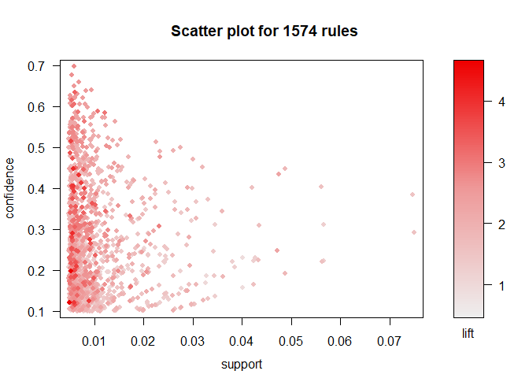<!-- -->

``` r
# swap the axes and color scales
plot(groceryrules, measure = c("support", "lift"), shading = "confidence")
```

    ## To reduce overplotting, jitter is added! Use jitter = 0 to prevent jitter.

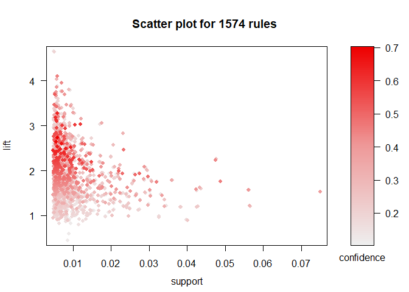<!-- -->

``` r
# "two key" plot: coloring is by size (order) of item set
plot(groceryrules, method='two-key plot')
```

    ## To reduce overplotting, jitter is added! Use jitter = 0 to prevent jitter.

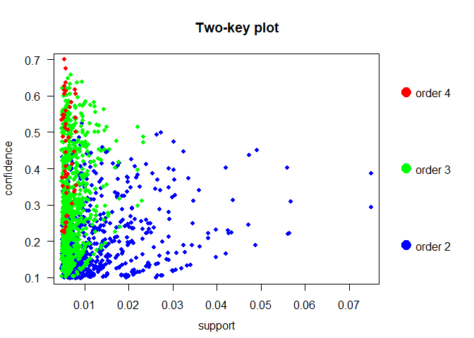<!-- -->

``` r
# graph-based visualization
sub1 = subset(groceryrules, subset=confidence > 0.5 & lift > 2.5)
plot(sub1, method='graph')
```

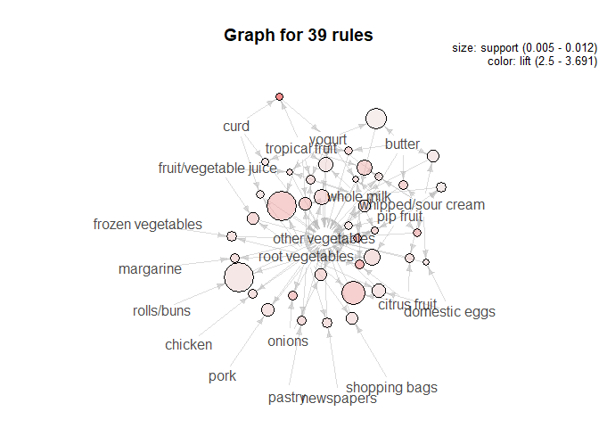<!-- -->

``` r
# export
saveAsGraph(sub1,file="stronggroceryrules.graphml")
```

*Gephi plots*

``` r
library("png")
pp <- readPNG("grocery_network2.png")
plot.new() 
rasterImage(pp,0,0,1,1)
```

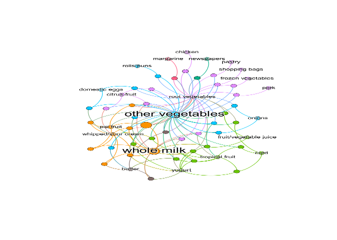<!-- --> The
network shown sizes nodes based on their betweenness centrality. The
colors show the modularity classes. This network tells us that
vegetables and whole milk are highly influential across the whole
network. The modularity classes highlights the items that are most
commonly purchased together. The unlabeled nodes represent itemsets with
more than one item.
